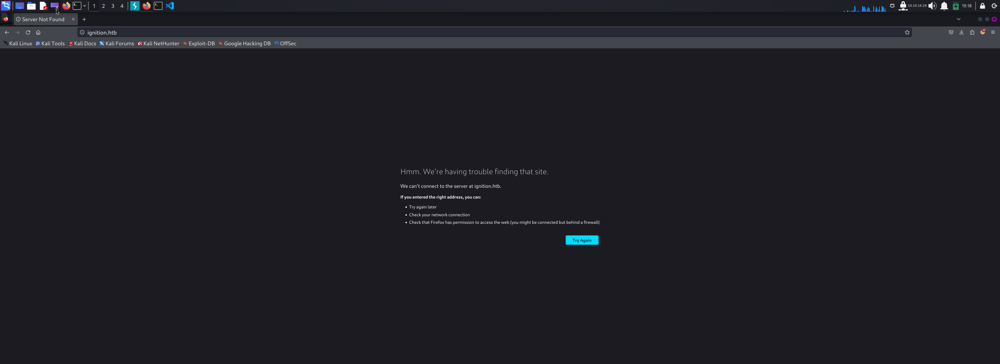
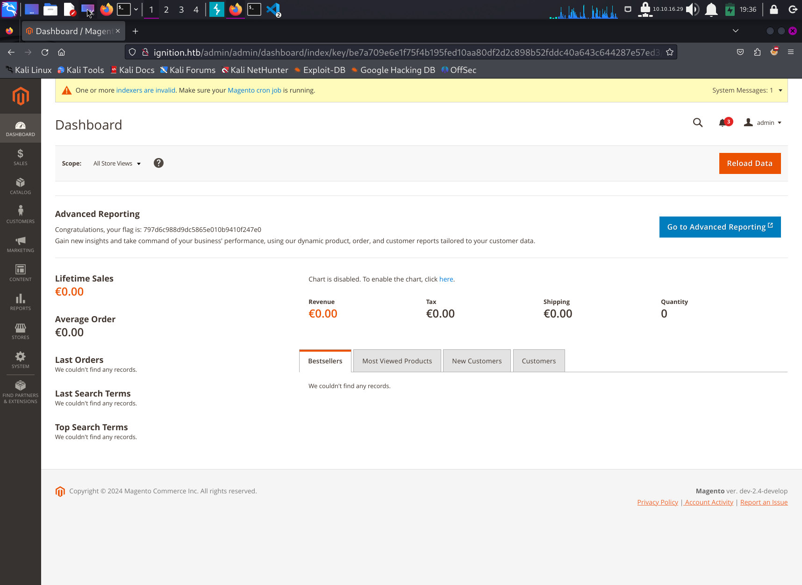

# Write Up for Hack The Box box - [Ignition](https://app.hackthebox.com/starting-point?tier=1)

Part of Starting Point Path. Guided Box

> Pratyush Prakhar (5#1NC#4N) - 01/31/2024

### TASKS

1. Which service version is found to be running on port 80? - **nginx 1.14.2** --> [rust file](rustscan/main.nmap)

2. What is the 3-digit HTTP status code returned when you visit http://{machine IP}/? - **curl** --> [curl out](web/curl.txt)

3. What is the virtual host name the webpage expects to be accessed by? - **ignition.htb**
\

4. What is the full path to the file on a Linux computer that holds a local list of domain name to IP address pairs? - **/etc/hosts**

5. Use a tool to brute force directories on the webserver. What is the full URL to the Magento login page? - **http://ignition.htb/admin** --> [admin page](web/ferox.out)

6. Look up the password requirements for Magento and also try searching for the most commong passwords of 2023. Which password provides access to the admin account? - **qwerty123** --> [in-house python script](script/crack.py)

7. Submit root flag - **797d6c988d9dc5865e010b9410f247e0**.
\

