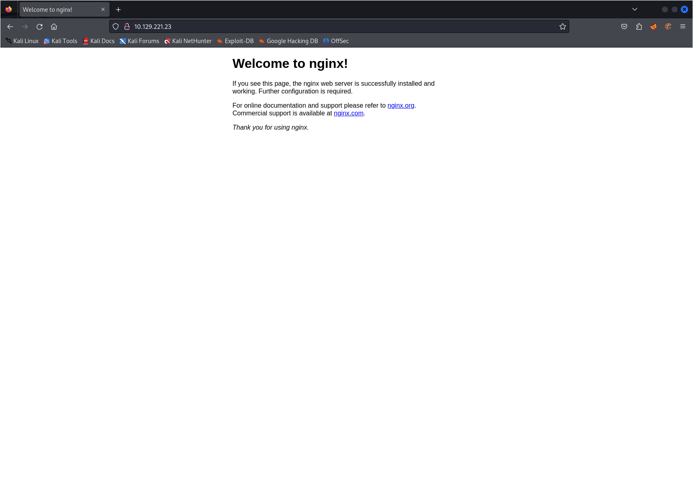
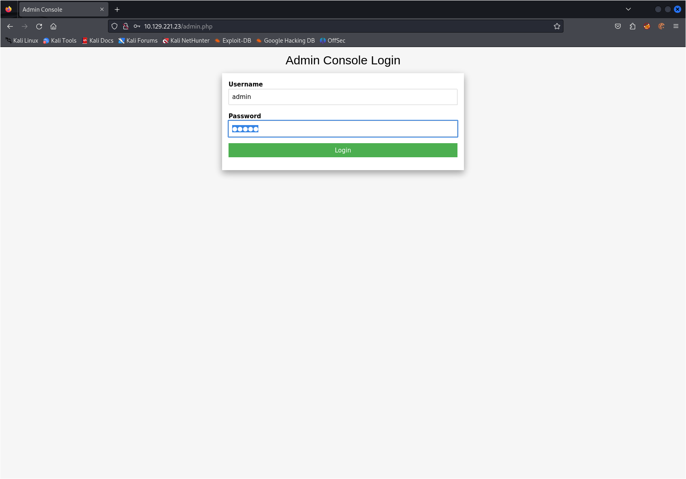
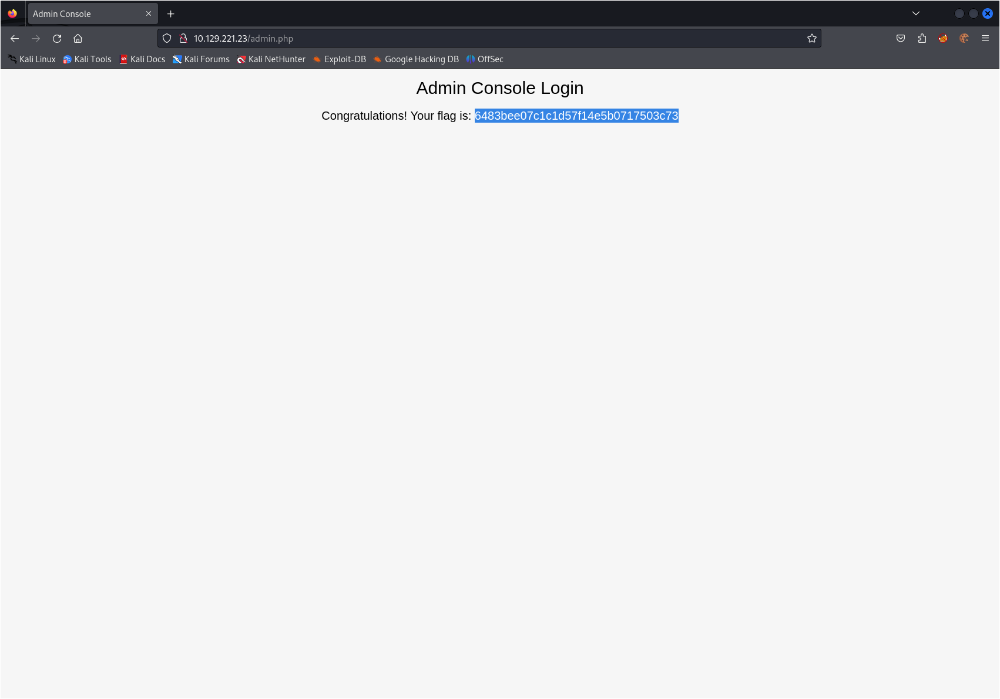

# Write Up for Hack The Box box - [PreIgnition](https://app.hackthebox.com/starting-point?tier=0)

Part of Starting Point. Very Easy, Guided Box

> Pratyush Prakhar (5#1NC#4N) - 09/22/2023

### TASKS

1. Directory Brute-forcing is a technique used to check a lot of paths on a web server to find hidden pages. Which is another name for this? (i) Local File Inclusion, (ii) dir busting, (iii) hash cracking. - **dir busting**

2. What switch do we use for nmap's scan to specify that we want to perform version detection - **-sV**

3. What does Nmap report is the service identified as running on port 80/tcp? - **http**
\

4. What server name and version of service is running on port 80/tcp? - **nginx 1.14.2** --> [rustscan file](rustsn/main.nmap)

5. What switch do we use to specify to Gobuster we want to perform dir busting specifically? - **dir**

6. When using gobuster to dir bust, what switch do we add to make sure it finds PHP pages? - **-x php** 

7. What page is found during our dir busting activities? - **/admin.php** --> [feroxscan file](ferox.out)

8. What is the HTTP status code reported by Gobuster for the discovered page? - **200**
\

9. Submit root flag - **6483bee07c1c1d57f14e5b0717503c73**
\

