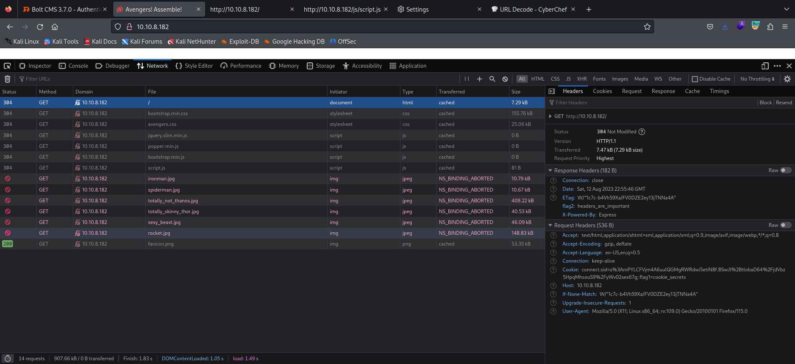
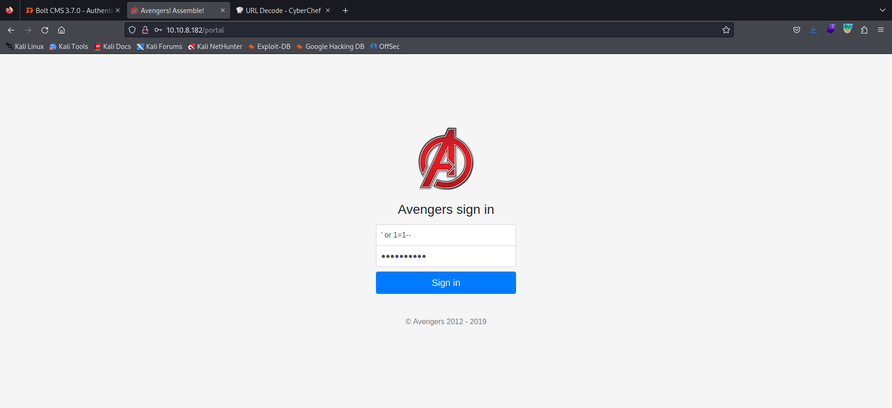
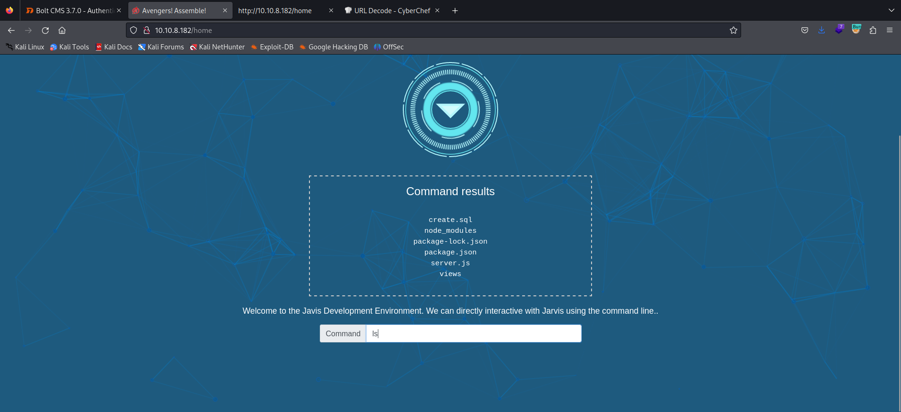
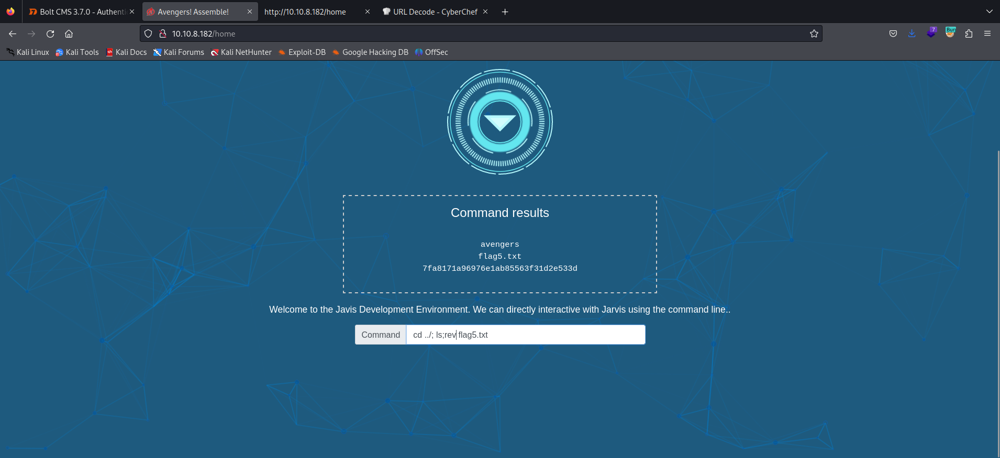

# Write Up for Try Hack Me box - [Avengers Blog](https://tryhackme.com/room/avengers)

This box has a SQL injection issue in the web portal that can be used to get inside the system to enumerate.\
There are other services that we enumerate too. 

> Pratyush Prakhar (5#1NC#4N) - 08/11/2023


## RECONNAISSANCE

1. Scan the box with nmap.

**Results**

```bash
$ nmap -vv -sC -sV -oN nmap/main.nmap 10.10.8.182 
[sudo] password for kali: 
Starting Nmap 7.94 ( https://nmap.org ) at 2023-08-12 18:36 EDT
NSE: Loaded 156 scripts for scanning.
NSE: Script Pre-scanning.
NSE: Starting runlevel 1 (of 3) scan.
Initiating NSE at 18:36
Completed NSE at 18:36, 0.00s elapsed
NSE: Starting runlevel 2 (of 3) scan.
Initiating NSE at 18:36
Completed NSE at 18:36, 0.00s elapsed
NSE: Starting runlevel 3 (of 3) scan.
Initiating NSE at 18:36
Completed NSE at 18:36, 0.00s elapsed
Initiating Ping Scan at 18:36
Scanning 10.10.8.182 [4 ports]
Completed Ping Scan at 18:36, 0.24s elapsed (1 total hosts)
Initiating Parallel DNS resolution of 1 host. at 18:36
Completed Parallel DNS resolution of 1 host. at 18:36, 0.03s elapsed
Initiating SYN Stealth Scan at 18:36
Scanning 10.10.8.182 [1000 ports]
Discovered open port 21/tcp on 10.10.8.182
Discovered open port 80/tcp on 10.10.8.182
Discovered open port 22/tcp on 10.10.8.182
Completed SYN Stealth Scan at 18:36, 2.08s elapsed (1000 total ports)
Initiating Service scan at 18:36
Scanning 3 services on 10.10.8.182
Completed Service scan at 18:36, 6.46s elapsed (3 services on 1 host)
NSE: Script scanning 10.10.8.182.
NSE: Starting runlevel 1 (of 3) scan.
Initiating NSE at 18:36
Completed NSE at 18:36, 6.13s elapsed
NSE: Starting runlevel 2 (of 3) scan.
Initiating NSE at 18:36
Completed NSE at 18:36, 1.50s elapsed
NSE: Starting runlevel 3 (of 3) scan.
Initiating NSE at 18:36
Completed NSE at 18:36, 0.00s elapsed
Nmap scan report for 10.10.8.182
Host is up, received reset ttl 61 (0.23s latency).
Scanned at 2023-08-12 18:36:04 EDT for 16s
Not shown: 997 closed tcp ports (reset)
PORT   STATE SERVICE REASON         VERSION
21/tcp open  ftp     syn-ack ttl 61 vsftpd 3.0.3
22/tcp open  ssh     syn-ack ttl 61 OpenSSH 7.6p1 Ubuntu 4ubuntu0.3 (Ubuntu Linux; protocol 2.0)
| ssh-hostkey: 
|   2048 e0:81:16:a2:b4:7b:30:ce:75:85:f1:82:e9:40:58:c9 (RSA)
| ssh-rsa AAAAB3NzaC1yc2EAAAADAQABAAABAQC30OjLUoSZ4WbeCwMnfZ4PkvI7RgeStulMTQT/tAThTnTmaqt+fQgq8iRKgf+9L7rVSQqW9jUK3O01vwea4BGxQRd47+vjdq0oYlefSvBAhmb9UGlJjXOc//AlYgnPRo4mczv/z8Q04+ztP7NyxKWKBxAqJjmRYIvpMvm7ka5bLogDiSCUmOS80GYOhY181Uo4PQYxJ/+tcwkXbDg3JcZMv66e4Vo8sXkb/s4xYcRO1V/QlyKspHvcqsbixWnEiXfZhmsi5e1NtIgJx1SKqgExjAgjO/Helw9eBs+bAI6DQWFQvyGNOmivBBm/hdDHsPhJtLE573um96Xx28qdjEV1
|   256 7c:c3:0e:14:26:a5:d6:48:fe:c5:8e:fc:0d:cc:24:f8 (ECDSA)
| ecdsa-sha2-nistp256 AAAAE2VjZHNhLXNoYTItbmlzdHAyNTYAAAAIbmlzdHAyNTYAAABBBBB70Zhi9T1y1ZU23nbD9vV4Vs8Vl4axVqgDDafvgTxZLOG8cQ03rHVOTuJ9siIlcAHZ/J1wlC11eO0yF5ZrqTE=
|   256 01:88:80:8c:78:d6:7f:ae:0f:4f:b2:f3:26:e4:84:5b (ED25519)
|_ssh-ed25519 AAAAC3NzaC1lZDI1NTE5AAAAIMRuu3GPrQKBKxVrsNNE81Uv/dLyWZi1HRB3093zcw8p
80/tcp open  http    syn-ack ttl 61 Node.js Express framework
|_http-favicon: Unknown favicon MD5: E084507EB6547A72F9CEC12E0A9B7A36
|_http-title: Avengers! Assemble!
| http-methods: 
|_  Supported Methods: GET HEAD POST OPTIONS
Service Info: OSs: Unix, Linux; CPE: cpe:/o:linux:linux_kernel

NSE: Script Post-scanning.
NSE: Starting runlevel 1 (of 3) scan.
Initiating NSE at 18:36
Completed NSE at 18:36, 0.00s elapsed
NSE: Starting runlevel 2 (of 3) scan.
Initiating NSE at 18:36
Completed NSE at 18:36, 0.00s elapsed
NSE: Starting runlevel 3 (of 3) scan.
Initiating NSE at 18:36
Completed NSE at 18:36, 0.00s elapsed
Read data files from: /usr/bin/../share/nmap
Service detection performed. Please report any incorrect results at https://nmap.org/submit/ .
Nmap done: 1 IP address (1 host up) scanned in 16.88 seconds
           Raw packets sent: 1005 (44.196KB) | Rcvd: 1002 (40.092KB)
```

2. There are **3 TCP** ports open. 
	1. *Port 22* - SSH - **OpenSSH 7.6p1**
	2. *Port 21* - FTP - **vsftpd 3.0.3**
	3. *Port 80* - HTTP - **NodeJS Webpage**

3. Let's actively enumerate them all.


## FTP

1. We have VsFTP installed on the system. Will require a set of login credentials to get access through this path.
2. The task provides us with Groot's creds as `groot:iamgroot`. Let's login using this.
3. We obtain **flag 3** in it.

**Results**
```bash
$ ftp 10.10.8.182                                            
Connected to 10.10.8.182.
220 (vsFTPd 3.0.3)
Name (10.10.8.182:kali): groot
331 Please specify the password.
Password: 
230 Login successful.
Remote system type is UNIX.
Using binary mode to transfer files.
ftp> ls -la
229 Entering Extended Passive Mode (|||45532|)
150 Here comes the directory listing.
dr-xr-xr-x    3 65534    65534        4096 Oct 04  2019 .
dr-xr-xr-x    3 65534    65534        4096 Oct 04  2019 ..
drwxr-xr-x    2 1001     1001         4096 Oct 04  2019 files
226 Directory send OK.
ftp> cd files
250 Directory successfully changed.
ftp> ls -la
229 Entering Extended Passive Mode (|||46735|)
150 Here comes the directory listing.
drwxr-xr-x    2 1001     1001         4096 Oct 04  2019 .
dr-xr-xr-x    3 65534    65534        4096 Oct 04  2019 ..
-rw-r--r--    1 0        0              33 Oct 04  2019 flag3.txt
226 Directory send OK.
ftp> get flag3.txt
local: flag3.txt remote: flag3.txt
229 Entering Extended Passive Mode (|||43468|)
150 Opening BINARY mode data connection for flag3.txt (33 bytes).
100% |***********************************|    33       13.95 KiB/s    00:00 ETA
226 Transfer complete.
33 bytes received in 00:00 (0.14 KiB/s)
ftp> cd ..
250 Directory successfully changed.
ftp> exit
221 Goodbye.
                                                                                
$ cat flag3.txt    
**********************************
```

## WEB

1. Let's first check out the web server on port 80. 
	1. We get a default page with no links going out.
	2. We will go for the low hanging fruit - robots, page source and try to get some information.
	3. We ca3 run sub domain check on this port using `gobuster`.
	4. Look through a proxy to get more details on the request:response model setup.
\


2. In the `Page Source`, we get a hint to look into the default js file. On exploring we get the `cookie` being set as `flag1=*****************`
\

\
\


3. Using the inspector developer tool in the browser, we observe that the original response have the **flag2** in it.
\



4. Let's now explore the sub pages/directories that might be hosted on the web server. We will use `gobuster` to analyze it. [Results](web/port_80.txt)

5. We are greeted with a login page for the `/portal` sub-page. There might be a possibility of SQL Injection somewhere here. As we don't have any creds, that is our best bet here.
\



6. We get in with this query in both param - `' or 1=1--`. We are greeted with page that might have CLI injection on the system. Let's pursue this path to get some more information.
\



## INITIAL ACCESS

1. We get by exploring that the basic enumeration tools like `ls, cat, more, less, vim, nc, python` are all disallowed. So, it will hard to get on the box through a shell.

2. We can still explore around the file system to get information on the system. **flag 5** found in the `/home/ubuntu` directory. We can obtain it by using the only read call allowed `rev` which is the rare case. This shows insecure coding practices.
\


## EXTRA TREATS

1. We see that there are two important files that we find on `/home/ubuntu/avengers` dir as `server.js` and `create.sql`. We read them through the rev command used above.

2. We get the following from it.
	1. Additional credentials - [see file here](creds.txt)
	2. **Flag 4** was found in the [database file](web/portal/sql/create.sql)
	3. Commands that are banned to use [here](web/portal/sql/server.js)

3. We tried additional SSH and FTP logins using the new credentials. No Luck!!
4. We can use the above information to dig deeper and find more issues and privesc. Good Luck Hunting!!

## FLAGS

1. flag 1 - `cookie_secrets`

2. flag 2 - `headers_are_important`

3. flag 3 - `8fc651a739befc58d450dc48e1f1fd2e`

4. flag 4 - `sanitize_queries_mr_stark`

5. flag 5 - `d335e2d13f36558ba1e67969a1718af7`


**Stay Tuned On**\
[Github](https://github.com/pratty010/Boxes)\
[LinkedIn](https://www.linkedin.com/in/pratyush-prakhar/)