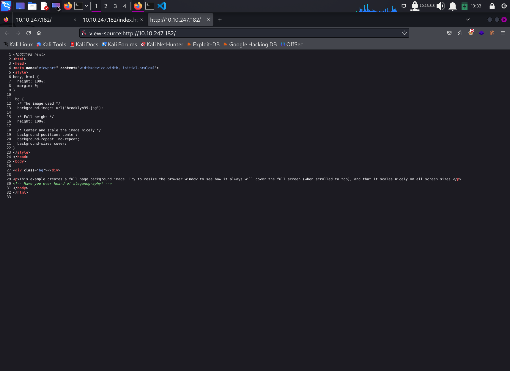

# Write Up for Try Hack Me box - [Brooklyn 99](https://tryhackme.com/room/brooklynninenine)

<TODO>

> Pratyush Prakhar (5#1NC#4N) - 11/04/2020

## RECONNAISSANCE

1. Scan the box with rustscan.
	1. Full port scan --> [nmap file here](rustscan/all.nmap).

	**Results**

	```bash
	└─$ rustscan --range 1-65535 -a 10.10.247.182 -- -sC -sV -oN rustscan/all.nmap
	.----. .-. .-. .----..---.  .----. .---.   .--.  .-. .-.
	| {}  }| { } |{ {__ {_   _}{ {__  /  ___} / {} \ |  `| |
	| .-. \| {_} |.-._} } | |  .-._} }\     }/  /\  \| |\  |
	`-' `-'`-----'`----'  `-'  `----'  `---' `-'  `-'`-' `-'
	The Modern Day Port Scanner.
	________________________________________
	: https://discord.gg/GFrQsGy           :
	: https://github.com/RustScan/RustScan :
	--------------------------------------
	😵 https://admin.tryhackme.com

	[~] The config file is expected to be at "/home/kali/.rustscan.toml"
	[!] File limit is lower than default batch size. Consider upping with --ulimit. May cause harm to sensitive servers
	[!] Your file limit is very small, which negatively impacts RustScan's speed. Use the Docker image, or up the Ulimit with '--ulimit 5000'. 
	Open 10.10.247.182:21
	Open 10.10.247.182:22
	Open 10.10.247.182:80
	[~] Starting Script(s)
	[>] Script to be run Some("nmap -vvv -p {{port}} {{ip}}")

	[~] Starting Nmap 7.94SVN ( https://nmap.org ) at 2024-02-11 18:59 EST
	NSE: Loaded 156 scripts for scanning.
	NSE: Script Pre-scanning.
	NSE: Starting runlevel 1 (of 3) scan.
	Initiating NSE at 18:59
	Completed NSE at 18:59, 0.00s elapsed
	NSE: Starting runlevel 2 (of 3) scan.
	Initiating NSE at 18:59
	Completed NSE at 18:59, 0.00s elapsed
	NSE: Starting runlevel 3 (of 3) scan.
	Initiating NSE at 18:59
	Completed NSE at 18:59, 0.00s elapsed
	Initiating Ping Scan at 18:59
	Scanning 10.10.247.182 [2 ports]
	Completed Ping Scan at 18:59, 0.20s elapsed (1 total hosts)
	Initiating Parallel DNS resolution of 1 host. at 18:59
	Completed Parallel DNS resolution of 1 host. at 18:59, 0.01s elapsed
	DNS resolution of 1 IPs took 0.01s. Mode: Async [#: 1, OK: 0, NX: 1, DR: 0, SF: 0, TR: 1, CN: 0]
	Initiating Connect Scan at 18:59
	Scanning 10.10.247.182 [3 ports]
	Discovered open port 80/tcp on 10.10.247.182
	Discovered open port 22/tcp on 10.10.247.182
	Discovered open port 21/tcp on 10.10.247.182
	Completed Connect Scan at 18:59, 0.21s elapsed (3 total ports)
	Initiating Service scan at 18:59
	Scanning 3 services on 10.10.247.182
	Completed Service scan at 18:59, 6.47s elapsed (3 services on 1 host)
	NSE: Script scanning 10.10.247.182.
	NSE: Starting runlevel 1 (of 3) scan.
	Initiating NSE at 18:59
	NSE: [ftp-bounce 10.10.247.182:21] PORT response: 500 Illegal PORT command.
	Completed NSE at 18:59, 6.58s elapsed
	NSE: Starting runlevel 2 (of 3) scan.
	Initiating NSE at 18:59
	Completed NSE at 18:59, 1.47s elapsed
	NSE: Starting runlevel 3 (of 3) scan.
	Initiating NSE at 18:59
	Completed NSE at 18:59, 0.00s elapsed
	Nmap scan report for 10.10.247.182
	Host is up, received syn-ack (0.21s latency).
	Scanned at 2024-02-11 18:59:39 EST for 15s

	PORT   STATE SERVICE REASON  VERSION
	21/tcp open  ftp     syn-ack vsftpd 3.0.3
	| ftp-syst: 
	|   STAT: 
	| FTP server status:
	|      Connected to ::ffff:10.13.5.5
	|      Logged in as ftp
	|      TYPE: ASCII
	|      No session bandwidth limit
	|      Session timeout in seconds is 300
	|      Control connection is plain text
	|      Data connections will be plain text
	|      At session startup, client count was 2
	|      vsFTPd 3.0.3 - secure, fast, stable
	|_End of status
	| ftp-anon: Anonymous FTP login allowed (FTP code 230)
	|_-rw-r--r--    1 0        0             119 May 17  2020 note_to_jake.txt
	22/tcp open  ssh     syn-ack OpenSSH 7.6p1 Ubuntu 4ubuntu0.3 (Ubuntu Linux; protocol 2.0)
	| ssh-hostkey: 
	|   2048 16:7f:2f:fe:0f:ba:98:77:7d:6d:3e:b6:25:72:c6:a3 (RSA)
	| ssh-rsa AAAAB3NzaC1yc2EAAAADAQABAAABAQDQjh/Ae6uYU+t7FWTpPoux5Pjv9zvlOLEMlU36hmSn4vD2pYTeHDbzv7ww75UaUzPtsC8kM1EPbMQn1BUCvTNkIxQ34zmw5FatZWNR8/De/u/9fXzHh4MFg74S3K3uQzZaY7XBaDgmU6W0KEmLtKQPcueUomeYkqpL78o5+NjrGO3HwqAH2ED1Zadm5YFEvA0STasLrs7i+qn1G9o4ZHhWi8SJXlIJ6f6O1ea/VqyRJZG1KgbxQFU+zYlIddXpub93zdyMEpwaSIP2P7UTwYR26WI2cqF5r4PQfjAMGkG1mMsOi6v7xCrq/5RlF9ZVJ9nwq349ngG/KTkHtcOJnvXz
	|   256 2e:3b:61:59:4b:c4:29:b5:e8:58:39:6f:6f:e9:9b:ee (ECDSA)
	| ecdsa-sha2-nistp256 AAAAE2VjZHNhLXNoYTItbmlzdHAyNTYAAAAIbmlzdHAyNTYAAABBBItJ0sW5hVmiYQ8U3mXta5DX2zOeGJ6WTop8FCSbN1UIeV/9jhAQIiVENAW41IfiBYNj8Bm+WcSDKLaE8PipqPI=
	|   256 ab:16:2e:79:20:3c:9b:0a:01:9c:8c:44:26:01:58:04 (ED25519)
	|_ssh-ed25519 AAAAC3NzaC1lZDI1NTE5AAAAIP2hV8Nm+RfR/f2KZ0Ub/OcSrqfY1g4qwsz16zhXIpqk
	80/tcp open  http    syn-ack Apache httpd 2.4.29 ((Ubuntu))
	|_http-server-header: Apache/2.4.29 (Ubuntu)
	| http-methods: 
	|_  Supported Methods: GET POST OPTIONS HEAD
	|_http-title: Site doesn't have a title (text/html).
	Service Info: OSs: Unix, Linux; CPE: cpe:/o:linux:linux_kernel

	NSE: Script Post-scanning.
	NSE: Starting runlevel 1 (of 3) scan.
	Initiating NSE at 18:59
	Completed NSE at 18:59, 0.00s elapsed
	NSE: Starting runlevel 2 (of 3) scan.
	Initiating NSE at 18:59
	Completed NSE at 18:59, 0.00s elapsed
	NSE: Starting runlevel 3 (of 3) scan.
	Initiating NSE at 18:59
	Completed NSE at 18:59, 0.00s elapsed
	Read data files from: /usr/bin/../share/nmap
	```

	2. Full Service and Scripts scan on the found ports. --> [nmap file here](rustscan/main.nmap))

	**Results**

	```bash
	└─$ rustscan -a 10.10.247.182 -- -sC -sV -oN rustscan/main.nmap
	.----. .-. .-. .----..---.  .----. .---.   .--.  .-. .-.
	| {}  }| { } |{ {__ {_   _}{ {__  /  ___} / {} \ |  `| |
	| .-. \| {_} |.-._} } | |  .-._} }\     }/  /\  \| |\  |
	`-' `-'`-----'`----'  `-'  `----'  `---' `-'  `-'`-' `-'
	The Modern Day Port Scanner.
	________________________________________
	: https://discord.gg/GFrQsGy           :
	: https://github.com/RustScan/RustScan :
	--------------------------------------
	🌍HACK THE PLANET🌍
	
	[~] The config file is expected to be at "/home/kali/.rustscan.toml"
	[!] File limit is lower than default batch size. Consider upping with --ulimit. May cause harm to sensitive servers
	[!] Your file limit is very small, which negatively impacts RustScan's speed. Use the Docker image, or up the Ulimit with '--ulimit 5000'. 
	Open 10.10.247.182:21
	Open 10.10.247.182:22
	Open 10.10.247.182:80
	[~] Starting Script(s)
	[>] Script to be run Some("nmap -vvv -p {{port}} {{ip}}")
	
	[~] Starting Nmap 7.94SVN ( https://nmap.org ) at 2024-02-11 18:58 EST
	NSE: Loaded 156 scripts for scanning.
	NSE: Script Pre-scanning.
	NSE: Starting runlevel 1 (of 3) scan.
	Initiating NSE at 18:58
	Completed NSE at 18:58, 0.00s elapsed
	NSE: Starting runlevel 2 (of 3) scan.
	Initiating NSE at 18:58
	Completed NSE at 18:58, 0.00s elapsed
	NSE: Starting runlevel 3 (of 3) scan.
	Initiating NSE at 18:58
	Completed NSE at 18:58, 0.00s elapsed
	Initiating Ping Scan at 18:58
	Scanning 10.10.247.182 [2 ports]
	Completed Ping Scan at 18:58, 0.22s elapsed (1 total hosts)
	Initiating Parallel DNS resolution of 1 host. at 18:58
	Completed Parallel DNS resolution of 1 host. at 18:58, 0.01s elapsed
	DNS resolution of 1 IPs took 0.01s. Mode: Async [#: 1, OK: 0, NX: 1, DR: 0, SF: 0, TR: 1, CN: 0]
	Initiating Connect Scan at 18:58
	Scanning 10.10.247.182 [3 ports]
	Discovered open port 80/tcp on 10.10.247.182
	Discovered open port 22/tcp on 10.10.247.182
	Discovered open port 21/tcp on 10.10.247.182
	Completed Connect Scan at 18:58, 0.23s elapsed (3 total ports)
	Initiating Service scan at 18:58
	Scanning 3 services on 10.10.247.182
	Completed Service scan at 18:58, 6.52s elapsed (3 services on 1 host)
	NSE: Script scanning 10.10.247.182.
	NSE: Starting runlevel 1 (of 3) scan.
	Initiating NSE at 18:58
	NSE: [ftp-bounce 10.10.247.182:21] PORT response: 500 Illegal PORT command.
	Completed NSE at 18:58, 7.20s elapsed
	NSE: Starting runlevel 2 (of 3) scan.
	Initiating NSE at 18:58
	Completed NSE at 18:58, 1.63s elapsed
	NSE: Starting runlevel 3 (of 3) scan.
	Initiating NSE at 18:58
	Completed NSE at 18:58, 0.00s elapsed
	Nmap scan report for 10.10.247.182
	Host is up, received syn-ack (0.22s latency).
	Scanned at 2024-02-11 18:58:16 EST for 15s
	
	PORT   STATE SERVICE REASON  VERSION
	21/tcp open  ftp     syn-ack vsftpd 3.0.3
	| ftp-anon: Anonymous FTP login allowed (FTP code 230)
	|_-rw-r--r--    1 0        0             119 May 17  2020 note_to_jake.txt
	| ftp-syst: 
	|   STAT: 
	| FTP server status:
	|      Connected to ::ffff:10.13.5.5
	|      Logged in as ftp
	|      TYPE: ASCII
	|      No session bandwidth limit
	|      Session timeout in seconds is 300
	|      Control connection is plain text
	|      Data connections will be plain text
	|      At session startup, client count was 3
	|      vsFTPd 3.0.3 - secure, fast, stable
	|_End of status
	22/tcp open  ssh     syn-ack OpenSSH 7.6p1 Ubuntu 4ubuntu0.3 (Ubuntu Linux; protocol 2.0)
	| ssh-hostkey: 
	|   2048 16:7f:2f:fe:0f:ba:98:77:7d:6d:3e:b6:25:72:c6:a3 (RSA)
	| ssh-rsa AAAAB3NzaC1yc2EAAAADAQABAAABAQDQjh/Ae6uYU+t7FWTpPoux5Pjv9zvlOLEMlU36hmSn4vD2pYTeHDbzv7ww75UaUzPtsC8kM1EPbMQn1BUCvTNkIxQ34zmw5FatZWNR8/De/u/9fXzHh4MFg74S3K3uQzZaY7XBaDgmU6W0KEmLtKQPcueUomeYkqpL78o5+NjrGO3HwqAH2ED1Zadm5YFEvA0STasLrs7i+qn1G9o4ZHhWi8SJXlIJ6f6O1ea/VqyRJZG1KgbxQFU+zYlIddXpub93zdyMEpwaSIP2P7UTwYR26WI2cqF5r4PQfjAMGkG1mMsOi6v7xCrq/5RlF9ZVJ9nwq349ngG/KTkHtcOJnvXz
	|   256 2e:3b:61:59:4b:c4:29:b5:e8:58:39:6f:6f:e9:9b:ee (ECDSA)
	| ecdsa-sha2-nistp256 AAAAE2VjZHNhLXNoYTItbmlzdHAyNTYAAAAIbmlzdHAyNTYAAABBBItJ0sW5hVmiYQ8U3mXta5DX2zOeGJ6WTop8FCSbN1UIeV/9jhAQIiVENAW41IfiBYNj8Bm+WcSDKLaE8PipqPI=
	|   256 ab:16:2e:79:20:3c:9b:0a:01:9c:8c:44:26:01:58:04 (ED25519)
	|_ssh-ed25519 AAAAC3NzaC1lZDI1NTE5AAAAIP2hV8Nm+RfR/f2KZ0Ub/OcSrqfY1g4qwsz16zhXIpqk
	80/tcp open  http    syn-ack Apache httpd 2.4.29 ((Ubuntu))
	| http-methods: 
	|_  Supported Methods: GET POST OPTIONS HEAD
	|_http-title: Site doesn't have a title (text/html).
	|_http-server-header: Apache/2.4.29 (Ubuntu)
	Service Info: OSs: Unix, Linux; CPE: cpe:/o:linux:linux_kernel
	
	NSE: Script Post-scanning.
	NSE: Starting runlevel 1 (of 3) scan.
	Initiating NSE at 18:58
	Completed NSE at 18:58, 0.00s elapsed
	NSE: Starting runlevel 2 (of 3) scan.
	Initiating NSE at 18:58
	Completed NSE at 18:58, 0.00s elapsed
	NSE: Starting runlevel 3 (of 3) scan.
	Initiating NSE at 18:58
	Completed NSE at 18:58, 0.00s elapsed
	```

2. There are **3 TCP** ports open. 
	1. *Port 21* - FTP - **vsftpd 3.0.3**
	2. *Port 22* - SSH - **OpenSSH 7.6p1** 
	3. *Port 80* - WEB - **Apache httpd 2.4.29**

3. Let's explore FTP and WEB part first. Then we can use SSH.


## FTP

1. We have VsFTP installed on the system. Will require a set of login credentials to get access through this path. 
2. But NMAP says `Anonymous Login` is possible. So, let's explore that.
3. We find a file in the directory listing.
	1. [note to JAKE](ftp/note_to_jake.txt) --> Leaks out a username `jake` and `amy` as possible users.
4. Let's keep this knowledge for later and dig into Web.

**Results**

```bash
└─$ ftp 10.10.247.182
Connected to 10.10.247.182.
220 (vsFTPd 3.0.3)
Name (10.10.247.182:kali): anonymous
331 Please specify the password.
Password: 
230 Login successful.
Remote system type is UNIX.
Using binary mode to transfer files.
ftp> ls
229 Entering Extended Passive Mode (|||16948|)
150 Here comes the directory listing.
-rw-r--r--    1 0        0             119 May 17  2020 note_to_jake.txt
226 Directory send OK.
ftp> cd ..
250 Directory successfully changed.
ftp> ls
229 Entering Extended Passive Mode (|||48337|)
150 Here comes the directory listing.
-rw-r--r--    1 0        0             119 May 17  2020 note_to_jake.txt
226 Directory send OK.
ftp> get note_to_jake.txt
local: note_to_jake.txt remote: note_to_jake.txt
229 Entering Extended Passive Mode (|||32958|)
150 Opening BINARY mode data connection for note_to_jake.txt (119 bytes).
100% |***********************************************************|   119       35.54 KiB/s    00:00 ETA
226 Transfer complete.
119 bytes received in 00:00 (0.56 KiB/s)
ftp> exit
221 Goodbye.
```

## WEB

1. Let's first check out the web server on port 80. 
	1. We get a default page with no links going out. - Default HTML page.
	\
	
	\
	2. We will go for the low hanging fruit - robots, page source and try to get some information. Found some hint for the index web page.
	\
	
	\

2. This is very odd but new. Let's get into the stenography. 

3. We try to heck out the directory listing. [Nothing interesting](web/ferox.txt) in the first turn. Let's revisit it back.

## STEGNO 

1. We get the image locally to our machine. It is [BROOKLYN NINE NINE](web/brooklyn99.jpg).

2. Let's look into our first enumeration tools - _exiftool_ and _strings_. Nothing interesting here.

```bash
└─$ strings brooklyn99.jpg | head
JFIF
$3br
%&'()*456789:CDEFGHIJSTUVWXYZcdefghijstuvwxyz
        #3R
&'()*56789:CDEFGHIJSTUVWXYZcdefghijstuvwxyz
,Fmb=bC
EKE;
s{}/
Du#8
+ppx
....................................
└─$ steghide info brooklyn99.jpg                   
"brooklyn99.jpg":
  format: jpeg
  capacity: 3.5 KB
Try to get information about embedded data ? (y/n) y
Enter passphrase: 
steghide: can not uncompress data. compressed data is corrupted.
```

3. Let's now try to find a secret cracker to get the data out. One of the tool that is [Stegseek](https://github.com/RickdeJager/stegseek?tab=readme-ov-file). It is basically stegcracker on steroids. Let's give it a run. 

```bash
└─$ stegseek brooklyn99.jpg /usr/share/wordlists/rockyou.txt
StegSeek 0.6 - https://github.com/RickdeJager/StegSeek

[i] Found passphrase: "*****"
[i] Original filename: "note.txt".
[i] Extracting to "brooklyn99.jpg.out".
```

4. Wow we get some interesting information from the captain and lost dad of Jake. Let's use this [note](web/brooklyn99.jpg.out) to our usefulness. 


## INITIAL ACCESS - SSH

1. We get into the system as `holt`. We land on it's home page. We can now read the user flag. 

```bash
holt@brookly_nine_nine:~$ ls
nano.save  user.txt
holt@brookly_nine_nine:~$ pwd
/home/holt
holt@brookly_nine_nine:~$ cat user.txt 
******************************
```

2. Now let's try to get fish around and escalate to some other worthwhile user as holt has nothing. We found in low hanging fruit `sudo -l`.

```bash
holt@brookly_nine_nine:~$ sudo -l
Matching Defaults entries for holt on brookly_nine_nine:
    env_reset, mail_badpass,
    secure_path=/usr/local/sbin\:/usr/local/bin\:/usr/sbin\:/usr/bin\:/sbin\:/bin\:/snap/bin

User holt may run the following commands on brookly_nine_nine:
    (ALL) NOPASSWD: /bin/nano
```

3. We find that old friend `nano` to be root runnable. This will allow us to run the system as root using [this](https://gtfobins.github.io/gtfobins/nano/#sudo).

## PRIVESC

1. Using the above method, we escalate to root. Now the keys are ours and so is the kingdom. Let's get on with the loot.

```bash
root@brookly_nine_nine:~# ls
nano.save  user.txt
root@brookly_nine_nine:~# cd /root/
root@brookly_nine_nine:/root# cat root.txt 
-- Creator : Fsociety2006 --
Congratulations in rooting Brooklyn Nine Nine
Here is the flag: ******************************

Enjoy!!
```

## EXTRA TREAT 

1. We can now obtain the [following files](ssh/etc) easily that can be used later.
	1. **/etc/passwd**
	2. **/etc/shadow**
	3. **/etc/hosts**
	4. **/etc/sudoers**
	5. **/etc/crontab**
	6. **/proc**

2. We can also add [our *ssh keys*](ssh/keys) to `authorized_keys` to get a foothold on the box. You can use other methods like crons and process hijacking as well to plant a backdoor.

3. Find out more with the linpeas scans that can be obtained [here](ssh/tmp/linpeas_holt.out).

4. Now we know through the password cracking that jake has password as - [jake passwd](extra/jake.passwd). So, we might be able to brute force ssh too. Go have a try.

## BROWNIE POINTS

1. User.txt - **ee11cbb19052e40b07aac0ca060c23ee**

2. root.txt - **63a9f0ea7bb98050796b649e85481845**

**Stay Tuned On**\
[GitHub](https://github.com/pratty010/Boxes)\
[LinkedIn](https://www.linkedin.com/in/pratyush-prakhar/)